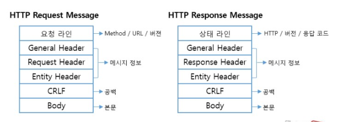

# 어플리케이션 계층

### 📝 어플리케이션 계층 개요

---

- **프로세스 간 통신**에서 서버는 정보를 만들고 클라이언트는 그 정보를 받는다
- 여러 계층 가운데 **사용자와 가장 밀접**한 곳이 *어플리케이션 계층*이다

 

### 🖥️ 서버 · 클라이언트

---

- **서버**는 24시간 클라이언트 요청을 기다린다
- **클라이언트**는 데이터가 필요할 때 서버에 요청을 보내고, 서버는 응답을 반환한다

 

### 🔗 프로세스 간 통신

---

- **프로세스**는 실행 중인 프로그램을 의미한다
- 종류
  - **서버 프로세스** : 서버 OS 위에서 동작한다
  - **클라이언트 프로세스** : 클라이언트 OS 위에서 동작한다
- **Socket** 인터페이스
  - OS와 프로세스 사이 통신 창구 역할을 한다
  - 프로세스 간 통신 시 소켓에 바인드된 주소가 사용된다.

 

### 🚚 TCP vs UDP

---

#### 🛡️ TCP (Transmission Control Protocol)

- **신뢰성**을 우선한다
- 특징
  - 3-way Handshake
  - **패킷 순서 보장 · 재전송 · 흐름 제어 · 혼잡 제어**
  - 손실·순서 오류 패킷을 복원한다
  - 속도는 상대적으로 느리다
- 사용 예시 : HTTP/HTTPS, SMTP, FTP

<!-- TCP 다이어그램 -->

#### ⚡ UDP (User Datagram Protocol)

- **속도**를 우선한다, 비연결성이다
- 특징
  - Handshake가 없다
  - **순서·흐름·혼잡 제어가 없다**
  - 패킷 일부가 손실될 수 있다
  - 오버헤드가 작아 빠르다
- 사용 예시 : 실시간 스트리밍, VoIP, 온라인 게임, DNS, DHCP

 

### 🌐 HTTP (HyperText Transfer Protocol)

---

- **HTTP**는 웹에서 서버·클라이언트가 데이터를 주고받기 위한 **규약**이다
- 구성 요소로는 대표적으로 Header, Body, Method, Status code 가 있다.

<!-- HTTP 요청·응답 흐름 그림 -->

#### 📦 동작 과정

1. 클라이언트가 요청을 보낸다
2. 서버가 처리 후 응답을 반환한다
3. 응답에는 *상태 코드*와 *콘텐츠*가 포함된다

#### 🧰 특징

- **Stateless** : 서버는 각 요청을 독립적으로 처리한다

 

#### 🔨 HTTP 메서드

| 메서드      | 목적                              |
| ----------- | --------------------------------- |
| **GET**     | 리소스를 조회한다                 |
| **POST**    | 리소스를 생성·처리한다            |
| **PUT**     | 리소스를 전체 교체한다            |
| **PATCH**   | 리소스를 부분 수정한다            |
| **DELETE**  | 리소스를 삭제한다                 |
| **HEAD**    | 본문 없이 헤더만 조회한다         |
| **OPTIONS** | 서버가 지원하는 메서드를 조회한다 |

 

#### 🏷️ HTTP 상태 코드

| 범주    | 의미            | 대표 코드                                                           |
| ------- | --------------- | ------------------------------------------------------------------- |
| **1xx** | 정보 전달       | 100 Continue                                                        |
| **2xx** | 성공            | 200 OK, 201 Created, 204 No Content                                 |
| **3xx** | 리다이렉트      | 301 Moved Permanently, 302 Found, 304 Not Modified                  |
| **4xx** | 클라이언트 오류 | 400 Bad Request, 401 Unauthorized, 403 Forbidden, 404 Not Found     |
| **5xx** | 서버 오류       | 500 Internal Server Error, 502 Bad Gateway, 503 Service Unavailable |

 

### 🍪 Cookie

---

- **Cookie**는 Stateless 특성을 보완하기 위해 서버가 **사용자 상태 정보를 담아** 클라이언트에 발급하는 데이터다
- 동작
  1. 서버 → `Set-Cookie` 헤더로 쿠키를 보낸다
  2. 클라이언트가 쿠키를 저장한다
  3. 이후 요청마다 쿠키를 포함해 서버로 전송한다 → 서버는 사용자 식별 및 세션 관리에 활용한다

 

### 🛡️ Proxy

---

- **Proxy 서버**는 서버·클라이언트 사이 **캐시 서버** 역할을 한다
- 동작
  1. 클라이언트 요청 → Proxy가 캐시에 데이터가 있는지 확인한다
  2. 캐시에 있으면 즉시 응답하고, 없으면 원 서버로 요청을 전달한다
- 장점
  - 응답 지연을 줄이고 서버 부하를 낮춘다
- 단점
  - **데이터 일관성 문제**가 발생할 수 있다 → `Conditional GET`으로 최신 여부를 확인한다

 

### 📞 DNS (Domain Name System)

---

- **DNS**는 도메인 이름과 IP 주소를 매핑하는 **분산 디렉터리 서비스**이다

<!-- DNS 트리 구조 그림 -->

#### 🔍 질의 흐름 예시 (`www.google.com`)

1. 클라이언트 → 로컬 DNS 서버로 질의를 보낸다
2. 로컬 DNS → 루트 DNS → TLD DNS → 권한 DNS 순으로 IP 주소를 찾는다
3. 최종 IP 주소가 클라이언트에 반환된다 (어플리케이션 계층에서 수행한다)

#### 🗂️ DNS 네임서버 계층

| 계층         | 역할                                                          |
| ------------ | ------------------------------------------------------------- |
| **루트 DNS** | TLD 서버 위치를 알려준다                                      |
| **TLD DNS**  | `.com`, `.kr` 등 TLD별 **권한 DNS** 위치를 알려준다           |
| **권한 DNS** | 도메인의 **최종 IP 주소**를 알려준다                          |
| **로컬 DNS** | 사용자·기관 내부 첫 질의 지점이며 **캐시·프록시** 역할을 한다 |

- **특징**
  - 전 세계적으로 **분산·계층화**된 구조로 동작한다
  - 하나의 도메인에 **다수 IP**를 등록해 부하를 분산할 수 있다

 

### 🧩 기타 용어

---

- **프로토콜**
  - 네트워크에서 패킷 형식과 절차를 정의한 **언어**이다
  - 송·수신자가 동일한 프로토콜을 이해해야 통신이 가능하다
  - 목적·특징에 따라 포함해야 할 **헤더 구조가 서로 다르다**
