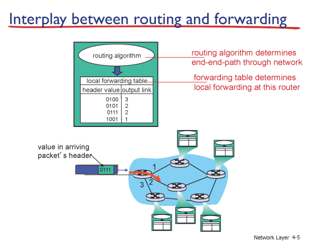
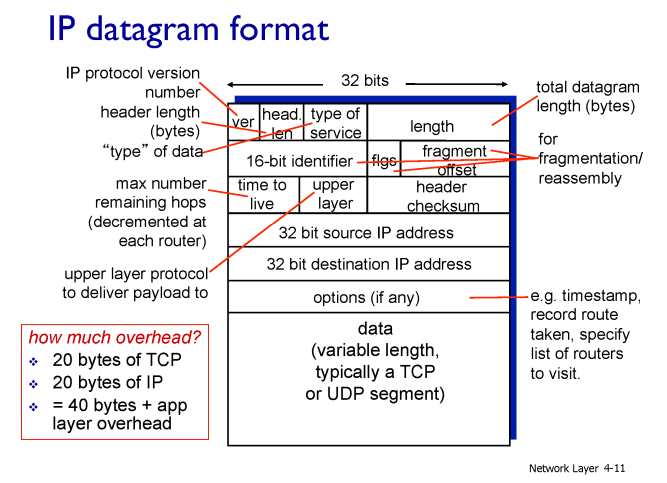
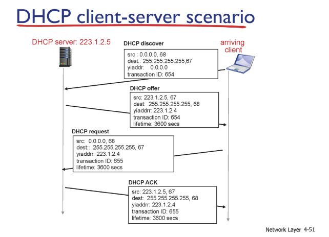
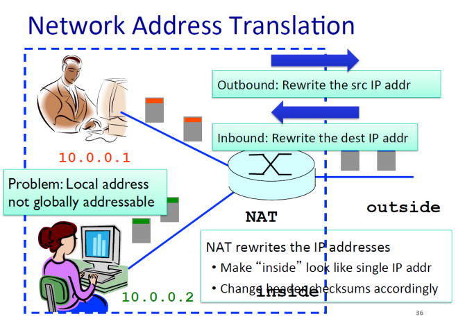

# 📡 네트워크 계층

---

## 📝 네트워크 계층 개요

- **역할**: 송신 호스트 → 수신 호스트로 **패킷(데이터그램)** 전달
- **서비스 모델**: 인터넷은 **최선형(best-effort)**  
  → 전달/순서/지연/대역폭 **보장 없음**

---

## 🔀 데이터 평면 vs 제어 평면

- **데이터 평면(포워딩)**: 들어온 패킷을 **어느 출력 포트로 보낼지 즉시 결정**
- **Longest Prefix Matching**: 가장 긴 범위의 prefix가 매칭되는 주소로 결정
- **제어 평면(라우팅)**: 네트워크 전반의 **경로 계산** 및 **포워딩 테이블 설정**
  - 라우팅 알고리즘 → 포워딩 테이블 작성
  - 포워딩 테이블 → 패킷이 들어왔을 때 다음 링크 결정
- **SDN 관점**: 중앙 **컨트롤러**가 경로/정책 계산·배포, 장비는 **포워딩 전담**

---

## 🧱 라우터 내부 구조

- **입력 포트**: L1/L2 처리 → **포워딩 테이블 조회(최장 프리픽스 일치)** → 스위치 구조로 전달
- **스위치 구조(Fabric)**: 입력 ↔ 출력 연결(메모리/버스/크로스바 등 구현)
- **출력 포트**: 큐잉·스케줄링 후 링크로 송신
- **라우팅 프로세서**: 라우팅 프로토콜 실행 및 테이블 관리

---

## 🌐 IP 주소와 주요 기능 (IPv4 / IPv6 공통)

### 1. 주소 지정(Addressing)

- **IPv4 헤더**: 버전, 길이, TTL, 상위 프로토콜(TCP/UDP), 출발지/목적지 주소 포함
- **주소 단위**: 장비가 아닌 **인터페이스 단위**에 IP 부여
- **Classful Addressing**: 클래스 단위로 네트워크를 구분
- **CIDR**: `a.b.c.d/x` 형태, **프리픽스 기반 주소 요약**
- **DHCP**: IP 주소를 동적으로 임대하는 프로토콜
- **브로드캐스트**
  - 제한적: `255.255.255.255` (로컬 네트워크 전용)
  - 지정: 네트워크ID + all 1 (예: `192.168.1.255`)

### 2. 단편화(Fragmentation)

- 네트워크 경로의 **MTU(Maximum Transmission Unit)**보다 큰 패킷을 작은 조각으로 나눔
- 송신측·라우터에서 단편화, 수신측에서 재조립

---

## 🧱 CIDR (Classless Inter-Domain Routing)

### 개요

- **등장 배경**: 고정 클래스(A/B/C) 주소 체계는 **주소 낭비와 확장성 한계** 존재
- **CIDR**: 네트워크 경계를 **가변 길이 프리픽스(/x)**로 표현
  - 필요한 만큼 주소 할당 (낭비 최소화)
  - 여러 네트워크를 묶어 **경로 요약(Route Aggregation)**
- **효과**: IPv4 주소 고갈 완화, 네트워크 설계 유연성 증가, 라우팅 테이블 축소

### 표기법

- `a.b.c.d/x` (예: `192.168.10.0/26`)
- `x` = 네트워크 비트 수, 나머지 `(32−x)` = 호스트 비트 수
- 같은 네트워크 판별: `IP & 마스크` 결과 동일 시 같은 네트워크
- 예: `/26` → 서브넷 마스크 `255.255.255.192`, 블록 크기 = 64

### 호스트 계산법

- 공식: `2^(32−x) − 2` (네트워크 주소와 브로드캐스트 주소 제외)
- 예시:
  - `/24` → 254개 호스트
  - `/26` → 62개 호스트
  - `/30` → 2개 호스트 (P2P)

---

## 📡 DHCP (Dynamic Host Configuration Protocol)

### 개요

- 클라이언트가 네트워크 접속 시 **자동으로 IP 및 관련 정보**(서브넷 마스크, 게이트웨이, DNS 등) 할당
- **임대(Lease)** 방식으로 주소 관리
- **포트 번호**: 서버(67), 클라이언트(68)

### 동작 과정 (DORA)

1. **Discover**: 클라이언트 → 브로드캐스트(`255.255.255.255:67`) → “IP 주소 줄 서버 있나요?”
2. **Offer**: 서버 → 브로드캐스트(`255.255.255.255:68`), transaction ID 포함 → “이 IP 사용 가능”
3. **Request**: 클라이언트 → 브로드캐스트(`255.255.255.255:67`) → “저 이 주소 쓰겠습니다”
4. **ACK**: 서버 → 브로드캐스트(`255.255.255.255:68`) → “확인 완료, 사용하세요”

---

## 🔁 NAT (Network Address Translation)

- 내부 **사설 IP ↔ 공인 IP:포트** 매핑으로 다수 호스트가 하나의 공인 IP 사용
- **Outbound**: 출발지 IP 재작성
- **Inbound**: 목적지 IP 재작성
- **장점**: 주소 절약, 내부 구조 은닉
- **제약**: 인바운드 연결·서버 운영 시 추가 설정 필요 (NAT Traversal/포트포워딩)

---

## 🆚 IPv4 vs IPv6

| 항목      | IPv4            | IPv6                                  |
| --------- | --------------- | ------------------------------------- |
| 주소 길이 | 32비트          | 128비트                               |
| 헤더      | 가변(옵션 포함) | 고정 40B + 확장 헤더                  |
| 단편화    | 라우터/끝점     | 끝점만 (라우터는 과대 패킷 폐기 알림) |
| 체크섬    | 있음            | 없음 (상·하위 계층 검증 의존)         |
| 주소 유형 | 유니/멀티캐스트 | 유니/멀티 + 애니캐스트                |
| 전환 방식 | —               | 듀얼스택, 터널링(IPv6-in-IPv4)        |

---

## ⏳ 큐잉 & 스케줄링

- **입력 큐**: 스위치가 바쁘면 대기, **HOL(Head-of-Line) 차단** 가능
- **출력 큐**: 다수 입력이 한 출력으로 몰리면 대기/드롭 발생
- **스케줄링 방식**: FIFO, 우선순위 큐, 라운드로빈, WFQ
- **버퍼블로트**: 버퍼 과대 → 손실 줄지만 지연 증가

---

## 🛰️ 라우팅 알고리즘

- **Link State(LS)**: 링크 상태(비용)를 플러딩하여 전역 토폴로지 공유 → SPF(Dijkstra)로 최단 경로 계산
- **Distance Vector(DV)**: 이웃과 거리 벡터 교환 → 단순하지만 느린 수렴/루프 발생 가능
- **Hierarchical Routing**: 대규모 네트워크 확장을 위해 AS 단위 계층화, 경로 요약으로 테이블 축소

---

## 🌍 인터넷 라우팅 프로토콜

### IGP (Interior Gateway Protocol)

- **RIP**: DV 기반, 홉 수 기준, 단순하나 대규모·수렴 속도 한계
- **OSPF**: LS 기반, 링크 비용 계산, Area 구조/빠른 수렴/풍부한 기능

### EGP (Exterior Gateway Protocol)

- **BGP**: Path-Vector 기반, AS 간 정책 라우팅 표준, 다양한 경로 속성으로 최선 경로 선택

---

## 🧠 SDN · OpenFlow

- **매치 → 액션 모델**: 헤더/포트 기반 매칭 후 포워딩·드롭·복제·헤더수정 등의 액션 수행
- **중앙 컨트롤러**: 플로우 규칙을 배포해 네트워크 동작을 일관되게 변경·관리

---

## 🧳 미들박스 (중간 장비 기능)

- 예: NAT, 방화벽, IDS/IPS, 로드밸런서, 프록시, 캐시, WAN 가속
- **장점**: 보안·성능·운영 편의성 제공
- **고려사항**: 계층 경계를 넘는 검사·변조 가능
