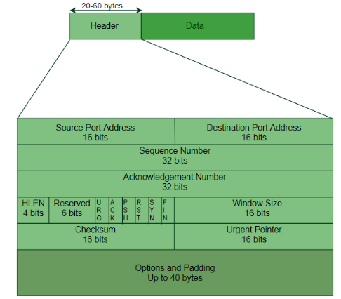
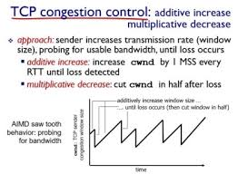

# 전송계층(Transport Layer)

> 프로토콜을 이해하려면 **헤더 필드**를 먼저 본다.  
> 헤더는 “필요 최소·최대 크기” 안에서 **표현 범위**를 갖도록 설계한다.

---

## 1. 전송계층의 역할

- **응용계층**과 **네트워크계층** 사이에서 동작한다.
- **End-to-End 통신**을 제공하며 **신뢰성·순서·오류 제어**를 담당한다.

---

## 2. 다중화(Multiplexing) · 역다중화(Demultiplexing)

| 구분               | 설명                                                                                                                                                 |
| ------------------ | ---------------------------------------------------------------------------------------------------------------------------------------------------- |
| **Multiplexing**   | 여러 애플리케이션(프로세스)에서 나온 데이터를 **하나의 네트워크 연결**로 합친다. 전송계층은 **포트 번호**를 부여해 *세그먼트*를 만든 후 전송한다. |
| **Demultiplexing** | 수신 세그먼트의 **포트 번호**를 확인해 **해당 애플리케이션**으로 정확히 전달한다.                                                                    |

---

## 3. UDP (User Datagram Protocol)

| 필드                               | 기능                  |
| ---------------------------------- | --------------------- |
| **Source Port / Destination Port** | 송신·수신 포트 번호   |
| **Length**                         | 헤더 + 데이터 총 길이 |
| **Checksum**                       | 오류 검출             |

- **비연결·비신뢰성** 특성으로 헤더가 **간단**하다.

---

## 4. RDT(신뢰성 전송) 프로토콜 발전

| 버전        | 핵심 아이디어                                        |
| ----------- | ---------------------------------------------------- |
| **rdt 1.0** | 채널이 **완전 신뢰**라고 가정한다.                   |
| **rdt 2.0** | 수신 측 **ACK/NAK 피드백**으로 오류를 수정한다.      |
| **rdt 2.1** | 피드백에도 오류 가능 → **시퀀스 번호**를 추가한다.   |
| **rdt 2.2** | NAK 제거, ACK + 시퀀스 번호만 사용한다.              |
| **rdt 3.0** | **타이머** 도입, 패킷·피드백 **유실** 시 재전송한다. |

---

## 5. TCP (Transmission Control Protocol)

### 5-1. 특성

- **점대점(Point-to-Point)**
- **신뢰성(Reliable)**
- **파이프라인(Pipelined)**
- **전이중(Full-Duplex)**
- **연결지향(Connection-Oriented)**
- **흐름제어(Flow-Controlled)**

### 5-2. 세그먼트 구조

| 필드                          | 설명                         |
| ----------------------------- | ---------------------------- |
| **Source / Destination Port** | 송·수신 포트                 |
| **Sequence Number**           | 바이트 단위 시퀀스 시작 번호 |
| **Acknowledgment Number**     | 다음에 기대하는 바이트 번호  |
| **Flags(SYN, ACK, FIN …)**    | 제어 비트                    |
| **Receive Window**            | 수신 버퍼 여유(Flow Control) |
| **Checksum**                  | 오류 검출                    |
| **Options**                   | MSS, 윈도우 스케일 등        |

### 5-3. 버퍼 & 윈도우

- **Send Buffer** : 재전송·순서 관리를 위해 보관
- **Receive Buffer** : 도착 세그먼트를 순서대로 적재
- **전송 윈도우** = `min(Receive Window, Congestion Window)`

### 5-4. 흐름제어 (Flow Control)

- 수신 측은 **Receive Window** 값을 헤더에 담아 송신 측에 알린다.
- 송신 측이 데이터가 없을 때도 **1 Byte Probe** 를 보내 창 크기를 확인한다.

### 5-5. Nagle 알고리즘

- **작은 세그먼트** 남발을 막기 위해 **RTT 동안** 모은 데이터가 MSS 이상이면 한꺼번에 전송, 미만이면 지연 전송한다.

### 5-6. 연결 설정 — 3-Way Handshake

1. **SYN** : 클라이언트 → 서버 (`seq = x`)
2. **SYN + ACK** : 서버 → 클라이언트 (`seq = y`, `ack = x+1`)
3. **ACK** : 클라이언트 → 서버 (`ack = y+1`)

> 1·2 단계는 헤더만, 3 단계부터 **데이터 전송**이 가능하다.

### 5-7. 혼잡제어 (Congestion Control)

- **Congestion Window(cwnd)** 단위 = **MSS**
- 전송 윈도우 = `min(rwnd, cwnd)`
- 네트워크 혼잡 시 패킷 손실(타임아웃, 중복 ACK)로 **cwnd를 줄이고**  
   정상 시 **점진적으로 늘린다** (“Additive-Increase, Multiplicative-Decrease”).
  

---

## 6. 핵심 용어 정리

| 용어                  | 의미                                            |
| --------------------- | ----------------------------------------------- |
| **세그먼트(Segment)** | 전송계층 데이터 단위(TCP/UDP)                   |
| **포트(Port)**        | 프로세스 식별 번호(0–65 535)                    |
| **MSS**               | Maximum Segment Size, 세그먼트 데이터 최대 길이 |
| **RTT**               | Round-Trip Time, 왕복 지연                      |
| **ACK / NAK**         | 긍정 / 부정 확인 응답                           |
