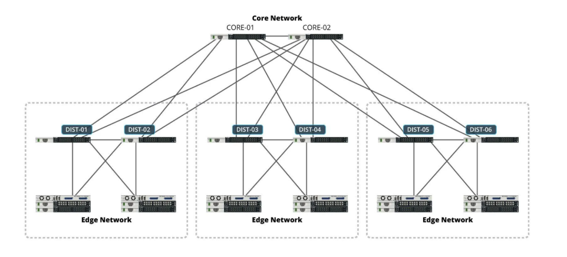
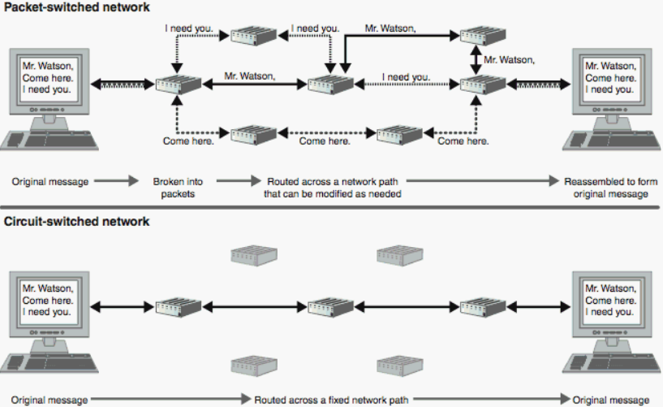

#  Computer Network Basics

컴퓨터 네트워크는 크게 **3가지 기본 프레임워크**로 설명할 수 있습니다.

---

## 1️⃣ Network Edge
- **구성 요소:** Application, Hosts (PC, 스마트폰, 서버 등)
- **역할:** 네트워크의 끝단에서 실제로 데이터를 생성하고 소비하는 주체
  - Client → User (웹 브라우저, 앱)
  - Server → 웹 서버, 게임 서버, 스트리밍 서버 등  
-  즉, 네트워크 엣지는 **네트워크를 이용하는 당사자들**이 위치한 부분입니다.

---

## 2️⃣ Network Core
- **구성 요소:** Routers
- **역할:**
  - 네트워크 엣지에서 온 데이터를 **빠르고 효율적으로 목적지로 전달**
  - 패킷 스위칭(Packet Switching) 기반
  - 경로 선택(Routing) 알고리즘 사용
  - 네트워크 자체는 데이터를 이해하지 않으며, 단지 최적 경로로 전달하는 역할
-  고속도로 역할에 비유할 수 있습니다 !

---

## 3️⃣ Access Networks & Physical Media
- **구성 요소:** Communication Links
- **역할:** 사용자의 호스트(엣지)와 네트워크 코어를 물리적으로 연결하는 구간
- **접속 네트워크 종류:**
  - 가정/사무실: 이더넷, 와이파이
  - 이동통신: LTE, 5G
  - ISP 제공: 광케이블, DSL
- **물리 매체 예시:** UTP 케이블, 동축 케이블, 광케이블, 무선 전파

---

# 🔄 Circuit Switching vs Packet Switching

## ✔ Circuit Switching
- **개념:** 통신 시작 전에 두 단말 간 전용 경로(회선)를 예약
- **특징:**
  - 전송 중 다른 사용자와 경로 공유 ❌ (독점적 사용)
  - 연결(Setup) 시간 필요
  - 지연이 일정 (QoS 보장)
- **Ex:** 옛날 유선 전화망, LTE 음성통화
- ✅ Pros: 안정적, QoS 보장  
- ❌ Cons: 비효율적 (대기 중에도 회선 자원 차지)

---

## ✔ Packet Switching
- **개념:** 메시지를 잘게 쪼개 패킷 단위로 전송, 각 패킷은 라우터를 거쳐 독립적으로 경로 선택
- **특징:**
  - 전용 회선 없음 → 자원 효율적 사용
  - 혼잡 시 지연 발생 가능
  - 패킷 순서 뒤바뀔 수 있음
- **Ex:** 인터넷(IP 네트워크), 이메일, 웹 브라우징
- ✅ Pros: 효율적, 자원 공유 가능  
- ❌ Cons: 혼잡 시 큐잉 지연 발생, QoS 보장 어려움

---

#  Nodal Delay (라우터에서의 지연 요소 4가지)

## (1) Processing Delay (처리 지연)
- 패킷 헤더 검사, 목적지 확인, 오류 검사 등에 소요
- 일반적으로 **μs 수준** (짧음)
- 좋은 라우터 사용 → 지연 감소 가능

---

## (2) Queuing Delay (큐잉 지연)
- 패킷이 큐(버퍼)에서 대기하는 시간
- 네트워크 혼잡 상태에 따라 **ms ~ 초 단위**까지 증가 가능
- 가장 **예측 불가하고 큰 지연 요인**

---

## (3) Transmission Delay (전송 지연)
- 패킷을 링크로 내보내는 데 걸리는 시간  
- 계산식: `L / R`  
  - L = 패킷 길이 (bits)  
  - R = 링크 전송률 (bps)  
- 회선 대역폭 증설 시 지연 완화 가능  
- 예: 1,000bit 패킷을 1Mbps 회선으로 보낼 때 → 1ms

---

## (4) Propagation Delay (전파 지연)
- 신호가 매체(광섬유, 구리선, 무선)를 따라 전달되는 시간  
- 계산식: `d / s`  
  - d = 거리 (m)  
  - s = 전파 속도 (~2×10^8 m/s, 광섬유에서 빛 속도 수준)  
- 거리 기반 → 서울 ↔ 미국 약 10,000km → 최소 50ms  
- 물리적으로 줄이기 어려움 (케이블 단축, 더 빠른 매체 필요)

---

#  Summary
- **네트워크 프레임워크:**  
  - Edge (데이터 생성/소비), Core (라우터), Access & Media (물리적 연결)
- **전송 방식:**  
  - Circuit Switching (안정적, 비효율적)  
  - Packet Switching (효율적, 혼잡 시 지연 발생)
- **Nodal Delay:**  
  - Processing, Queuing, Transmission, Propagation
