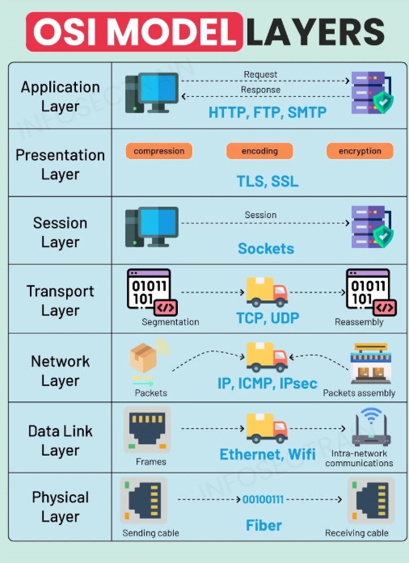

# OSI 7계층 (Open Systems Interconnection)

> 네트워크 통신을 계층화해서 각 단계별로 역할을 나눠놓은 국제 표준 모델

---

## 📚 OSI 7계층 요약

| 계층 | 이름 | 주요 기능 | 관련 장비 / 프로토콜 |
|------|------|----------|---------------------|
| 7 | Application | 사용자와 가장 가까운 계층. 웹, 이메일 등 실제 서비스 제공 | HTTP, FTP, DNS 등 |
| 6 | Presentation | 데이터 형식, 인코딩, 압축, 암호화 | SSL/TLS, JPEG, MP3 |
| 5 | Session | 세션 생성, 유지, 종료 관리 | NetBIOS, PPTP |
| 4 | Transport | 신뢰성 있는 데이터 전송, 포트 번호 사용 | TCP, UDP |
| 3 | Network | IP 기반 라우팅, 패킷 전송 | IP, ICMP, 라우터 |
| 2 | Data Link | MAC 주소 기반 프레임 전송, 오류 제어 | 스위치, 브리지 |
| 1 | Physical | 0과 1의 비트 전송, 물리적 매체 | 케이블, 허브 |

---

## 🧭 각 계층 상세 설명

### 🔹 1계층 – 물리 계층 (Physical Layer)

- 0과 1의 비트 스트림을 전기적/광학적으로 전송  
- 장비: 허브, 리피터, 전선, 광케이블

---

### 🔹 2계층 – 데이터 링크 계층 (Data Link Layer)

- MAC 주소 기반으로 프레임 단위 전송  
- 같은 네트워크 내 장비 간 통신  
- 오류 감지, 흐름 제어  
- 장비: 스위치, 브리지

---

### 🔹 3계층 – 네트워크 계층 (Network Layer)

- IP 주소 기반으로 라우팅  
- 목적지까지의 경로 설정  
- 패킷 단위 전송  
- 프로토콜: IP, ICMP, IGMP  
- 장비: 라우터

---

### 🔹 4계층 – 전송 계층 (Transport Layer)

- 신뢰성 있는 데이터 전송 보장  
- 세그먼트 단위 데이터 처리  
- 프로토콜: TCP(신뢰성 有), UDP(속도 우선)  
- 포트번호 사용: 80(HTTP), 443(HTTPS)

---

### 🔹 5계층 – 세션 계층 (Session Layer)

- 통신을 위한 세션 생성, 유지, 종료  
- 데이터 교환 시 순서 제어 및 동기화  
- 예시: NetBIOS, PPTP

---

### 🔹 6계층 – 표현 계층 (Presentation Layer)

- 데이터 형식/인코딩/압축/암호화 처리  
- 시스템 간 데이터 표현 형식 맞춤  
- 예시: SSL/TLS, JPEG, MP3

---

### 🔹 7계층 – 응용 계층 (Application Layer)

- 사용자와 가장 가까운 계층  
- 웹, 이메일, 파일전송 등 실제 서비스 제공  
- 프로토콜: HTTP, HTTPS, FTP, SMTP, DNS

---

## 🧪 시나리오 예시

> 내가 크롬 브라우저에서 `www.ssafy.com`에 접속하면?

1. **Application Layer** – HTTP 요청 생성 (GET /index.html)
2. **Presentation Layer** – UTF-8 인코딩, TLS 암호화
3. **Session Layer** – SSL 세션 생성 및 유지
4. **Transport Layer** – TCP로 분할, 포트번호 부여 (443)
5. **Network Layer** – IP 설정, 패킷 생성
6. **Data Link Layer** – MAC 주소 부여, 프레임 생성
7. **Physical Layer** – 비트 신호로 변환 → 전송

📥 서버에서는 이걸 역순으로 다시 처리하여 응답!

---

## ❓ 면접 예상 질문 및 답변

### Q1. OSI 7계층이 무엇인가요?

OSI 7계층은 ISO에서 정의한 네트워크 통신의 계층 구조로, 각 계층은 특정 역할을 담당하여 기능을 분리합니다. 설계와 디버깅이 쉬워지고, 모듈화된 시스템 구축에 용이합니다.

---

### Q2. TCP/IP 모델과의 차이점은?

| 항목 | OSI 7계층 | TCP/IP 4계층 |
|------|-----------|---------------|
| 목적 | 이론적 모델 | 실질 구현 중심 |
| 계층 수 | 7개 | 4개 |
| 응용 계층 | 세분화됨 (Application/Presentation/Session) | 통합 |

---

### Q3. HTTP 요청이 OSI 7계층에서 어떻게 처리되나요?

1. Application – 요청 생성 (GET 등)  
2. Presentation – 인코딩, 암호화  
3. Session – 세션 생성  
4. Transport – TCP 세그먼트로 분할  
5. Network – IP 패킷 생성  
6. Data Link – MAC 프레임 생성  
7. Physical – 비트 신호 전송

---

### Q4. MAC 주소 vs IP 주소

| 구분 | MAC 주소 | IP 주소 |
|------|----------|---------|
| 부여 | 하드웨어 내장 | 네트워크에서 할당 |
| 구조 | 48비트 (16진수) | IPv4: 32비트, IPv6: 128비트 |
| 사용 | 같은 네트워크 내 | 전 세계 라우팅 |

---

### Q5. TCP와 UDP의 차이

| 항목 | TCP | UDP |
|------|-----|-----|
| 연결 방식 | 연결 지향 | 비연결 |
| 신뢰성 | 높음 | 낮음 |
| 속도 | 느림 | 빠름 |
| 용도 | 웹, 이메일, 파일전송 | 게임, 스트리밍, VoIP |

---

🧠 TCP는 신뢰성 있는 연결을 보장하지만 느리고,  
⚡ UDP는 빠르지만 손실이 발생할 수 있음. 용도에 따라 선택됨.

---

## 💡 응용 계층 (7계층) 심화 정리

### ✅ 응용 계층의 주요 역할

- 네트워크 통신의 **출발지이자 종착지**
- 브라우저, 메일, 메신저, FTP, 게임 등 **실제 사용자가 접하는 네트워크 서비스**를 담당
- 사용자와 네트워크 간 **인터페이스** 제공

---

### ✅ 주요 프로토콜 및 쓰임새

| 프로토콜 | 설명 | 사용 예시 |
|----------|------|-----------|
| **HTTP** | 웹페이지 요청/응답 | 브라우저에서 웹사이트 접속 |
| **HTTPS** | HTTP + TLS 보안 연결 | 로그인, 결제 등 민감한 데이터 통신 |
| **FTP** | 파일 업로드/다운로드 | FTP 서버 파일 관리 |
| **SMTP** | 메일 전송 | 이메일 발신 |
| **POP3** | 메일 수신 (다운로드) | 메일 다운로드 후 삭제 |
| **IMAP** | 메일 수신 (동기화) | 메일 서버와 다중기기 동기화 |
| **DNS** | 도메인 → IP 주소 변환 | www.naver.com → IP 주소 |
| **SSH** | 보안 원격 접속 | 서버 관리, 원격 터미널 접속 |

---

### ✅ 클라이언트가 응답을 어디서부터 받아들이는가?

1. 사용자가 주소 입력 → HTTP 요청 생성
2. 서버로 전송 → 서버는 이를 응용 계층에서 받아들임
3. HTTP 헤더와 바디를 파싱하여 요청 처리  
4. HTML, CSS, JS 등의 응답을 생성 후 다시 응용 계층에서 클라이언트로 전송

---

## 🔥 면접 자주 나오는 심화 질문

### Q1. HTTP vs HTTPS 차이

| 항목 | HTTP | HTTPS |
|------|------|-------|
| 암호화 | ❌ 없음 | ✅ SSL/TLS 적용 |
| 포트 | 80 | 443 |
| 보안성 | 낮음 | 높음 |
| 용도 | 블로그, 뉴스 | 결제, 로그인 등 민감한 정보 송수신 |

---

### Q2. SMTP, POP3, IMAP 차이

| 프로토콜 | 역할 | 특징 |
|----------|------|------|
| SMTP | 메일 송신 | 메일 전송 전용 |
| POP3 | 메일 수신 | 다운로드 후 서버에서 삭제 |
| IMAP | 메일 수신 | 동기화 방식으로 여러 기기 동시 사용 가능 |

---

### Q3. DNS란 무엇인가요?

- 도메인명을 → IP 주소로 바꿔주는 서비스  
- 예: `www.ssafy.com` → `203.255.112.5`  
- 응용 계층에서 **DNS 요청**을 만들어 전송하고, **응답 받은 IP 주소로 서버와 통신 시작**

---

### Q4. 응용 계층 요청은 어떻게 전달되고, 어디서 처리되나요?

- 사용자가 요청한 데이터는 → 응용 계층에서 시작
- 전송 계층, 네트워크 계층을 거쳐 → 서버에 도착
- 서버는 1계층 → 7계층으로 역순 처리 후, 응용 계층에서 요청 파싱
- HTML 응답 등을 다시 7 → 1계층 거쳐 클라이언트로 전달

---

## ✅ 정리

- **응용 계층은 네트워크 통신의 출발점이자 도착점**
- 우리가 자주 사용하는 웹, 메일, 파일 전송 등은 전부 응용 계층의 범주
- **HTTPS, DNS, SMTP/IMAP** 등은 면접과 실무에서 핵심
- OSI 7계층 모델은 네트워크를 이해하는 데 있어 **기초이자 핵심 틀**

---

> 📌 참고: OSI는 개념 모델, TCP/IP는 실제 구현.  
> **이론은 OSI로 설명하고, 실제 구현은 TCP/IP 기준으로 간다!**