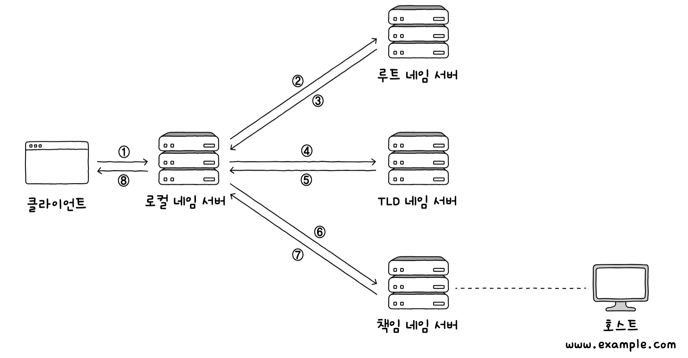
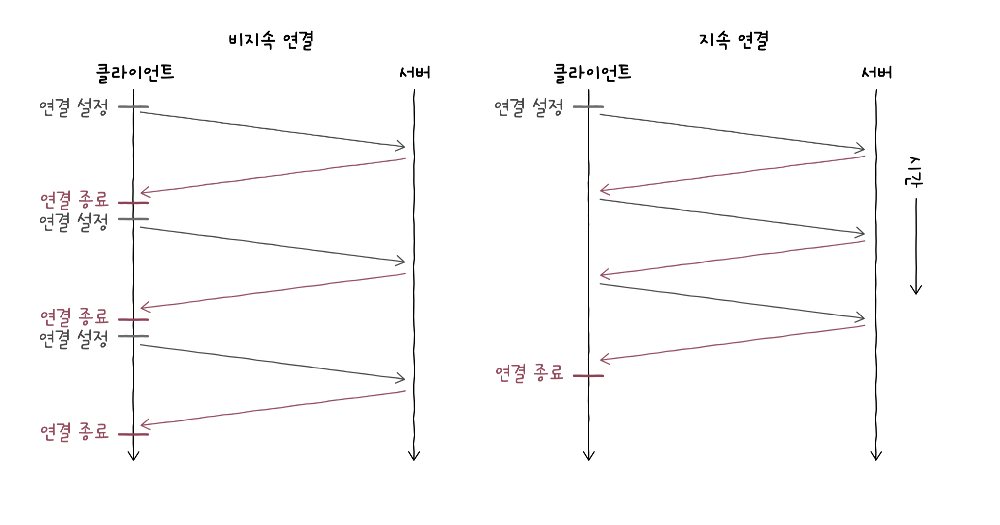

# 💻 Application Layer (응용 계층)


## 1. Application Layer란?

- OSI 7계층 중 **최상위 계층 (7계층)**  
- 사용자가 직접 사용하는 **응용 프로그램과 네트워크 간 인터페이스** 담당  
- 웹 브라우저, 이메일 클라이언트, FTP 클라이언트 등 **응용 소프트웨어가 사용하는 계층**  
- 데이터 단위: `Message`

> 실제 데이터를 생성하거나 사용자 요청을 처리하며, 하위 계층에 데이터를 전달함
> 
## 2. 주요 역할

- **서비스 위치 확인**: 원하는 서비스 위치 파악 (ex. DNS)
- **자원 접근 제어**: 인증, 인가 등 권한 처리
- **데이터 변환**: 인코딩, 압축 등 데이터 포맷 맞춤
- **오류 처리**: 애플리케이션 간 통신 오류 복구/보고


## 3. 대표 프로토콜

| 프로토콜 | 설명 |
|----------|------|
| HTTP / HTTPS | 웹 페이지, REST API 요청 |
| SMTP / POP3 / IMAP | 이메일 송수신 |
| FTP / SFTP | 파일 전송 |
| DNS | 도메인 → IP 주소 변환 |
| DHCP | 동적으로 IP 할당 |
| Telnet / SSH | 원격 서버 접속 |
| SNMP | 네트워크 장비 관리 |


## 4. DNS

네트워크 상에서 어떤 호스트를 특정하기 위해서 `IP 주소`를 사용한다.

그러나 모든 호스트의 IP 주소는 가변적이고 기억하고 있을 수 없기 때문에 상대 호스트를 특정하기 위해서 IP 주소보다 **도메인 네임**을 사용한다. 여기서 도메인 네임은 우리가 주로 사용하는 www.google.com 등을 말한다.

이러한 도메인 네임과 IP 주소를 네임 서버에서 관리하는데, 이러한 도메인 네임을 관리하는 네임 서버를 **DNS 서버**라고 부르는 것이다.


네임 서버를 관리하는 방법은 다음과 같다.

```text
www.google.com
```

위와 같은 도메인 주소가 있다고 할 때 최상단에 `root domain`이 있고, 그 다음에는 최상위 도메인 `TLD`, 그 다음 도메인 이렇게 계속 이어진다.


일반적으로 알고 있는 도메인 네임의 마지막 부분을 최상위 도메인, 줄여서 TLD 라고 한다.

위의 www.google.com을 예시로 하면, 최상위 도메인은 `com` 이 되는 것이다.

최상위 도메인의 하부 도메인은 **2단계 도메인**이라고 하며, `google`이 이에 해당된다.

`www` 는 3단계 도메인으로 불리며, 도메인의 단계는 이보다 더 늘어날수도 있지만 일반적으로는 3~5단계로 이루어져있다.

이러한 도메인 네임이 계층적인 형태를 띠는 것 처럼 네임 서버 또한 계층적인 형태를 이루며, 이러한 분산된 도메인 네임에 대한 관리 체계를 도메인 네임 시스템, DNS 라고 부르는 것이다.

### 계층적 네임 서버

우리가 IP 주소를 모를 때, 도메인 네임에 대응되는 IP 주소를 알아내는 과정을, resolving 한다. 라고 한다.

이 과정에서 다양한 네임 서버들이 사용되는데, 로컬 네임 서버, 루트 네임 서버, TLD 네임 서버, 책임 네임 서버로 크게 네 가지로 구분된다.


먼저, **로컬 네임 서버**는 클라이언트와 맞닿아 있는 네임 서버로, 클라이언트가 도메인 네임을 통해 IP 주소를 알아내고자 할 때 가장 먼저 찾게 되는 네임 서버이다.

보통 로컬 네임 서버의 주소는 일반적으로 ISP에서 할당해주거나, 공개 DNS 서버를 이용할 수 있다.

만약에 클라이언트가 로컬 네임 서버에게 특정 도메인에 대응되는 IP 주소를 물어봤을 때, 알고 있다면 그 주소를 알려주고, 모른다면 루트 네임 서버에게 해당 도메인 네임을 질의하게 된다.

위와 같은 방식으로 TLD 네임 서버에 없다면, 책임 네임 서버로 다시 질의를 보내는데 이 과정에서 **재귀적 질의**와 **반복적 질의**가 존재한다.

### 재귀적 질의
클라이언트가 로컬 네임 서버에게 도메인 네임을 질의하면, 로컬 네임 서버가 루트 네임 서버에게 질의하고, 루트 네임 서버가 다시 TLD 네임 서버에게, 또 TLD 네임서버가 다음 단계에 질의하는 과정을 반복하며 최종 응답 결과를 역순으로 전달받는 방식이다.


### 반복적 질의
반복적 질의는 클라이언트가 로컬 네임 서버에게 IP 주소를 알고 싶은 도메인 네임을 질의하면, 로컬 네임 서버가 루트 도메인 서버에게 질의해서 다음으로 질의할 네임 서버의 주소를 응답받고, 다음으로 TLD 네임 서버에게 질의할 네임 서버의 주소를 응답받는 과정을 반복후, 최종 응답 결과를 클라이언트에게 알려 주는 방식이다.



그러나 위와 같이 도메인 네임을 리졸빙 하다보면 너무 많은 단계를 거치는데, 실제로는 네임 서버들이 기존에 응답받은 결과를 임시로 저장했다가, 같은 질의에 대해 재활용하는 경우가 있는데 이를 DNS 캐시 라고 한다.

## 5. HTTP

| 응용 계층에서 정보를 주고받는 데 사용되는 프로토콜

### 요청-응답 기반 Protocol

HTTP는 '클라이언트-서버' 구조 기반의 요청-응답 프로토콜이다.

클라이언트가 서버에게 요청 메시지를 전송하고, 서버는 클라이언트에게 요청에 대한 응답 메시지를 전송하는 형태이다.

그렇기에 같은 HTTP 메시지일지라도 HTTP 요청 메시지와 HTTP 응답 메시지는 메시지 형태가 다르다.

### 미디오 독립적 프로토콜

HTTP가 요청하는 대상은 자원이라고 한다. HTTP는 자원의 특성을 제한하지 않으며, 자원과 상호작용하는데 사용할 수 있는 인터페이스를 정의할 뿐이며, 대부분의 자원은 URI로 식별된다.

정리하자면, HTTP는 주고받을 자원의 특성과 무관하게 그저 자원을 주고받을 수단(인터페이스)의 역할만을 수행하기에 미디어 독립적 프로토콜이라는 특성을 가진다.

### Stateless 프로토콜

HTTP는 상태를 유지하지 않는 Stateless 프로토콜이다. 이는 서버가 HTTP 요청을 보낸 클라이언트와 관련된 상태를 기억하지 않는다는 의미이며, 그렇기 때문에 클라이언트의 모든 HTTP 요청은 기본적으로 독립적인 요청으로 간주된다.

그렇다면 이게 왜 효율적이냐?

1. HTTP 서버는 일반적으로 많은 클라이언트와 동시에 정보를 주고받을텐데, 이러한 상황에서 모든 클라이언트의 상태 정보를 유지하는 것은 서버에 부담이 된다.
2. 서버는 보통 여러대로 구성되기 때문에, 이러한 상황에서 모든 서버가 모든 클라이언트의 상태를 유지할 경우 클라이언트가 여러 서버를 동시에 이용하기 어려워진다.

### 지속 연결 프로토콜
초기의 HTTP 버전에서는 3-way handshake를 통해 TCP 연결을 수립한 후, 요청에 대한 응답을 받으면 연결을 종료하는 방식으로 동작하고, 추가적인 요청과 응답을 위해서는 다시 TCP 연결이 필요했는데 이러한 방식은 비지속 연결이라고 한다.

그러나 최근 사용되는 HTTP 버전에서는 지속 연결이라는 기술을 제공하며, keep-alive 라고도 부른다.
이는 하나의 TCP 연결상에서 여러 개의 요청-응답을 주고받을 수 있는 기술이다.


