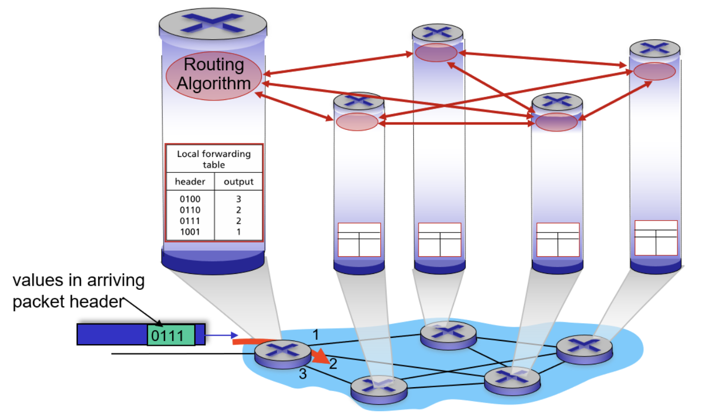
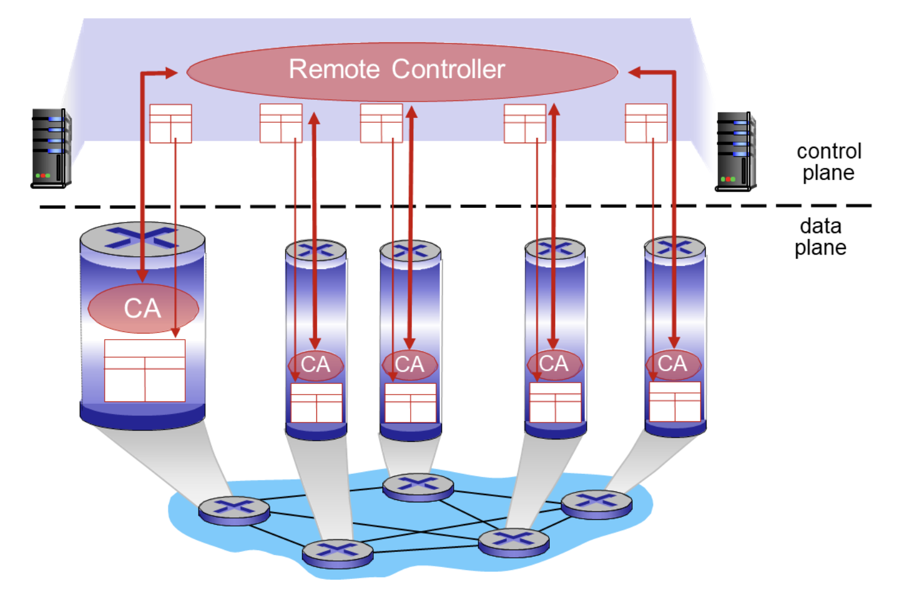
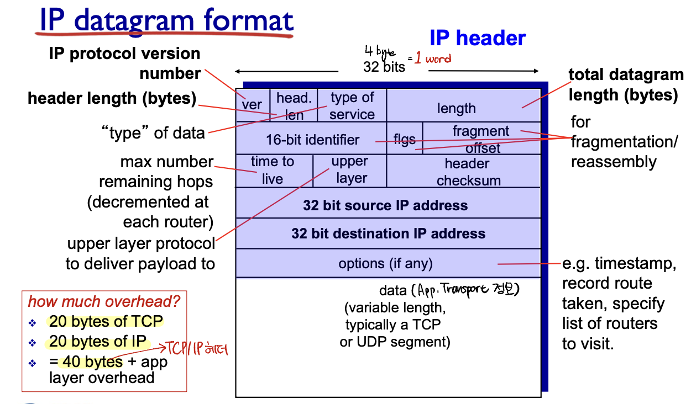
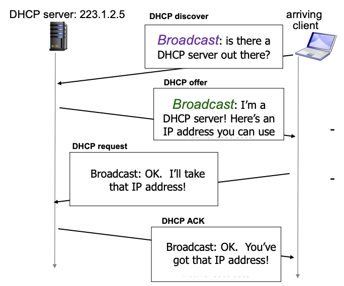
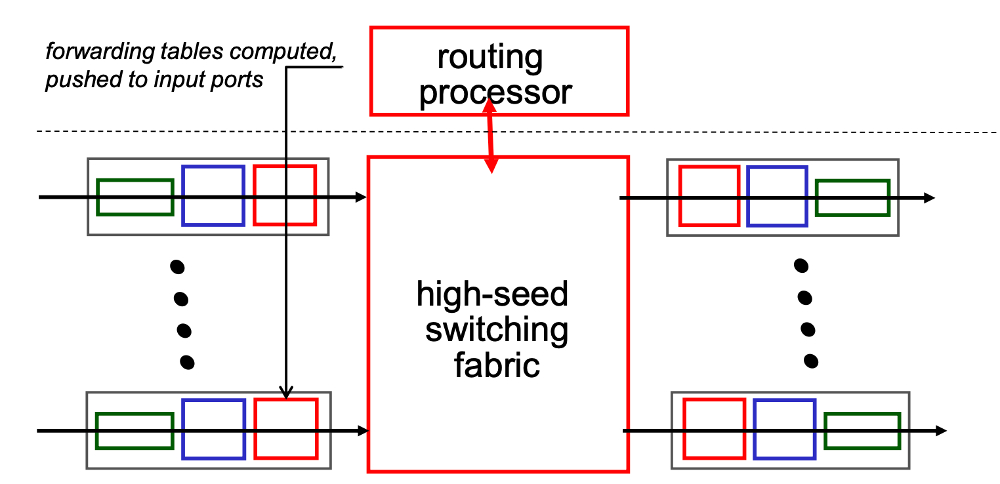
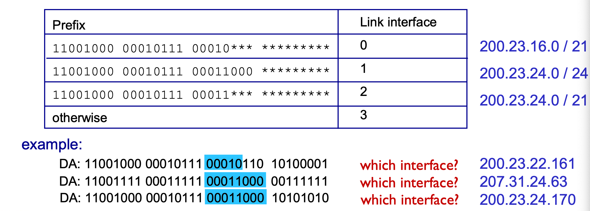
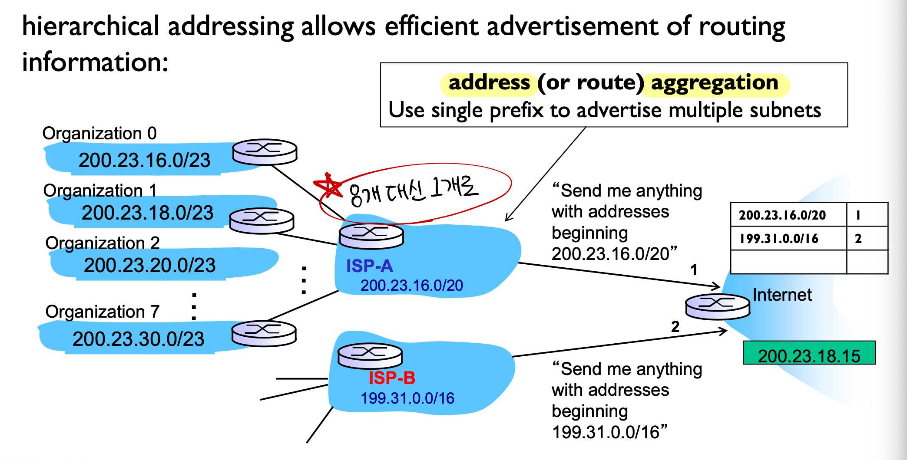
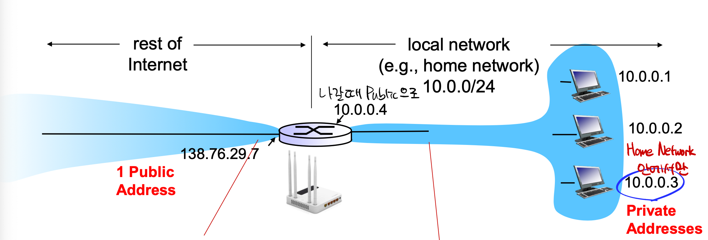
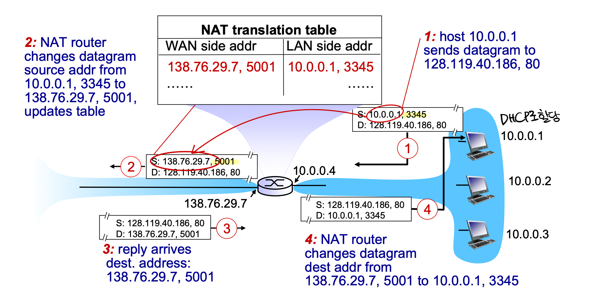

# 🌐 Network Layer (네트워크 계층)

## Control plane

우리가 자주 듣는 `Routing` 이라는 길을 찾는 과정은 **Control Plane**에서 일어난다.
전송하려고 하는 패킷들이 출발지에서 도착지로 가기까지의 전체적인 경로를 짜주고 라우팅 알고리즘을 사용해서 길을 짜주는 것이며 네트워크 전체에 걸쳐 경로가 결정되고 동기화되는 과정이다.

라우팅 알고리즘은 크게 전통적인 분산형 라우팅과 SDN(Software Defined Networking) 기반 중앙집중형 라우팅으로 나눌 수 있다.

### 전통적인 라우팅

모든 라우터가 Control Plane을 내장하고 있으며, 각자 라우팅 알고리즘(OSPF, RIP, BGP 등)을 실행하여 라우팅 테이블을 계산한다.
<br/>계산된 라우팅 테이블은 **Forwarding Table(FIB)** 로 변환되어 Data Plane에서 포워딩에 사용된다.

### SDN 방식<br>

각 라우터(혹은 스위치)는 Control Plane 기능 대신 `Control Agent`만을 가지고, 중앙 SDN 컨트롤러가 네트워크 전체 토폴로지를 기반으로 라우팅 알고리즘을 실행한다.<br>
<br/>컨트롤러가 생성한 포워딩 테이블을 각 장비에 내려주며, 장비는 받은 테이블을 바탕으로 Data Plane에서 패킷을 포워딩한다.

네트워크 전체에 걸쳐서 경로가 결정된다는 말은 한 라우터만 관여하는게 아니라 출발지에서 도착지로가기까지 모든 라우터에 걸쳐서 길이 정해진다는 뜻이다.

#### SDN의 장점
비용 절감

제어하는 부분이 여러 네트워크 장비를 제어할 수 있기 때문에 관리가 간소화 되며 운영에 들어가는 비용이 줄어든다.

각 장비의 사양을 각각의 기능에 최적화 시킬 수 있으므로 리소스의 낭비가 적다.

확장성 및 유연성

SDN은 네트워크를 가상화하는 기술을 사용하기 때문에 물리적인 리소스의 한계에 구애받지 않고 원하는 시기에 필요한 만큼 네트워크 리소스를 확장하거나 축소할 수 있다.

### SDN의 계층

```
[ 응용 계층 (L7) ]   ← SDN 컨트롤러 (제어 기능)
       ↓
[ 네트워크 계층 (L3) ] ← IP 라우팅 제어
[ 데이터 링크 계층 (L2) ] ← MAC 기반 포워딩 제어
       ↓
[ 물리 계층 (L1) ] ← 실제 데이터 전송은 여기서

```

## IP

### IP 인터페이스

IP 인터페이스는 호스트나 라우터가 물리적 링크 (이더넷, 와이파이, 등) 과 연결되는 지점을 말한다.

### IPv4

`IPv4` 는 32-bit 로 이루어진 주소체계를 말하며 약 43억개가 가능하다. 8비트씩 4개의 옥텟으로 표현한다.

주소는 크게 세가지로 구분되는데 네트워크 부분, 호스트 부분, 서브넷 마스크로 구분된다.

    •	네트워크 부분 (Network ID): 해당 장치가 속한 네트워크 식별
    •	호스트 부분 (Host ID): 네트워크 내 개별 장치 식별
    •	서브넷 마스크로 네트워크/호스트 구분 (예: 255.255.255.0)

이렇게 구분하는 이유에 대해서 생각해보아야 하는데 만약에 네트워크 부분을 구별하지 않고 그냥 맘대로 쓴다고 해보면 라우터는 모든 호스트 주소를 개별적으로 저장해야 해서 확장성이 떨어지게 된다.

그래서 주소를 네트워크별로 묶는 방식이 필요한 것이다.

### 서브넷

위에서 말한 서브넷에 대해서 알아보자.

서브넷은 라우터를 거치지 않고 물리적으로 직접 통신할 수 있는 장치들의 집합으로, 같은 네트워크에 속한 친구들을 말한다.

### Prefix

Prefix는 `a.b.c.d/x` 의 형식이다.

여기서 `/x` 가 뜻하는 것은 IP주소 체계에서 네트워크 부분이 **x비트 만큼 차지한다**는 것을 말한다.

이렇게 Prefix를 설정해 놓는 것이 무슨 의미가 있냐면 라우팅 테이블을 구성할 때 모두 개별적으로 저장하는 것이 아닌 특정 prefix만 저장해서 라우팅을 할 수 있게 된다.

이렇게 된다면 당연히 Prefix가 길 수록 호스트 부분이 가질 수 있는 bit 수는 줄어들기 때문에 Prefix와 Host는 반비례 관계를 가지게 된다.

예시) prefix가 24-bit 라면 host는 8-bit 만큼만 차지

### IP datagram format



위의 그림은 IP 데이터그램의 형식에 대해서 설명한 그림이다.

#### 1. ver (Version number)
- IP 버전을 나타낸다.
- IPv4이면 4, IPv6이면 6으로 표시한다.

#### 2. head. len (Header length)
- IP 헤더의 길이를 32비트 word 단위로 표시한다.
- 최소 20바이트를 가지며 "IP options" 사용 시 더 길어질 수 있음

#### 3. type of service (TOS)
- 서비스 품질(QoS) 관련 정보
- 지연, 처리량, 신뢰성 등의 우선순위를 표시

#### 4. total length
- 전체 IP 데이터그램 길이 (헤더 + 데이터)
- 단위: 바이트
- 최대 65,535바이트 (2^16 - 1)
- 네트워크에서 패킷 크기 판단 및 분할 시 기준

#### 5. 16-bit identifier
- 패킷을 식별하는 ID
- 특히 단편화시 재조립에 사용
- 재조립할 때 이 번호가 같으면 같은 원본 패킷의 조각임을 알 수 있음!!

#### 6. flags (flgs)
- 단편화 관련 제어 비트
  - 첫번째 비트 : 예약(항상 0)
  - DF(Don’t Fragment): 이 비트가 1이면 단편화 금지
  - MF(More Fragments): 이 비트가 1이면 뒤에 조각이 더 있음을 뜻하고, 마지막 조각이면 0으로 설정

#### 7. fragment offset
- 단편화된 조각이 원래 데이터에서 어디에 위치하는지 표시
- 8바이트 단위
- 재조립 시 이 값을 기준으로 올바른 순서로 조합함

#### 8. time to live (TTL)
- 패킷이 네트워크에서 살 수 있는 최대 홉 수
- 라우터를 한 번 지날 때마다 1 감소, 0이 되면 폐기

#### 9. upper layer (Protocol)
- 상위 계층 프로토콜 지정
- 예: TCP(6), UDP(17), ICMP(1)

#### 10. header checksum
- IP 헤더 오류 검출을 위한 체크섬
- 각 홉에서 재계산됨

#### 11. 32-bit source IP address
- 출발지 IP 주소

#### 12. 32-bit destination IP address
- 목적지 IP 주소

#### 13. options (if any)
- 선택적으로 들어가는 필드
- 예: 타임스탬프, 경로 기록, 특정 라우터 지정

#### 14. data (payload)
- 전송할 실제 데이터
- 상위 계층(TCP/UDP 세그먼트 등)의 내용이 여기에 포함됨

### IP Fragmentation & Reassembly

#### 왜 Fragmentation 필요한가?

네트워크마다 허용하는 최대 전송 단위인 **MTU (Maximum Transmission Unit)**가 다르다.

MTU보다 큰 IP 패킷은 전송할 수 없기 때문에, 패킷을 여러 조각으로 쪼개서 보내야하기 때문에 **Fragmentation** 이 필요하다.

#### Fragmentation 과정

예를 들어 이더넷의 MTU는 1500byte 인데 내가 4000byte짜리 데이터를 보낸다고 해보자.
그러면 데이터를 조각을 내면 되는데 헤더가 20바이트를 차지하기 때문에 20바이트를 제외하고 첫번째 조각은 오프셋 0, 데이터는 1480 바이트를 차지하고 MF = 1로 설정을 한다.
두번째 조각은 오프셋은 185 (1480 / 8), 데이터는 또 1480 byte, MF = 1로 설정을 한다.
세번째 조각은 남은 데이터는 1040bvyte이고 오프셋은 370, MF는 마지막 조각이기 때문에 9으로 설정하면 된다.

#### Reassembly 과정

목적지 호스트는 동일한 `Identification` 번호와 출발지/목적지 IP를 가진 조각들을 모으고
`Fragment Offset` 정보를 이용해서 원래 순서대로 데이터를 재배치한다. 모든 조각이 도착하고 `MF = 0` 인 마지막 조각까지 받으면 완전한 패킷을 복원할 수 있다.

### IP Header Checksum

#### 체크섬 계산

IP 헤더가 전송 중에 손상되었는지 검사하기 위한 오류 검출 코드이다.

체크섬은 16비트 단위로 IP 헤더의 모든 16비트 워드를 더하고, 결과가 16비트를 넘으면 초과비트는 다시 더해준다.

이때 나온 합의 1의 보수를 구하는데 이것이 체크섬 값이 되고 이 값을 체크섬 필드에 넣고 전송한다.

#### 체크섬 검증

수신 측은 동일한 계산을 수행해서 헤더 전체 체크섬 합을 구하고 이 값의 모든비트가 1이면 오류가 없다는 것을 확인하고, 아니라면 패킷을 폐기하게 된다.

#### 체크섬 재계산 필요성

그러나 IP 헤더 중 TTL은 라우터를 지날 때마다 1씩 감소하므로, TTL이 바뀌면 체크섬도 다시 계산해서 갱신해야 한다.

#### 한계 및 문제점

만약에 1비트만 오류가 있다면 잡아낼 수 있지만 여러 개의 비트 오류가 서로 상쇄되었다면 검출을 못할 수도 있다.

### Classful Addressing (고전 IP 주소 체계)

### 개요
- **정의**: IPv4 주소를 **고정된 클래스(A/B/C/D/E)**로 나눠 네트워크/호스트 비트를 **정해진 규칙**으로 나누던 초기 방식이다.
- **특징**:
  - 클래스별 **기본 서브넷 마스크**가 고정됨(예: Class C = /24).
  - **VLSM/CIDR 없음** → 네트워크 크기 조절이 비유연.
  - RIP v1 등 **classful 라우팅 프로토콜**은 프리픽스를 광고하지 않고 “클래스”를 기준으로 해석.

---

### 클래스와 범위

| 클래스 | 첫 비트 패턴 | 첫 옥텟 범위 | 기본 마스크 | 네트워크/호스트 비트 | 각 네트워크 당 호스트 수* | 용도 |
|---|---|---|---|---|---:|---|
| A | `0` | 0–127 | 255.0.0.0 (/8) | N=8 / H=24 | 16,777,214 | 대규모 |
| B | `10` | 128–191 | 255.255.0.0 (/16) | N=16 / H=16 | 65,534 | 중규모 |
| C | `110` | 192–223 | 255.255.255.0 (/24) | N=24 / H=8 | 254 | 소규모 |
| D | `1110` | 224–239 | - | - | - | 멀티캐스트 |
| E | `1111` | 240–255 | - | - | - | 실험용(예약) |

> 호스트 수는 네트워크 주소(.0)와 브로드캐스트 주소(.255) 2개 제외 기준.

#### Subsnet (Classful Addressing 기준)
- 기본 마스크에서 **호스트 비트 일부를 빌려 서브넷**을 만들 수 있음(예: Class B 255.255.0.0 ➜ 255.255.255.0).
- 그러나 **classful 라우팅**은 다른 네트워크로 서브넷 정보를 넘길 때 프리픽스 길이를 전송하지 않아,
  **네트워크 경계(major network 경계)** 밖에서는 서브넷 정보가 사라짐 → **VLSM 불가**.

#### 한계
1. **주소 낭비**: 조직 규모와 상관없이 A/B/C 중 하나를 통째로 받아야 했음
2. **유연성 부족**: 프리픽스 길이를 자유롭게 조절 불가(VLSM X)
3. **라우팅 테이블 비대화**: 경로 집계(summarization)가 제한적
4. **상호운용성 문제**: classful 프로토콜은 프리픽스를 광고하지 않아 설계에 제약

### IPv6
기존이 IPv4의 개수적 제한 때문에 나온 IPv6 버전이다.

IPv6는 기존의 32비트와는 달리 128비트 주소 공간를 가지기 때문에 3.4 * 10^38 (사실상 무한개)에 가까운 주소를 할당 가능하다.

그렇다고 현재 우리가 쓰고 있는 IPv4 주소 체계를 바로 전환하기는 힘든데 그 이유는 모든 라우터가 동시에 업그레이드하는 것은 불가능하고 호환성 유지가 필요하기 때문이다.

#### Encapsulation & Tunneling

그래서 나온 개념이 `Encapsulation` 이라는 개념이다.

IPv6 패킷을 IPv4 패킷 안에 **페이로드(payload)**로 넣어 IPv4 네트워크를 통과시키는 방식으로, 서로 다른 프로토콜 환경에서 데이터를 전달할 수 있도록 포장하는 과정이다.

`Tunneling`은 Encapsulation의 한 형태로, IPv6 네트워크와 IPv6 네트워크 사이를 IPv4 네트워크가 가로막고 있을 때 사용한다.

IPv6 패킷(IPv6 header + payload)을 생성하고, 이 IPv6 패킷을 IPv4 패킷의 payload 부분에 통째로 넣는다. (Encapsulation)
그 후에 IPv4 네트워크를 통과하고 목적지에서 IPv4 헤더를 벗겨내고, IPv6 패킷을 꺼내 처리하는 방식이다.

## DHCP(Dynamic Host Configuration Protocol)

`DHCP` 란 네트워크에 연결된 호스트에게 자동으로 IP 주소 및 네트워크 설정 정보를 부여하는 프로토콜을 뜻하며 IP 주소, 서브넷 마스크, 기본 게이트웨이, DNS 서버 주소 등을 자동으로 할당해주는 것이다.

### Bootstrapping Problem & Solving

DHCP가 생긴 이유를 말하는 문제와 DHCP를 통한 해결 방법이다.

예를 들어 내가 카페에서 노트북을 Wi-Fi에 연결하거나 PC에 직접적으로 유선 LAN을 연결하면 물리적링크는 된 상태이지만 아직 IP주소가 없는 상태이다.

이 때, 내가 직접 네트워크 설정에 IP를 입력해서 연결하는 방법도 있지만 그렇게 하고 싶지도 않고 매번 그렇게는 할 수 없다.

그렇기 때문에 자동으로 설정을 해주는 **DHCP**를 사용한다.

새로 연결된 호스트는 IP 주소가 없다고 했으니 현재 내 Source IP도 모르고, 누구에게 IP주소를 달라고 할 수도 없다. 그래서 일단 아무나 찾아서 도와달라고 해야하니깐 `BroadCast` 방식을 통해서 소리를 지른다(**DHCP discover**)고 생각하면 된다.

그 후에 이 요청을 들은 DHCP 서버가 IP 드릴게요 라는 메시지를 준다.(**DHCP offer**)
이 요청 또한 어떻게 보내는지에 대해서도 생각을 해봐야하는데 `BroadCast` 방식으로 주어야한다.
그 이유는 클라이언트는 아직 IP가 없어서 유니캐스트 통신이 안정적으로 불가능하고, 같은 LAN에 있는 다른 DHCP 서버들도 누가 응답했는지 알아야 하기 때문이다.

여기서 DHCP 서버들은 왜 알아야 하는가? 에 대해서 고민을 해보는 것도 좋다.
DHCP 서버는 클라이언트에게 IP를 할당하기 전에 **자신이 가진 풀에서 하나를 예약**해놓는데, 만약 다른 서버가 이 사실을 모른다면 같은 IP를 다른 장치에 중복 할당할 위험이 생긴다.

그렇기 때문에 Offer를 브로드캐스트로 보내면 **같은 네트워크의 다른 DHCP 서버들이 “저건 내 응답이 아닌데”라는 사실을 인지**하고, 해당 MAC 주소나 트랜잭션 ID의 클라이언트에 대한 응답을 피하거나 조정할 수 있게 된다.

이렇게 **DHCP offer**를 받은 사용자는 "아 그러면 난 이거 쓸게요" 라는 메시지를 보낸다. (**DHCP request**)

이 메시지 또한 `BroadCast` 방식을 사용하며, 그 이유는 위에서 말했듯이 다른 DHCP 서버들이 보낸 IP를 사용하지 않았다고 말해주기 위함이다. 이렇게 전달되는 DHCP request 메시지를 보고 예약해두었던 IP 자원을 해제함으로 리소스 회수가 가능해진다.

최종적으로 선택된 DHCP 서버는 최종 승인(**DHCP ACK**)을 보내 IP 사용을 확정 짓는데 일부 구현에서는 브로드캐스트, 일부는 유니캐스트로 전송하게 된다.



### DHCP가 주는 정보

DHCP는 단순히 서브넷 안에서 IP 주소만 할당하는 게 아니라, 그 외에도 다양한 정보를 클라이언트에게 제공할 수 있다.

```
IP Address:         192.168.10.25
Subnet Mask:        255.255.255.0
Default Gateway:    192.168.10.1
DNS Server:         8.8.8.8, 8.8.4.4
Domain Name:        mycompany.local
NTP Server:         192.168.10.100
```

### 만약에 DHCP가 없다면?

수동으로 IP 설정을 해주어야 하는데 그때 사용자는 직접 IP주소, 서브넷 마스크, 게이트웨이, DNS 등을 입력해야한다.

여기서 게이트웨이란 내 컴퓨터가 다른 네트워크와 통신할 수 있도록 연결해주는 장비 또는 IP주소를 말하며 일반적으로 `라우터`가 이 게이트웨이 역할을 한다.
컴퓨터에서 기본 게이트웨이라고 하면 **라우터**의 IP주소를 의미한다.


## Data Plane

방금 위에서 설명한 `Routing` 을 기반으로, 정해진 길을 찾아서 보내주는 과정을 바로 `Forwarding` 이라고 하고 이건 **Data Plane** 에서 일어난다.

라우터에서 라우터 간에 올바른 길로 패킷을 보내주고 `Forwarding table` 을 기반으로 이루어진다.

## 라우터 내부 구조


### Control Plane

Control Plane 에서는 라우팅 알고리즘과 프로토콜을 실행하며 소프트웨어를 기반으로 동작한다.
라우팅 알고리즘에는 RIP, OSPF, BGP 등이 있다.

### Data Plane

Data Plane 에서는 데이터그램을실제로 포워딩을 해주는 역할이며 하드웨어 기반으로 동작한다.

## Packet Forwarding 방식

### Hop-by-Hop Packet Forwarding

각각의 라우터는 `Forwarding Table` 이라는 것을 가지고 있는데 이 포워딩 테이블은 주소가 출력 포트에 매핑되어있는 정보를 가지고 있다.

들어온 패킷에 대하여 목적지의 주소를 확인하고, 테이블 인덱싱, 출력 포트 결정, 전송의 과정을 통해 다음 라우터로 진행하며 모든 라우터에서 반복적으로 수행하게 된다.

### Prefix-based forwarding

Prefix 기반 포워딩은 위에서 말한 Hop-by-Hop Packet Forwarding 방식에서 목적지의 주소를 보고 다음 Hop을 결정하는 방식이다.

각 라우터의 Forwarding Table에는 IP주소 Prefix 단위로 엔트리가 저장되는데 들어온 목적지 주소와 테이블의 Prefix를 비교하여 가장 긴 Prefix를 매칭해서 출력 포트를 결정하게 된다.



### ISP(Internet Service Provider)



ISP에 대해서 이야기 해보기 위해서 위 그림을 봐보자.

맨 오른쪽 그림의 라우터는 현재 포워딩 테이블에 두개의 정보가 매핑이 되어있다.

200.23.16.0/20 을 받으면 1번으로, 199.31.0.0/16을 받으면 2번으로 보내주는 포워딩 테이블을 보유하고 있는데 이걸 가능하게 해주는 것이 `ISP` 이다.

그림처럼 ISP-A 는 다시 prefix를 3bit 늘려서 8개의 조직으로 다시 라우팅을 할 수 있게 되고 이러한 구조를 **Hierarchical addressing** 이라고 한다.

## Middle boxes

Middlebox는 전통 라우터 외의 네트워크 장치들을 말하는데 NAT, 방화벽, 로드밸런서, 터널링 장치 등을 말하며 네트워크 계층에서 동작하지만 라우팅과 다른 기능들을 수행한다.

### NAT(Network Address Translation)

#### 배경
NAT가 나오게 된 배경을 한번 보자.

아까 위에서 말했듯이 IPv4 의 주손믄 그렇게 많지 않다. 인터넷 기기가 많이 증가함에 따라서 점점 공인 IP가 모자르게 되면서 **모든 가정/회사 장치에 공인 IP를 줄 수 없으니깐 하나의 공인 IP를 줄테니깐 알아서 나눠서 써!** 하면서 나온 개념이 바로`NAT`이다.

#### 기본 구조



왼쪽에서 들어오는 부분이 공인 IP로 들어오는 부분이다. 공인 IP는 현재 `136.76.29.7` 로 들어왔다.

오른쪽 부분이 내가 집에서 3대의 컴퓨터를 사용하는 부분이다. 이 부분은 사설 IP라고 불리며 10.0.0.1 ~ 10.0.0.3 으로 나뉘게 된다.

내부에서 외부로 나가는 모든 패킷은 NAT 라우터에서 출발지 주소가 하나의 공인 IP로 변경되며 내부의 장치가 구분되도록 출발지 포트 번호를 다르게 사용한다.

#### 동작 원리



이번엔 동작원리를 살펴보자.

Step1

내부 호스트가 웹서버로 요청을 보내는 단계이다.
현재 source 주소는 10.0.0.1:3345 에서 최종 목적지인 128.119.40.186:80 으로 요청을 보낸다.

Step2

NAT라우터가 이 패킷을 받고 NAT 테이블에 새로운 매핑을 생성한다.
```
(LAN) 10.0.0.1:3345  <=>  (WAN) 138.76.29.7:5001
```

그 후에 패킷의 source ip와 포트를 NAT의 위치, 즉 공인 IP인 138.76.29.7:5001로 변경하고 인터넷으로 전송한다.

Step3

웹 서버(128.119.40.186)가 응답 패킷을 138.76.29.7:5001로 보내주면 NAT 라우터가 이를 받는다.

Step4

NAT 라우터는 아까 작성된 NAT 테이블을 보고, 목적지 주소 138.76.29.7:5001 → 내부 10.0.0.1:3345로 변환 후에 패킷을 내부 네트워크로 전달하게 된다.

#### NAT traversal problem

좋아보이지만 문제가 있다. 만약에 내가 요청을 받고 싶은 상대 서버의 주소가 Private IP라고 생각을 해보면 외부 클라이언트는 내부 네트워크의 모든 장치가 외부에서는 하나의 공인 IP로 보이기 때문에 이 주소로 직접 접근이 불가능하다.


이러한 문제를 해결하기 위해서는 UPnP, Relaying, Post Forwarding 등의 해결 방안이 필요하다. 


### Firewall(방화벽)

방화벽은 네트워크 경계에서 IP주소, 포트 번호, 프로토콜, 키워드 등으로 **패킷을 필터링**해줄 수 있는 네트워크 보안 시스템이다.

종류로는 Host-based Firewall 과 Network-based Firewall이 있다.

#### Host-based Firewall

개별 PC, 서버, 노트북 등 엔드포인트(End-point) 장치에 설치하여 **해당 장치**에 들어오거나 나가는 트래픽을 제어한다.
예시로는 Windows Defender Firewall, Linux iptables / ufw 가 있으며
장점으로는 각 장치 단위로 세부적인 보안 정책 가능하고 사용자별, 애플리케이션별로 접근을 제어할 수 있다.
그러나 단점으로는 관리 대상 장치가 많으면 설정/유지 보수에 부담이 되며 장치가 꺼져 있거나 보안 업데이트가 늦으면 취약하다.

#### Network-based Firewall

네트워크 경계(게이트웨이, 라우터 앞 등)에 배치하여 **내부 네트워크 전체**로 들어오는/나가는 트래픽을 제어한다.
예시로는 Cisco ASA, Palo Alto, Fortinet 방화벽, 클라우드 보안 게이트웨이가 있으며
장점으로는 한 지점에서 네트워크 전체의 보안 정책을 적용 가능하며 중앙 집중 관리이기 때문에 운영 효율성이 높다.
그러나 단점으로는 세부적인 개별 장치 제어에는 한계가 있으며 방화벽 장비 자체가 장애나면 네트워크 전체에 영향을 미치게 된다.