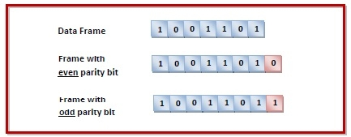

# 🌐 Overall (네트워크)

## Link Layer(링크 계층)

### Link Layer의 역할

링크계층은 두 개의 인접한 네트워크 장치 간의 데이터 전송을 담당하며 주로 NIC(Network Inteface Card)의 형태 또는 칩셋의 형태로 하드웨어에 구축이 되어있다.

물리적으로 직접 연결된 장치 간에 동작하며, 데이터는 이러한 연결을 통해서 `프레임 단위`로 전달된다.

`Sender` 측에서는 상위계층으로부터 받은 데이터그램(IP 패킷)을 `프레임` 이라는 단위로 캡슐화한다.

프레임에는 아래와 같은 정보가 포함된다.
- 헤더 정보 (MAC 주소 등)
- 데이터 (IP datagram)
- 에러 검출 정보 (CRC 등의 checking bit)

`Receiver` 측에서는 프레임을 수신하고 에러 검출을 통해 데이터에 문제가 없는 지 확인한 후에 유효한 경우 IP 데이터그램을 추출해서 상위 계층으로 전달한다.

### Link Layer 서비스

링크 계층은 `hop-to-hop`, 즉 인접 노드 간의 신뢰성을 보장한다.

이러한 신뢰성을 보장하는 것은 `이더넷`이나 `광케이블`같은 에러율이 매우 낮은 링크에서는 굳이 제공할 필요가 없지만 `Wi-Fi` 같은 에러율이 높은 링크에서는 매우 유용하다.

그러면 TCP와 뭐가 다른가?

위에서 말했다시피 링크계층은 `hop-to-hop`을 보장하지만 TCP는 `end-to-end` 신뢰성을 보장하게 된다. 따라서 TCP는 송신지와 수신지의 Application 레벨에서 재전송, 흐름제어, 혼잡제어 등을 담당하게 되며 링크 계층은 로컬에서 에러를 수정하여 한 홉 단위에서 재전송해주면, 에러가 상위 계층까지 올라가지 않으니깐 더 효율적이게 사용할 수 있다.

> 이렇게 되면 또 하나만 쓰면 되는거 아닐까,, 둘 다 필요한가?

위의 질문에 대한 답은 **"그렇다"** 이다.

일단 TCP가 있음에도 Link Layer가 존재하는 이유는 로컬에서 고치면 패킷이 멀리까지 갔다가 재전송할 필요가 없어지기 때문에 빠르고 효율적이기 때문이다.

그러나 링크 계층만으로는 전체 경로에서 손실되는 경우, 예를 들어 라우터 큐의 오버플로우 등을 막을 수 없기 때문에 TCP 같은 `end-to-end reliability` 또한 필요하다.

### Error Detection

> LinkLayer 에서 에러는 왜 발생할까?

에러는 `신호 감쇠(Signal attenuation)`, 또는 `잡음(noise)` 때문에 발생한다.

두 원인 모두 전송 중에 발생하는 에러이기 때문에 에러가 발생하면 수신측에서 프레임을 검사해서 에러를 감지해야 한다.

송신측이 에러를 감지하면 재전송을 요청하는 `ARQ`, 또는 그냥 프레임을 드롭 중 하나로 처리한다.

#### Parity Checking(Simplest Error Detection)

에러를 검출하는 가장 간단한 방법으로 `Parity Checking` 방법이 있다.


위와 같은 그림처럼 DataFrame에 존재하는 `1`의 개수를 세서 1의 개수가 항상 짝수 또는 홀수가 되게 맞춰주는 과정이다. 

만약 짝수개로 설정을 해놨다면, 수신측에서 홀수개의 1이 있다면 오류가 있다는 것을 알 수 있다.

그러나 이것에 대한 문제점은 뭘까?

생각을 좀만 해보면 알겠지만 이 오류 검출 방식은 **에러가 발생했는지 여부**만 확인하기 때문에 수정은 불가하고, 단순히 **에러 감지용**이다.

또한 짝수개의 비트가 오류가 나서 서로 상쇄가 된다면 오류가 없다고 하고 넘어가는 불상사가 발생하게 된다.

> 그럼 2차원으로 해보면 되는거 아닌가?

아까 1차원으로 한 것보다 더 강력한 에러 검출 능력과 수정 가능성을 제공한다.

데이터 블록을 행과 열로 배열하고, 각 행마다 가로 Parity bit, 각 열마다 세로 Parity bit를 추가하는 방식이다.

아래 그림은 내가 짝수개로 맞춘다는 가정을 하고 2차원으로 오류를 검출한다고 해보자.

```
1 0 1 0 1  1   ← 행 패리티
1 0 1 1 0  0   ← ❌ 3 + 0 != 짝수 오류 발생!!
0 1 1 1 0  1
---------
0 0 1 0 1  0   ← 열 패리티
```

2번 행과 2번 열에서 오류가 검출되었다는 것을 알 수 있다. 이런 방식으로 어디서 오류가 발생했는지를 탐색을 해서 수정을 할 수 있게 되었다.

그러나 아래와 같은 상황을 가정해보자.

```
원래:
1 0 1 0 1   1
0 1 1 1 0   1
1 1 0 0 1   1

세로 패리티:
0 0 0 0 0
```

```
변경 후:
0 0 0 0 1   1
0 1 1 1 0   1
1 1 0 0 1   1
```

이렇게 되면 여전히 짝수로 유지가 되기 때문에, 에러검출을 실패하게 된다.

이러하듯 2차원 또한 짝수 개의 에러가 같은 행 또는 같은 열에서 발생하면 검출할 수 없다.