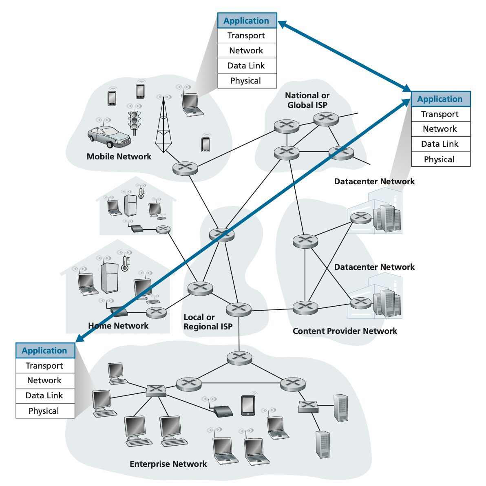

# Application Layer

---

## 개요

---

- Network App은 운영체제 위에서 실행되는 프로세스
  - 결국 **다른 머신의 프로세스와 통신**하는 것.
  - 다른 머신과의 통신 <br> => **IPC**.(그 중에서 **Socket**)

## Network Application 원리

--- 


**목표**
- 다른 종단 시스템에서 동작하고 네트워크를 통해 서로 통신하는 프로그램을 작성하는 것. <br> 서버 <-> 클라이언트, p2p 파일 공유 시스템

### Network Application Architecture
> 개발자에 의해 설계되고 애플리케이션이 다양한 종단 시스템에서 
> 어떻게 조직되어야하는 지를 지시

**Client - Server Architecture**
- Server
  - 항상 켜져 있는 Host
  - 항상 같은 장소 -> Permanent IP Address
  - Port 번호 고정 <br> ex) Well Known Port: HTTP: 80, SMTP: 25, HTTPS: 443
- Client
  - Server에게 Request를 보내는 존재
  - Dynamic IP Address
  - 필요에 의해서만 요청
- Socket에 정확하게 전달하기 위해서 <br> -> IP Address(머신) + Port(프로세스)
- Host name은 32bit의 이진수
  - DNS를 사용하여 32bit 주소를 얻음
- 클라이언트끼리 직접 통신 X

**P2P Architecture**
- 항상 켜져있는 기반구조 서버에 최소로 의존.
- peer라는 간헐적으로 연결된 호스트쌍이 직접 통신.
- 특정 서버를 통하지 않고 피어가 통신하므로 peer-to-peer
- 인기있고 트래픽 집중적인 애플리케이션은 p2p구조 ⇒ 인스턴스 메시징 애플리케이션의 경우.
- 자가 확장성(self-scalability): new peers bring new service capacity, as well as new service demands

### Interface Between Process and Computer
> 실제 통신하는 것은 프로그램이 아닌 프로세스!

**Process**
- 종단 시스템(app)에서 실행되는 프로그램
- 통신 프로세스가 같은 종단 시스템에서 실행 될 때 서로 프로세스 간에 통신.
- 규칙은 OS에 의해 좌우됨.
- 2개의 다른 종단 시스템에서 프로세스는 컴퓨터 네트워크를 통한 message 교환으로 통신.

**프로세스와 컴퓨터 네트워크 사이의 인터페이스**

- 통신 프로세스 쌍으로 구성되어 서로 메시지를 보낸다.
- 프로세스는 **소켓**을 통해 네트워크로 메시지를 주고 받는다.
- **소켓**은 API. 통신하기 위한 interface
- 애플리케이션 개발자는 소켓의 애플리케이션 계층에 대한 모든 통제권을 갖고 소켓의 트랜스포트 계층에 대한 통제권은 갖지 못한다.

**프로세스 주소배정**

특정 목적지로 메시지를 전달하기 위해, 주소를 가지고 있어야 함. <br>
수신 프로세스를 식별하기 위해 필요한 두가지 정보 <br>

1. Host Address => **IP Address**
2. Destination Host Process => **Port Number**

## Web and HTTP

---

> Web => On-demand 방식으로 동작
> On-demand: 그들이 원할 때 원하는 것을 수신

### HTTP 개요
>웹 애플리케이션 계층 프로토콜 ⇒ HTTP(HyperText Transfer Protocol)
> 클라이언트와 서버는 서로 다른 시스템에서 HTTP 메시지를 교환하여 통신

```thymeleafurlexpressions
http://www.SSAFY.edu/someDepartment/picture.gif
```

- ```www.SSAFY.edu```: Host name
- ```/someDepartment/picture.gif```: path name

**HTTP**
- 클라이언트가 서버에게 어떻게 페이지를 요청하는지와 <br> <br>
서버가 클라이언트로 어떻게 웹 페이지를 전송하는 지를 정의하는 프로토콜
- 사용자가 웹 페이지를 요청할 때 브라우저는 페이지 내부의 객체에 대한 HTTP 요청 메시지를 서버에게 보낸다.
- 서버는 요청을 수신하고 객체를 포함하는 HTTP 응답 메시지로 응답한다.
- **TCP**를 전송 프로토콜로 사용
- HTTP client는 서버에게 TCP 연결을 시작. ⇒ 비용 발생.(TCP Connection)
- 서버가 클라이언트에게 요청 파일을 보낼 때 서버는 클라이언트에 관한 어떠한 상태 정보도 저장하지 않는다. <br> ⇒ 정보를 유지하지 않는 것. stateless protocol

### Non-Persistent and Persistent Connections

> 클라이언트가 일련의 요청(request)을 하고 서버가 응답(response)을 하면서 일정 시간 동안 통신이 유지된다.  
> 이러한 통신은 일정한 간격으로 주기적이거나 간헐적으로 발생할 수 있다.

**🔄 Non-Persistent Connection (비지속 연결)**

- 각 요청/응답 쌍마다 **새로운 TCP 연결**을 설정하고 종료함.
- **연결이 짧게 유지**되며, 여러 개의 리소스를 요청할 경우 **매번 연결을 재설정**해야 함.
- 오버헤드가 크고, 지연 시간이 발생할 수 있음.
- 주로 **HTTP/1.0**에서 사용됨.

```text
[Client] --request--> [Server]
         <--response-- 
[Connection Closed]

[Client] --request--> [Server]
         <--response-- 
[Connection Closed]
```

**🔁 Persistent Connection (지속 연결)**
- 하나의 TCP 연결을 통해 **여러 요청과 응답**을 주고받음. 
- 연결이 계속 열려 있으므로 성능이 향상되고, 지연 시간이 줄어듦. 
- **Connection: keep-alive 헤더**를 통해 유지됨. 
- 기본적으로 HTTP/1.1 이상에서 사용됨.

``` text
[Client] --request1--> [Server]
<--response1--

         --request2--> 
         <--response2-- 

         --request3--> 
         <--response3-- 
[Connection Closed]
```
**비교**

| 항목             | Non-Persistent             | Persistent                     |
|------------------|----------------------------|--------------------------------|
| 연결 수명        | 요청마다 새로 연결         | 다수의 요청/응답 공유         |
| 연결 방식        | 요청/응답 후 연결 종료     | 연결을 유지하면서 여러 요청 처리 |
| 오버헤드         | 큼 (매번 연결/해제 반복)   | 적음 (한 번 연결로 여러 요청) |
| 지연 시간        | 상대적으로 길어질 수 있음 | 상대적으로 짧음              |
| HTTP 버전        | HTTP/1.0                   | HTTP/1.1 이상                  |
| 성능             | 낮음                       | 높음                           |
