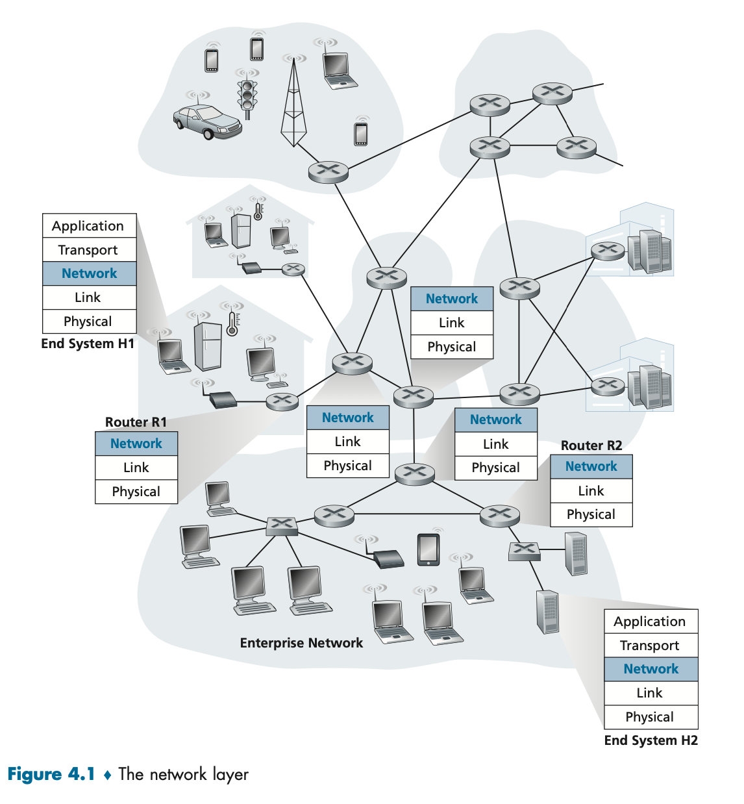
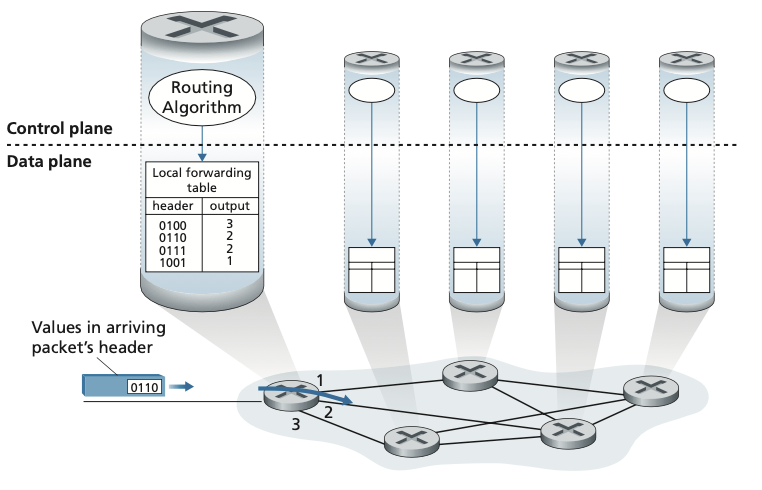
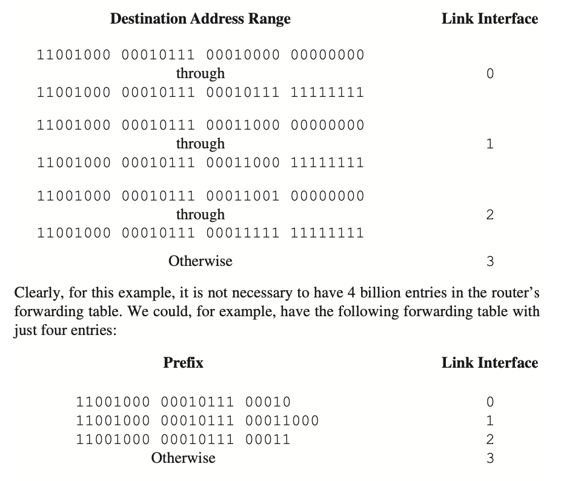
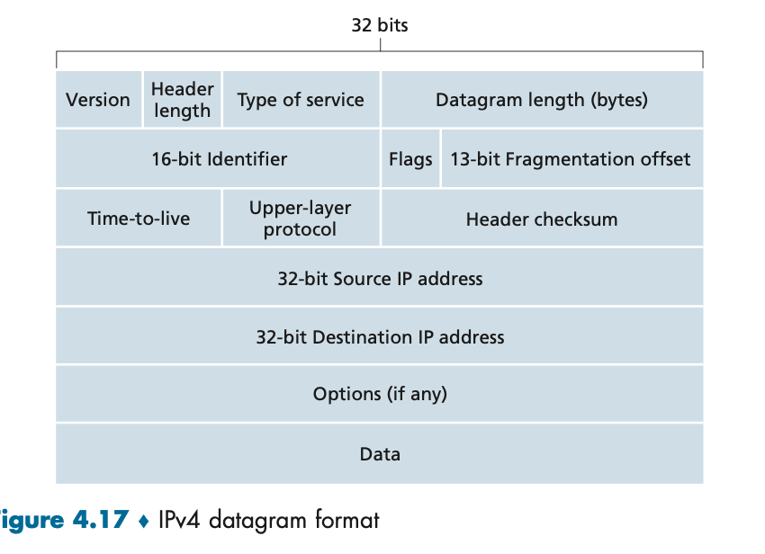
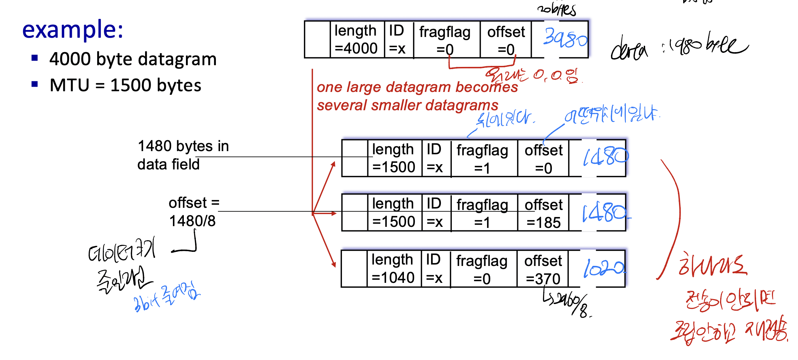
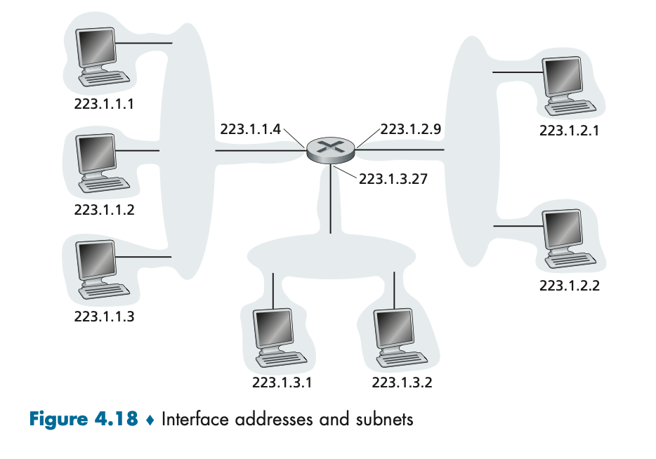
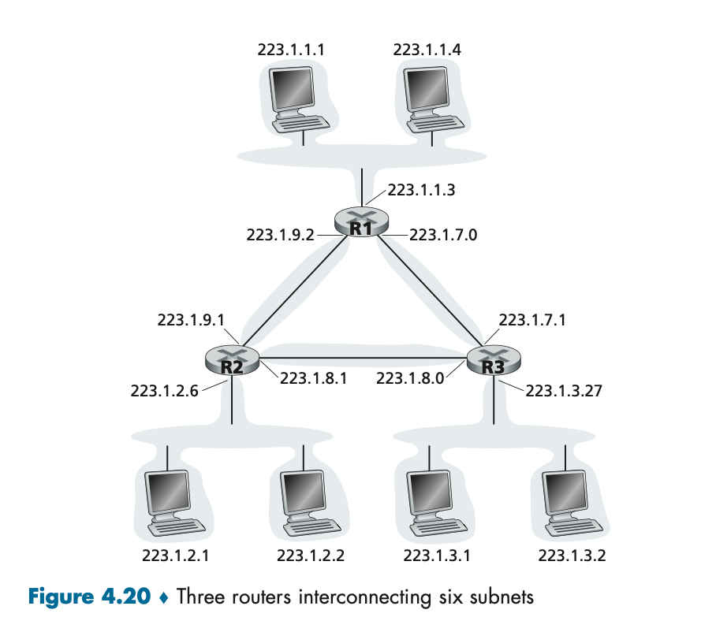
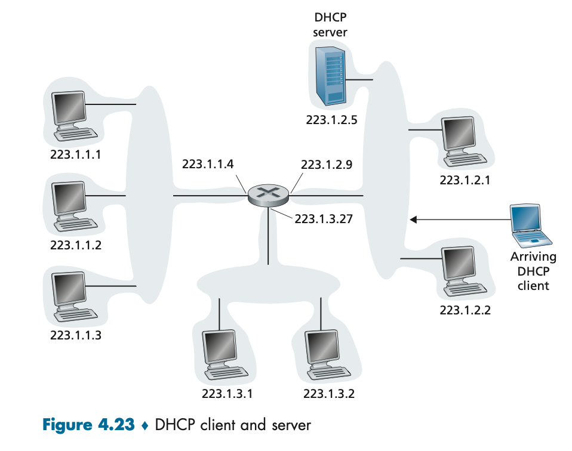
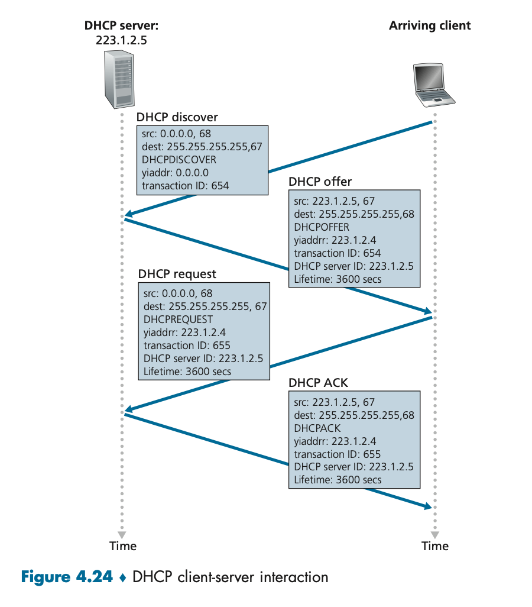
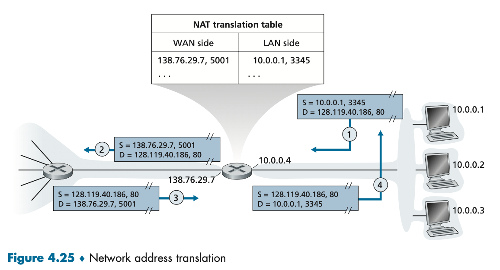

# Network Layer: Data Plane

---



## 개요
- Data Plane 역할
  - 입력 링크에서 출력 링크로 데이터 그램을 전달
- Network Plane 역할
  - 데이터그램이 송신 호스트에서 목적지 호스트까지 잘 전달되게끔

### Forwarding & Routing

- **forwarding**: 패킷이 라우터의의 입력 링크에 도달했을 때 라우터는 그 패킷을 적절한 출력 링크로 이동 <br> => 데이터링크에 구현되어 있는 기능
  - 매우 짧은 시간.
  - 라우터마다 포워딩 테이블 존재
- **routing**: 송신자가 수신자에게 패킷을 전송할 때 패킷 경로를 결정 <br> => 라우팅 알고리즘
  - 비교적 긴 시간
  - 포워딩 테이블을 채우는 역할

**Data Plane**
- 라우팅 알고리즘은 **라우터의 포워딩 테이블의 내용**을 결정
- 라우터는 **포워딩**과 **라우팅 기능** 모두 가지고 있음.
- 라우팅 알고리즘 기능은 다른 라우터와 소통하며 라우팅 메시지를 교환

### 네트워크 서비스 모델
- Best effort Service
  - 순서 보장 X
  - 지연 보장 X
  - 패킷 보장 X
  - **대신 최선은 다하겠다.**

**Longest prefix matching**

- 라우터의 검색은 라우터 동작의 핵심
- 라우터는 포워딩 테이블을 이용하여 도착 패킷이 스위칭 구조를 통해 전다로디는 출력포트를 검색
- 모든 비트가 prefix에 대응하는 비트를 포워딩하는 것이 아닌 **longest prefix matching rule**을 적용
- 큐가 있기에 **지연/손실** 가능

## 인터넷 프로토콜 IP

---


### IPv4 데이터 그램 형식
- 버전 번호:
  - 4비트로 이루어진 IP프로토콜 버전 명시. 4 or 6
- 헤더길이:
  - 4의 배수로 정해짐. ex) 헤더길이: 5 ⇒ 4*5 = 20 bytes. 대부분 20 bytes
- 서비스 타입:
  - 서로 다른 유형의 IP 데이터그램을 구별
- 데이터그램 길이:
  - total packet size ⇒ 16bit이므로 65535 bytes인데 대부분 1500 바이트보다 큰 경우는 없다.
- 식별자, 플래그, 오프셋:
  - **IP fragment와 관계.**
- TTL:
  - 데이터그램이 무한히 순환하지 않도록. 0이 되면 라우터가 데이터그램을 폐기, 라우터 도착할 때마다 1씩 감소
- 프로토콜:
  - 상위 레이어의 프로토콜 명시.
  - 6 ⇒ TCP
  - 17 ⇒ UDP
  - 1 ⇒ ICMP
- 헤더 체크섬:
  - 라우터가 수신한 IP 데이터 그램의 비트 오류를 탐지
  - 라우터는 보통 오류가 검출된 데이터 그램을 폐기.
- 출발지와 목적지 IP 주소:
  - 데이터 그램을 생성할 때 IP 주소 명시.
- 옵션:
- 데이터:
  - ICMP등 다른 유형의 데이터를 담기도 하고 목적지에 전달하고자하는
  - TCP/UDP segment

### IPv4 데이터그램 fragment

- 모든 프로토콜은 같은 크기 네트워크 계층 패킷을 전달할 수 없다.
- 링크 계층 프레임이 전달할 수 있는 최대 데이터 양 ⇒ **MTU(maximum transmission unit)**
- IP 데이터그램의 길이에 제약을 둔다.
- 따라서 작은 IP 패킷을 만들어 보낸다.
- **end host에서 재조합**을 한다. ⇒ TCP, UDP는 재조합의 기능이 없기에 네트워크 계층에서 마무리지어야 함.
- 이때 사용하는 필드
  - 식별자
  - 플래그
    - 뒤에 패킷이 있다. ⇒ 1
    - 마지막 패킷이다. ⇒ 0
  - 오프셋 비트
    - 시작 바이트 표시
    - / 8 값을 저장

### IPv4 주소 체계

- 호스트 IP가 데이터그램을 보낼 때 링크를 통해 데이터링크를 보내는 사이의 경계를 **인터페이스**
  - **IP가 지칭하는 것은 인터페이스.**
- 각 IP주소는 32비트 길이. ⇒ 십진 표기법으로 사용.
- NAT 제외, 모두 고유한 IP 주소를 갖는다.
  - 마음대로 선택 X, subnet이 결정
- 위 그림은 세개의 인터페이스를 갖는 라우터
  - 인터페이스에 묶인 부분을 **세그먼트**라 부름 ⇒ **서브넷**을 구성한다고 말한다.
  - 같은 네트워크 ID를 가진 interface의 집합.
  - 같은 서브넷끼리 같은 IP의 부분을 서브넷 마스크라고 부름. 223.1.1.0/24로 표시 ⇒ 223.1.1이 **서브넷 주소**라는 것을 가르킴
    - Network ID == prefix ID
- 인터넷 주소 할당 방식 ⇒ **CIDR (Classless Interdomain Routing)**
  - 서브넷 주소체계 표기를 일반화. ⇒ 기관 사이즈에 맞게 가변적으로 운용
  - 서브넷 마스크를 유동적으로 조절. ⇒ 21, 24, 18 등..
- 이전에는 클래스 주소체계를 사용
  - 고정된 서브넷. 8, 16, 24…
    (아래 그림 보면서 서브넷과 IP 공부)


## 호스트 주소 획득: DHCP

---



- 호스트에 IP 주소를 수동으로 할당 가능
- 하지만 일반적으로 **동적 호스트 구성 프로토콜(DHCP, Dynamic Host Configuration Protocol)** 이용
- 동일한 IP 주소를 받도록하거나, 임시 IP 주소 할당
  - DHCP와의 통신은 일련의 Client - Server Protocol
  - 각 서브넷이 DHCP 서버를 가질 경우 유리 및 편리



1. DHCP 서버 발견: 새롭게 도착한 호스트는 상호 동작될 DHCP 서버를 발견한다 <br> => ```DHCP discover```
   1. 포트 67로 **UDP 패킷**을 보낸다
   2. Dest IP(DHCP 서버 주소)를 모르니 broadcasting으로 보낸다. ```255.255.255.255, 67```
   3. Src IP는 ```0.0.0.0```
   4. DHCP 클라이언트는 링크계층으로 모든 노드로 IP 데이터그램을 보냄
2. ```DHCP 서버 offer```
   1. DHCP discover 메시지를 응답
   2. broadcasting으로 응답. ```255.255.255.255, 68```
   3. IP 주소와 기간을 데이터에 포함해서 전달
3. ```DHCP 서버 request```: 요청 메시지로 응답
   1. broadcasting
   2. 여러 DHCP가 응답할 수 있기 때문에 broadcasting 해야함
4. ```ACK로 응답```
   1. **unicast**
   2. ACK 메시지를 받으면 상호 동작은 종료되고 할당 IP 주소를 임대기간동안 사용 가능

## Network Address Translation

---



> IP주소 => global unique해야 하지만 현제 제한된 ip이므로 서브넷 내부적으로만 유니크하게

- 포트번호로 구분
- 서브넷 밖에서는 라우터의 IP밖에 모름
  - 게이트웨이의 IP 주소를 바꿔주기
  - 서브넷 내부에서는 이동이 가능하지만 **밖에서는 해당 IP로 들어오는 것이 불가능**
  - 게이트웨이가 설정한 IP로만 들어올 수 있음
- **부작용**
  - 라우터가 Transport Layer까지 확인함(라우터는 IP 계층)
  - hole punching 가능
