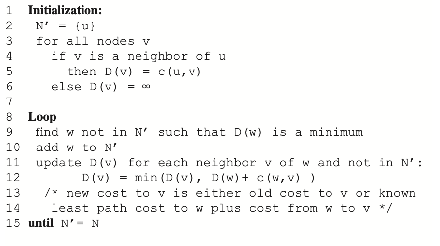
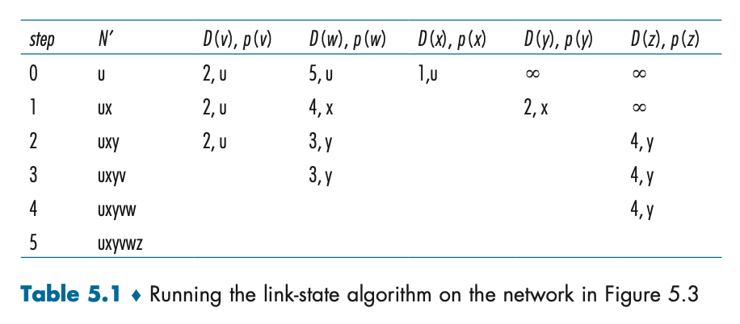
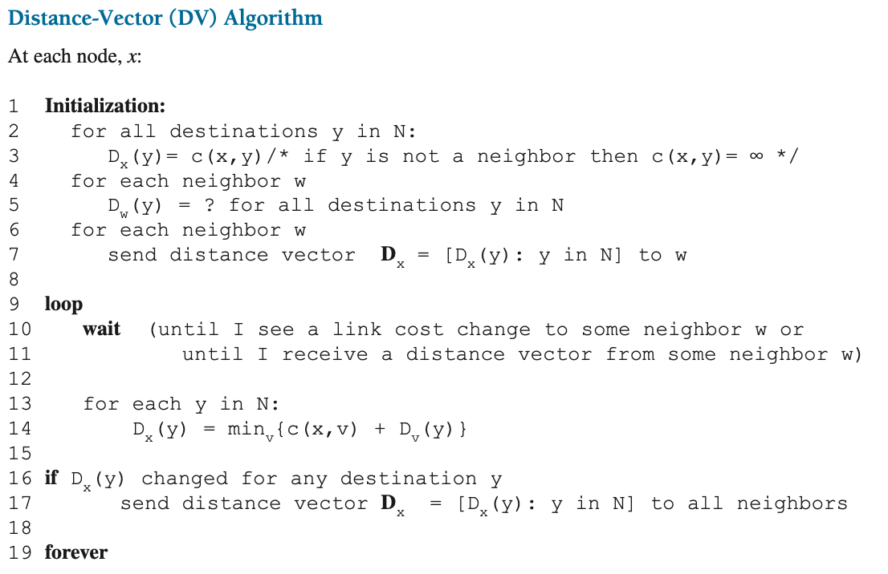
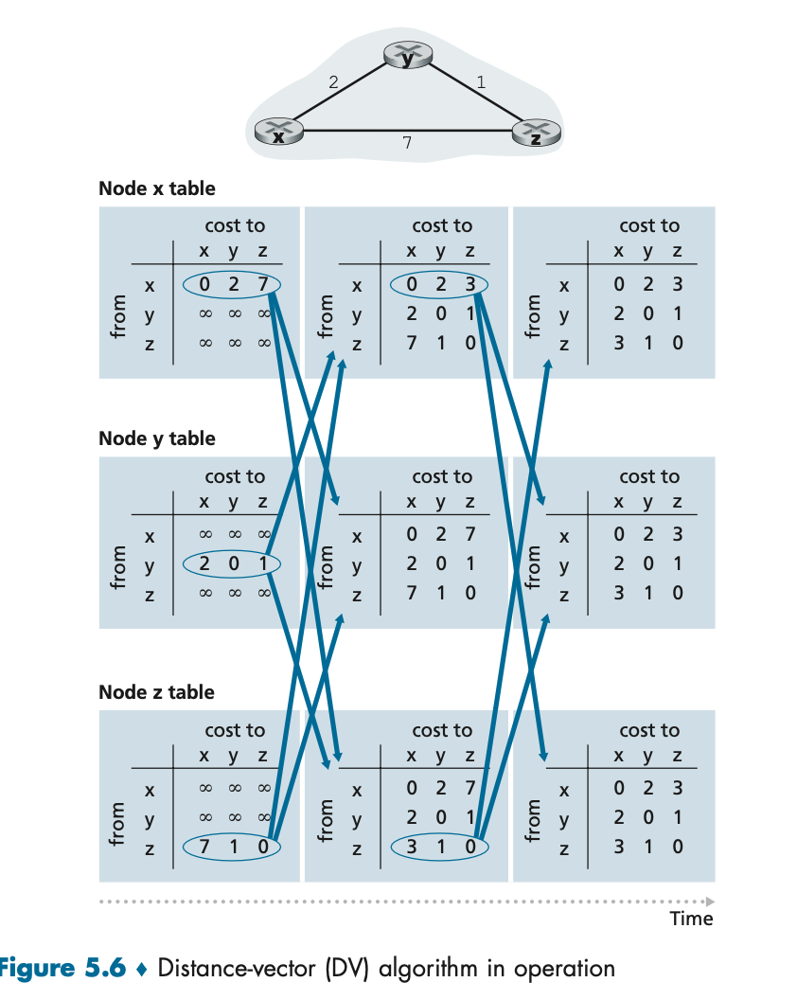
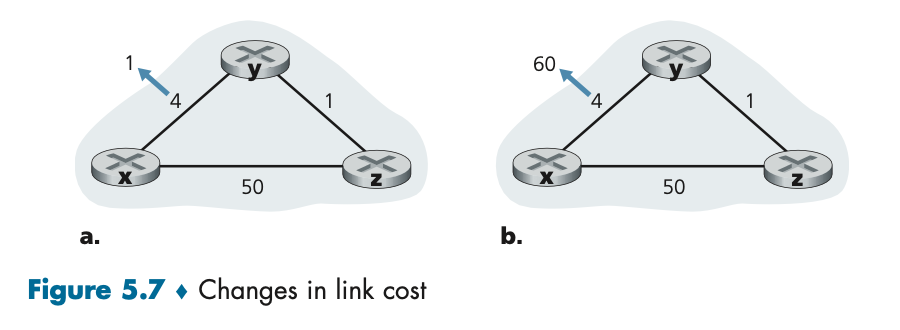
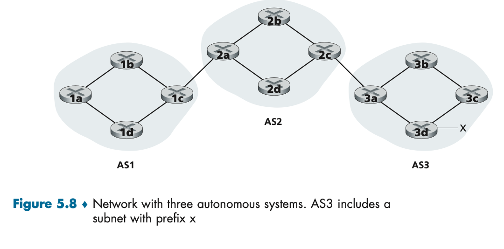

# Network Layer: Data Plane

---


## 개요
- Data Plane 역할
  - 입력 링크에서 출력 링크로 데이터 그램을 전달
- Network Plane 역할
  - 데이터그램이 송신 호스트에서 목적지 호스트까지 잘 전달되게끔

### Forwarding & Routing

- **forwarding**: 패킷이 라우터의의 입력 링크에 도달했을 때 라우터는 그 패킷을 적절한 출력 링크로 이동 <br> => 데이터링크에 구현되어 있는 기능
  - 매우 짧은 시간.
  - 라우터마다 포워딩 테이블 존재
- **routing**: 송신자가 수신자에게 패킷을 전송할 때 패킷 경로를 결정 <br> => 라우팅 알고리즘
  - 비교적 긴 시간
  - 포워딩 테이블을 채우는 역할

**Data Plane**
- 라우팅 알고리즘은 **라우터의 포워딩 테이블의 내용**을 결정
- 라우터는 **포워딩**과 **라우팅 기능** 모두 가지고 있음.
- 라우팅 알고리즘 기능은 다른 라우터와 소통하며 라우팅 메시지를 교환

### 네트워크 서비스 모델
- Best effort Service
  - 순서 보장 X
  - 지연 보장 X
  - 패킷 보장 X
  - **대신 최선은 다하겠다.**

**Longest prefix matching**

- 라우터의 검색은 라우터 동작의 핵심
- 라우터는 포워딩 테이블을 이용하여 도착 패킷이 스위칭 구조를 통해 전다로디는 출력포트를 검색
- 모든 비트가 prefix에 대응하는 비트를 포워딩하는 것이 아닌 **longest prefix matching rule**을 적용
- 큐가 있기에 **지연/손실** 가능

## 인터넷 프로토콜 IP

---


### IPv4 데이터 그램 형식
- 버전 번호:
  - 4비트로 이루어진 IP프로토콜 버전 명시. 4 or 6
- 헤더길이:
  - 4의 배수로 정해짐. ex) 헤더길이: 5 ⇒ 4*5 = 20 bytes. 대부분 20 bytes
- 서비스 타입:
  - 서로 다른 유형의 IP 데이터그램을 구별
- 데이터그램 길이:
  - total packet size ⇒ 16bit이므로 65535 bytes인데 대부분 1500 바이트보다 큰 경우는 없다.
- 식별자, 플래그, 오프셋:
  - **IP fragment와 관계.**
- TTL:
  - 데이터그램이 무한히 순환하지 않도록. 0이 되면 라우터가 데이터그램을 폐기, 라우터 도착할 때마다 1씩 감소
- 프로토콜:
  - 상위 레이어의 프로토콜 명시.
  - 6 ⇒ TCP
  - 17 ⇒ UDP
  - 1 ⇒ ICMP
- 헤더 체크섬:
  - 라우터가 수신한 IP 데이터 그램의 비트 오류를 탐지
  - 라우터는 보통 오류가 검출된 데이터 그램을 폐기.
- 출발지와 목적지 IP 주소:
  - 데이터 그램을 생성할 때 IP 주소 명시.
- 옵션:
- 데이터:
  - ICMP등 다른 유형의 데이터를 담기도 하고 목적지에 전달하고자하는
  - TCP/UDP segment

### IPv4 데이터그램 fragment

- 모든 프로토콜은 같은 크기 네트워크 계층 패킷을 전달할 수 없다.
- 링크 계층 프레임이 전달할 수 있는 최대 데이터 양 ⇒ **MTU(maximum transmission unit)**
- IP 데이터그램의 길이에 제약을 둔다.
- 따라서 작은 IP 패킷을 만들어 보낸다.
- **end host에서 재조합**을 한다. ⇒ TCP, UDP는 재조합의 기능이 없기에 네트워크 계층에서 마무리지어야 함.
- 이때 사용하는 필드
  - 식별자
  - 플래그
    - 뒤에 패킷이 있다. ⇒ 1
    - 마지막 패킷이다. ⇒ 0
  - 오프셋 비트
    - 시작 바이트 표시
    - / 8 값을 저장

### IPv4 주소 체계

- 호스트 IP가 데이터그램을 보낼 때 링크를 통해 데이터링크를 보내는 사이의 경계를 **인터페이스**
  - **IP가 지칭하는 것은 인터페이스.**
- 각 IP주소는 32비트 길이. ⇒ 십진 표기법으로 사용.
- NAT 제외, 모두 고유한 IP 주소를 갖는다.
  - 마음대로 선택 X, subnet이 결정
- 위 그림은 세개의 인터페이스를 갖는 라우터
  - 인터페이스에 묶인 부분을 **세그먼트**라 부름 ⇒ **서브넷**을 구성한다고 말한다.
  - 같은 네트워크 ID를 가진 interface의 집합.
  - 같은 서브넷끼리 같은 IP의 부분을 서브넷 마스크라고 부름. 223.1.1.0/24로 표시 ⇒ 223.1.1이 **서브넷 주소**라는 것을 가르킴
    - Network ID == prefix ID
- 인터넷 주소 할당 방식 ⇒ **CIDR (Classless Interdomain Routing)**
  - 서브넷 주소체계 표기를 일반화. ⇒ 기관 사이즈에 맞게 가변적으로 운용
  - 서브넷 마스크를 유동적으로 조절. ⇒ 21, 24, 18 등..
- 이전에는 클래스 주소체계를 사용
  - 고정된 서브넷. 8, 16, 24…
    (아래 그림 보면서 서브넷과 IP 공부)


## 호스트 주소 획득: DHCP

---


- 호스트에 IP 주소를 수동으로 할당 가능
- 하지만 일반적으로 **동적 호스트 구성 프로토콜(DHCP, Dynamic Host Configuration Protocol)** 이용
- 동일한 IP 주소를 받도록하거나, 임시 IP 주소 할당
  - DHCP와의 통신은 일련의 Client - Server Protocol
  - 각 서브넷이 DHCP 서버를 가질 경우 유리 및 편리


1. DHCP 서버 발견: 새롭게 도착한 호스트는 상호 동작될 DHCP 서버를 발견한다 <br> => ```DHCP discover```
   1. 포트 67로 **UDP 패킷**을 보낸다
   2. Dest IP(DHCP 서버 주소)를 모르니 broadcasting으로 보낸다. ```255.255.255.255, 67```
   3. Src IP는 ```0.0.0.0```
   4. DHCP 클라이언트는 링크계층으로 모든 노드로 IP 데이터그램을 보냄
2. ```DHCP 서버 offer```
   1. DHCP discover 메시지를 응답
   2. broadcasting으로 응답. ```255.255.255.255, 68```
   3. IP 주소와 기간을 데이터에 포함해서 전달
3. ```DHCP 서버 request```: 요청 메시지로 응답
   1. broadcasting
   2. 여러 DHCP가 응답할 수 있기 때문에 broadcasting 해야함
4. ```ACK로 응답```
   1. **unicast**
   2. ACK 메시지를 받으면 상호 동작은 종료되고 할당 IP 주소를 임대기간동안 사용 가능

## Network Address Translation

---


> IP주소 => global unique해야 하지만 현제 제한된 ip이므로 서브넷 내부적으로만 유니크하게

- 포트번호로 구분
- 서브넷 밖에서는 라우터의 IP밖에 모름
  - 게이트웨이의 IP 주소를 바꿔주기
  - 서브넷 내부에서는 이동이 가능하지만 **밖에서는 해당 IP로 들어오는 것이 불가능**
  - 게이트웨이가 설정한 IP로만 들어올 수 있음
- **부작용**
  - 라우터가 Transport Layer까지 확인함(라우터는 IP 계층)
  - hole punching 가능

# Network Plane

---
- 네트워크 전체를 아우르는 구성 요소
- 데이터그램이 송신 호스트에서 목적지 호스트까지 경로 상의 라우터들 간에 어떻게 전달되어야 하는지
- 네트워크 계층 구성요소들과 서비스들을 어떻게 설정하고 관리할 지
- 최소 비용 경로를 계산하기 위한 알고리즘
  - OSPF
    - 단일 ISP 네트워크 내에서 동작한느 라우팅 프로토콜
  - BGP
    - 인터넷의 모든 네트워크를 상호 연결하는 역할을 하는 라우팅 프로토콜
- ICMP
- SNMP

## 개요
> 포워딩 테이블이나 플로우 테이블이 어떻게 만들어지고 유지, 설치되는지
- 라우터별 제어
  - 모든 라우터 각각에서 동작하는 경우
  - 포워딩과 라우팅 기능이 모두 개별 라우터에 포함
  - 각 라우터는 다른 라우터와 통신하여 자신의 포워딩 테이블의 값을 계산하는 라우팅 구성요소
  - OSPF, BGP 프로토콜 방식
- 논리적으로 중앙 집중된 제어
  - 일반화된 일치와 행동 추상화를 통해 다양한 기능들 수행 가능
  - 라우터끼리 상호작용하지 않으며 포워딩 테이블을 계산하는데 참여 X

## 라우팅 알고리즘

---
> 송신자부터 수신자까지의 라우터의 최적 루트를 결정하는 것
- 사용 요소
  - 그래프 G = (N, E)로 표현
  - N = Node(라우터), E = Edge(비용)
  - E(x, y)는 node x & node y, x와 y는 이웃
  - 최소비용 경로 => 최단경로
- 첫번째 알고리즘 분류 방식
  - 중앙 집중형 라우팅 알고리즘
    - 네트워크 전체에 대한 완전한 정보를 가지고 계산
    - 노드 사이의 연결 상태와 링크 비용을 입력값으로 사용
    - 전체 상태 정보를 가지는 알고리즘 **링크상태 알고리즘(Link-State, LS)**
  - 분산 라우팅 알고리즘
    - 최소 비용 경로의 계산이 라우터들에 의해 반복적이고 분산된 방식으로 수행
    - 완전한 정보를 가지고 있진 않지만, 자신과 연결된 링크에 대한 비용 정보를 가지고 시작
    - 반복되는 계산과 정보 교환을 통해 최소 비용 경로를 계산 => **거리 벡터 알고리즘(Distance-Vector, DV)**
- 두번째 알고리즘 분류 방식
  - 정적 라우팅 알고리즘
  - 사람이 개입하면 느려짐
- 동적 라우팅 알고리즘
  - 네트워크 트래픽 부하나 토폴로지 변화에 따라
  - 주기적으로 응답하는 방식 ⇒ 빠르게 대응.
  - 경로의 loop나 경로의 oscillation 문제에 최약
- 세번째 알고리즘 분류 방식
  - 부하에 민감한 알고리즘
    - 초기의 ARP
  - 부하에 민감하지 않은 알고리즘
    - RIP, OSPF, BGP

### 링크상태 라우팅 알고리즘 Link-State
네트워크 토폴로지와 모든 링크 비용이 알려져 있어 링크 상태 알고리즘의 입력값으로 사용될 수 있다.
> 각 노드가 자신과 연결된 링크의 식별자와 비용을 포함하는 링크상태 패킷을
> 네트워크 상의 모든 다른 노드로 **브로드캐스팅**하여서 때로는 OSPF

- 다익스트라 알고리즘을 통해 구현
- 하나의 노드에서 네트워크 내에 모든 다른 노드로의 **최소 비용 경로** 계산


- 출발 노드 u
- D(v): v까지의 최소 비용
- p(v): v까지의 현재 최소 비용 경로에서 v의 직전 노드
- N`: 노드의 집합


1. 초기화 단계에서 u로 직접 연결된 v, x, w까지의 현재 최소 경로 2, 1, 5로 초기화. 직접 연결되어 있지 않으면 무한대로 표기
2. 바로 이전 연결된 노드를 연결.
3. 첫번째 반복에서 N'에 있지 않고, 가장 최소 비용을 가진 노드를 찾고 N'에 추가한다.(x)
4. 다음 링크를 갱신. ⇒ D(w), D(y) 변동
5. 두번째 반복에서는 2번 동작 수행 후 3번 동작 수행
6. 반복..

- 시간 복잡도 ⇒ **O(n^2)**
- **ICMP**에 담겨서 포워딩 테이블 구축

**발생할 수 있는 문제**

- 진동 문제
  - 각각의 라우터가 모두 라우팅 알고리즘을 반영해서 생긴 문제
  - 하나의 라우터만 작동하게. ⇒ 주기를 주어서

### 거리벡터(Distance-Vector, DV) 라우팅 알고리즘

- 반복적, 비동기적, 분산적
- 각 노드는 하나나 그 이상의 직접 연결된 이웃으로부터 정보를 받고 계산을 수행하고 결과를 다시 이웃에게 배포 ⇒ **분산적**
- 이웃끼리 더이상 정보를 교환하지 않을 때까지 프로세스 지속 ⇒ **반복적**
- 모든 라우터가 알아서 작동 ⇒ **비동기적**

`dx(y) = minv{c(x, v) + dv(y)}`
v는 x와 연결된 노드
- x에서 v로 이동한 후, v에서 y까지의 최소 비용 경로 선택.
- 모든 v에 대해 그중 최소값이 dx(y)
- 벨만 포드
  - 각 노드 포워딩 테이블의 엔트리를 제공


- RIP, BGP, ISO, IDRP, ARP Anet에서 사용

1. 왼쪽 세개의 열은 각각 라우터의 초기 테이블 
2. 노드끼리 정보를 교환하면서 최소 경로 update 
3. update한 정보를 다시 교환. 
4. 반복…

### 거리 벡터 알고리즘: 링크 비용 변경과 링크 고장

- 거리 벡터 알고리즘을 수행하는 노드가 자신과 이웃 사이 링크의 비용이 변경된 것을 알게되면 자신의 거리 벡터를 갱신하고 최소 비용 경로의 비용에 변화가 있는 경우, 이웃에게 새로운 거리 벡터를 보낸다.
- 두가지 상황을 고려 figure 5.7(a)&(b)



- 5.7(a)
  - 시각 t0에 y가 링크 비용의 변화(4→1)로 변함을 감지하고 자신의 거리 벡터를 업데이트 한 후 이 변경 값을 이웃에게 알린다
  - t1에서는 z는 y로부터 업데이트 정보를 받고 자신의 테이블을 갱신(5→2) 새로운 정보를 전송 ⇒ 이웃에게
  - 노드들은 전달된 정보를 받고 자신의 테이블을 갱신.
- 5.7(b) 4→60으로 증가했을 경우
  - t0에서 y가 링크 비용의 변화(4→60)을 감지하고 노드 x까지의 새로운 최소 비용 경로를 계산
    Dy(x) = min{c(y,x) + Dx(x), c(y,z) + Dz(x)} = min{60 + 0, 1 + 5} = 6
  - 눈으로 보기에 한눈에 잘못 되었지만 가지고 있는 정보로는 어쩔 수 없음. ⇒ routing loop가 발생함. (y → z, z → y)
  - 노드 y는 최소 비용을 (6)으로 갱신 했으므로 z에게 새로운 거리벡터를 알린다.
  - z는 새로운 거리 벡터를 받아 update하고 x까지의 최소 비용을 7로 갱신한다. 이를 다시 y에게 알린다.
  - y는 또 반복… 무한 루프 ⇒ **count-to-infinity problem**
  - poisoned reverse라는 방법으로 회피 가능
    - z가 y를 통해서 x로 간다면 그 경로를 무한대로 설정.
    - 하지만 세개 이상의 노드를 포함한 루프는 포이즌 리버스를 감지할 수 없다.

### 링크 상태 알고리즘과 거리 벡터 라우팅 알고리즘 비교

- 메시지 복잡성
  - 링크상태 알고리즘
    - 각 링크 비용을 다 알고 있어야함.
    - 링크의 변화가 있을 경우 링크 비용이 모든 노드에게 전달되어야 함.
  - 거리벡터 알고리즘
    - 매번 반복마다 연결된 이웃끼리 메시지를 교환
    - 변화가 있을 경우에만 수정된 링크 비용을 전파
- 수렴속도
  - 링크 상태 알고리즘
    - O(n^2)
  - 거리 벡터 알고리즘
    - 모름
- 견고성
  - 링크 벡터 알고리즘
    - 잘못된 비용 정보를 브로드 캐스팅의 가능성
    - 폐기 가능
  - 거리벡터 알고리즘
    - 모든 목적지에게 잘못된 정보를 알릴 수 있음
    - 한 노드의 잘못된 계산으로 전체 네트워크에 악영향을 미칠 수 있음

## 인터넷에서의 AS 내부 라우팅: OSPF

---

> 여태까지 라우터 집합 = 네트워크 집합 
> 모든 라우터가 동일한 라우팅 알고리즘을 수행하고 네트워크 경로를 계산함으로써 우리는 라우터간에 구별할 수 없었다.

**자율 시스템(Autonomous System, AS)**
각 AS는 동일한 관리 제어하에 있는 라우터의 그룹으로 구성. 한 ISP의 라우터와 그들을 연결하는 링크가 종종 하나의 AS를 이룸

같은 AS 안에 있는 라우터들은 동일한 라우팅 알고리즘을 사용하고 상대방에 대한 정보를 가지고 있음. 자율 시스템 내부에서 동작하는 라우팅 알고리즘 ⇒ **AS 내부 라우팅 프로토콜**

### 개방형 최단 경로 우선 프로토콜(Open Shortest Path First, OSPF)

OSPF와 비슷한 IS-IS는 인터넷에서 인트라-AS 라우팅에 사용

- 링크 상태 정보를 flooding하고 다익스트라 최소 비용 경로 알고리즘을 사용하는 **링크 상태 알고리즘**
- OSPF를 이용하여 각 라우터는 전체 AS에 대한 환벽한 토폴로지 그래프를 얻는다.
- 각 라우터는 자신을 루트노드로 두고 모든 서브넷에 이르는 최단 경로 트리를 결정하기 위해서 혼자 다익스트라 최단 경로 알고리즘을 수행.
- 개별 링크들의 비용은 네트워크 관리자가 구성.
- OSPF를 사용하는 라우터는 인접한 라우터만이 아니라 자율 시스템 내의 다른 모든 라우터에게 라우팅 정보를 브로드캐스팅. ⇒ 링크 상태가 변경되었을 때와 정기적으로
- 상태정보는 IP에 의해 전달. 포트번호는 89번
- 신뢰할 수 있는 메시지 전송과 링크 상태의 브로드캐스팅과 같은 기능을 구현해야 함.
- OSPF에 구현된 사항
  - 보안: 정보 교환이 인증이 가능
    - 인증을 통해 신뢰할 수 있는 라우터들만이 AS 내부의 OSPF에 참여 가능.
    - 공유 비밀키 기반.
    - 재생 공격 방지하기 위해 순서 번호 첨부.
  - 복수 동일 비용 경로: 동일한 비용을 가진 여러개의 경로가 존재할 때 OSPF는 여러 경로 사용 가능
  - 유니캐스트와 멀티캐스트 라우팅의 통합 지원
  - 단일 AS 내에서의 계층 지원: AS는 계층적인 영역으로 구성 간,ㅇ

### 인터넷 서비스 제공업자(ISP)간의 라우팅: BGP

동일한 AS 내에 있는 출발지와 목적지 사이에서 패킷을 라우팅할 때 패킷이 전송되는 경로는 전적으로 AS 내부 라우팅 프로토콜에 의해 결정.

그러나 패킷이 여러 AS를 통과하도록 라우팅할 때 자율 시스템 간 라우팅 프로토콜이 필요하다. ⇒ BGP

### BGP 역할

어떤 AS와 그 AS 내의 임의의 라우터를 가정.

모든 라우터는 포워딩 테이블을 가지고 있고 이는 도착한 패킷을 출력 링크로 내보내는 과정에서 중추적인 역할.

만약 목적지가 AS 외부에 있는 경우는 BGP가 필요. (내부에 있다면 AS 내부 라우팅 프로토콜 이용하면 됨)

- BGP는 패킷이 특정한 목적지 주소를 향해서가 아닌 CIDR(Classless Inter-Domain Routing) 형식으로 표현된 주소의 앞쪽 prefix를 향해 포워딩.
- prefix ⇒ 서브넷이나 서브넷의 집합. ex) 138.16.68/22
- 다음과 같은 수단을 제공
  - 이웃 AS로부터 도달 가능한 서브넷 접두부 정보를 얻는다.
    - BGP는 각 서브넷이 자신의 존재를 네트워크에게 알릴 수 있어야 한다.
  - 서브넷 주소 접두부로의 가장 좋은 경로를 결정
    - 두개이상의 경로를 특정할 수 있지만 가장 좋은 경로를 선택.

### BGP 경로 정보 알리기

- 다른 AS와 연결된 라우터 ⇒ 게이트웨이 라우터. ex) 1c, 2a, 2c, 3a
- 이외 ⇒ 내부 라우터. ex) 이외
- prefix x에 대해 도달 가능성 정보를 모든 라우터에게 알리는 작업을 가정.
  - AS3가 AS2에게 BGP 메시지를 보내고 x가 AS3에 있음으 ㄹ알림.
  - AS2는 AS1에게 BGP 메시지를 보내서 x가 존재하고 x에 도달하기 위해서 AS2를 통과하고 AS3로 갈 수 있음을 알린다.
  - ⇒ 이상적인 아이디어이지만 현실적으로 동작하지 않는다.
  - BGP는 **라우터의 쌍**들은 **포트번호가 179**이고 반 영구적인 TCP 연결을 통해 라우팅 정보를 교환한다. ⇒ BGP connection
  - 두개의 AS의 걸친 BGP연결은 external BGP, eBGP)연결. 내부 라우터간의 연결 internal BGP라고 함.

### AP anycast
BGP는 DNS에서 사용되는 IP anycast에도 사용된다.

1. 같은 컨텐츠를 지리적으로 분산된 많은 다른 서버에 복제
2. 각 사용자를 가장 가까운 서버의 컨텐츠로 접근.


