# Transport Layer

---

## 역할
* 애플리케이션 계층과 네트워크 계층 사이 데이터를 주고 받고 핵심 역핡   => 서로 다른 호스트 머신에서 동작하는 애플리케이션 프로세스에게 직접 통신 서비스를 제공
* 종단 시스템에서만의 구현(End To End)
* 애플리케이션의 전송단위(message)가 Transport Layer의 전송단위(segment)의 데이터로 들어감   => Header + Data(message) 형태

## Transport Layer Service

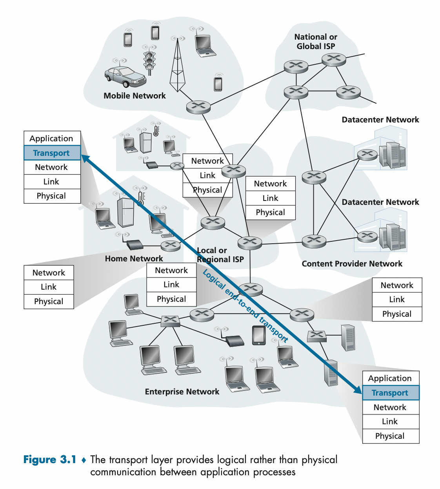
- 트랜스포트 계층은 서로 다른 호스트에서 동작하는 애플리케이션 프로세스들 간의 **논리적 통신**을 제공
    - 논리적 통신이란 애플리케이션 관점에서 보면 프로세스들이 동작하는 호스트들이 직접 연결된 것처럼 보이도록

## 트랜스포트 계층과 네트워크 계층 사이의 관계
전송 계층은 네트워크 계층 상위에 존재
- 전송계층은 서로 다른 호스트에서 동작하는 **프로세스**들 사이의 논리적 통신 제공  네트워크 계층은 호스트들 사이의 논리적 통신 제공
  - 트랜스포트 계층은 종단 시스템에 존재
  - 종단 시스템 내에서 애플리케이션 프로세스에서 네트워크 경계까지 메시지를 운반하며 반대 방향으로 작동
  - 하지만 서로 어떻게 동작하는지는 관심 없음.(모름)

### 인터넷 전송계층 개요
- UDP
    - 비 신뢰적이고 비 연결형인 서비스
- TCP
    - 신뢰적이고 연결지향형
- 트랜스포트 계층 패킷 ⇒ 세그먼트
- 네트워크 계층 프로토콜은 IP ⇒ 최선형 전달 서비스(best-effort delivery service)
    - 세그먼트를 전달하기 위해서 최대한 노력하지만 보장하지 않는다.
    - 세그먼트의 전달을 보장하지 않는다
    - 순서대로 전달되는 것을 보장하지 않는다.
    - 비 신뢰적인 서비스
- 호스트는 적어도 각 하나의 IP 주소를 가지고 있음.
- 트랜스포트 다중화와 역 다중화 ⇒ 프로세스 사이의 전달 서비스
- UDP와 TCP는 헤더에 오류 검출 필드를 포함함으로 써 무결성 검사를 제공.

## Multiplexing / Demultiplexing

---
> 목적지 호스트에서 전송계층은 바로 아래의 네트워크 계층으로부터 세그먼트를 수신한다.
> 전송계층은 호스트에서 동작하는 해당 애플리케이션 프로세스에서 이 세그먼트의 데이터를 전달하는 의무를 가진다.

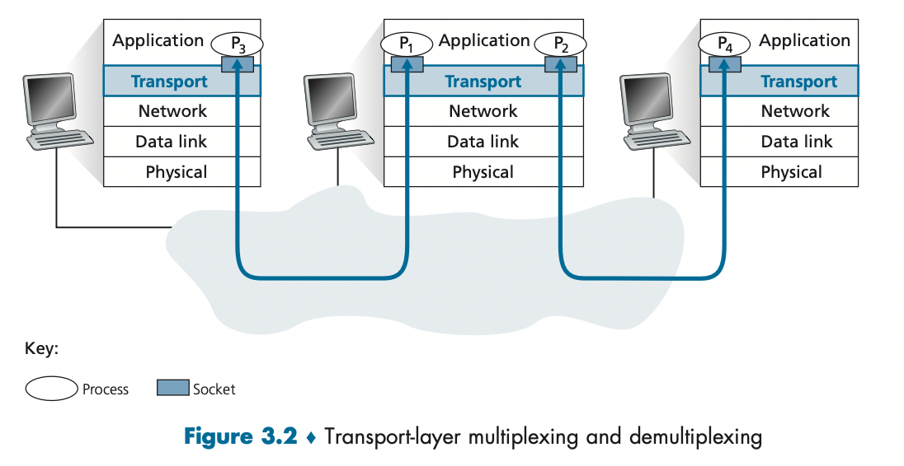
- 네트워크 애플리케이션의 한 부분으로서 프로세스가 **소켓**을 가지고 있음.
- 네트워크에서 프로세스로 데이터를 전달, 또 프로세스로부터 네트워크로 데이터를 전달하는 출입구 역할
- UDP와 TCP에 따라서 동작과정 달라짐
- **Demultiplexing**: 올바른 소켓으로 전달하는 작업
- **Multiplexing**: 출발지 호스트에서 소켓으로부터 데이터를 모으고 이에대한 세그먼트를 생성하기 위해   각 데이터의 헤더정보로 캡슐화 하고, 그 세그먼트들을 네트워크 계층으로 전달하는 작업

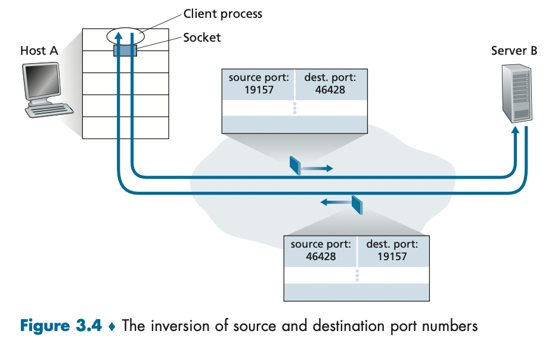
- UDP 소켓이 생성될 때 트랜스포트 게층은 포트번호를 소켓에게 자동으로 할당한다.
- 우리는 소켓을 생성한 뒤에 bind() 방식을 이용하여 특정 포트번호를 UDP 소켓에 할당할 수 있다.
- UDP socket 19157을 가진 호스트 A와 UDP socket 46428을 가진 호스트 B의 통신가정
  - 출발지 포트번호 19157, 목적지 포트번호 46428
  - 2개의 다른 값을 포함하는 트랜스포트 계층 세그먼트를 생성. ⇒ 네트워크 계층으로 전달. 후 캡슐화.
  - 세그먼트가 수신 호스트 B에 도착하면 수신 호스트는 세그먼트 안의 목적지 포트 번호를 검사하고 46428에 대응하는 소켓으로 전달.
  - 호스트 B에는 여러 프로세스가 수행될 수 있음. ⇒ 세그먼트의 목적지 포트를 검사하여 세그먼트를 적절한 소켓으로 보낸다. demultiplexing
  - 프로세스들은 각각 UDP 소켓과 그와 연관된 포트번호를 갖는다.
- UDP를 사용하므로 커넥션을 만들 필요가 없으며 목적지 포트의 소켓까지 가는데 목적지 ip address와 목적지 port number만이 사용된다.

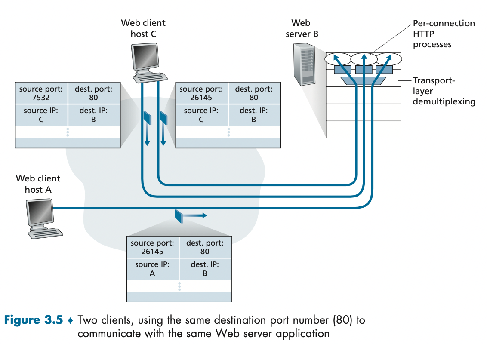
- TCP를 수행하기 위해서 네가지의 필드가 필요
    - source IP
    - source port #
    - dest IP
    - dest port #
    - 네트워크 호스트에 TCP 세그먼트가 도착하면 호스트는 해당되는 소켓으로 세그먼트를 전달하기 위해 4개의 값 모두 사용.
- 서버 호스트는 동시에 존재하는 많은 TCP 소켓을 지원할 수 있다.
- TCP는 클라이언트 소켓과 서버 소켓이 1대1이다.

## UDP 비연결현 Transport

---
- unreliable하고 unordered
- best effort => 최대한 전달. 
  - lost의 가능성 -> 유실이 발생할 수 있다.
  - 부정확한 순서
- connectionless
  - no handshake => 비연결형
- **유실될 지언정, 데이터는 정확히 보낸다** -> 에러 감지(checksum)

### UDP를 사용하는 이유
- **Simple**
  no connectionless
- **Small size**
  no field of sender and receiver
- **Fast**
  no congestion control
- **무슨 데이터를 언제 보낼지에 대해 애플리케이션 레벨에서 더 정교한 제어**
  - Fast
- **연결 설정이 없다**
  - hand shake X
  - 지연이 없다.
  - 만약 DNS가 TCP로 작동된다면 느려질 것.
- **연결 상태가 없다**
  - 연결상태를 유지하지 않으며 파라미터 중에 어떤 것도 기록하지 않는다.
- **작은 패킷 헤더 오버헤드**
  - 8byte의 오버헤드

### 사용되는 분야
- Streaming Service
- DNS
- SNMP
- HTTP3

### UDP Header
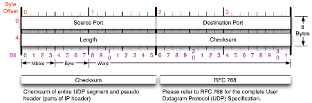
- UDP 헤더는 작을수록 좋음 => 64bit
- Src Port(16bit)
  - 줄발지 port
- Dest Port (16bit)
  - 목적지 port
- Length(16bit)
  - UDP 헤더길이와 데이터 길이를 모두 합친 바이트
- Checksum(16bit)
  - 에러 파악코드
  - 한 bit라도 0이 있으면 오류
  - Checksum을 제공하는 이유
    - 출발지와 목적지 사이의 모든 링크가 오류 검사를 제공한다는 보장 X
    - end-end principle

## TCP Transmission Control Protocol

---

### Go-Back-N
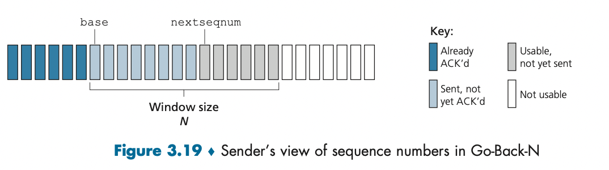
- 송신자는 확인 응답을 기다리지 않고 여러 패킷을 전송할 수 있다.
- 이때 확인 응답이 안된 패킷의 최대 허용 수 N보다 크지 않아야한다.
- 프로토콜이 동작할 때, N은 순서번호 공간에서 오른쪽으로 이동된다. 따라서 N을 Window size라 부른다.
- 따라서 GBN 프로토콜을 sliding-window protocol 이라고 부른다
- N설정 이유 ⇒ 흐름제어

### Selective Ack
- GBN 프로토콜은 송신자가 패킷으로 파이프라인을 채우는 것을 가능하게 하여 전송-후-대기 프로토콜에서의 채널 이용률 문제를 회피.
- 하지만 GBN protocol은 하나의 패킷이 오류가 나면 모든 패킷을 재전송해야 하는 문제가 발생

**SR**
- 수신자에게서 오류가 발생한 패킷을 수신했다고 의심되는 패킷만 송신자가 다시 전송 ⇒ 불필요한 재전송 회피.
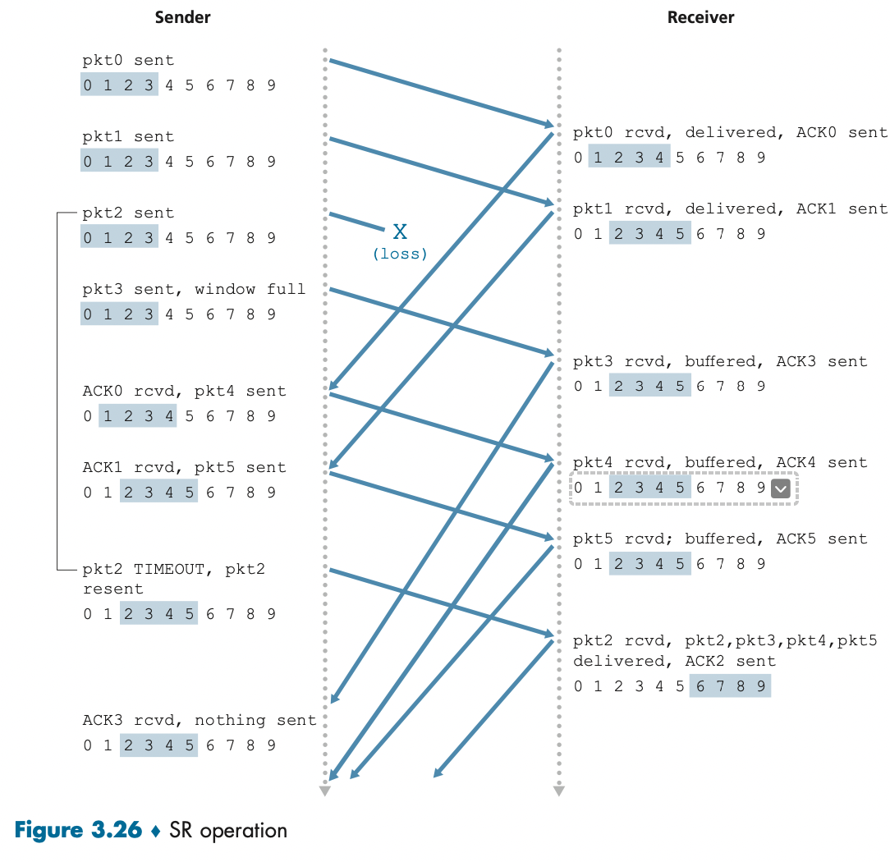

### TCP 특징
- **Point to point**: 일대일 대응, socket까지..
- 믿을수 있고, **순서대로** 데이터 전달
- **congestion control**: 전체 네트워크의 상태 확인
- **flow control**: 상대방의 컴퓨터의 상태 확인

### TCP 연결
- TCP는 두 프로세스가 서로 **handshake**해야 함. → 연결 지향형
- TCP 프로토콜은 오직 **종단 시스템**에서만 동작하므로 중간의 네트워크 요소에서는 동작하지 않으므로 라우터들 간에 연결은 하지 않아도 된다.
- **전이중(full-duplex) 서비스**를 제공. A ↔ B 가능(양방향 통신)

**동작방법**
- 클라이언트의 트랜스포트 계층은 서버의 TCP와의 TCP 연결 설정을 진행한다.
- 서버는 두번째 특별한 TCP 세그먼트로 응답한다
- 클라이언트가 세번째 특별한 세그먼트로 응답한다.
- 처음 2개의 세그먼트에는 페이로드. 즉 애플리케이션 계층 데이터가 없다. 세번째 세그먼트에는 페이로드를 포함할 수 있다.
- 두 호스트 사이에 3개의 세그먼트가 보내지므로 이 연결 설정은 **Three-way handshake**라고 한다

### TCP Header
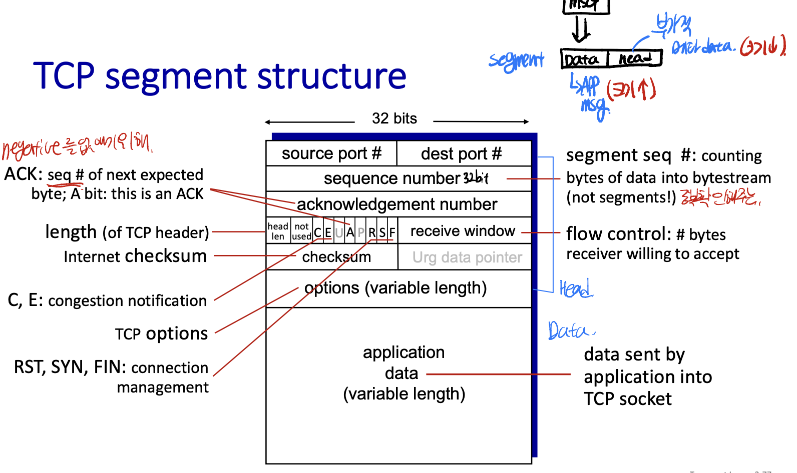
TCP 헤더 최소 크기 => 20Byte
- Src port # 16bit
  보내는 포트 번호
  IP addr + port # ⇒ 소켓주소
- dest Port # 16bit
  목적지 포트 번호
  IP addr + port # ⇒ 소켓주소
- sequence number 32bit
  - byte 단위 순서화되는 번호
  - 이를 통해 TCP는 신뢰성 있는 흐름제어 가능
- acknowelgement number 32bit
  - 받기를 기대하는 다음 바이트 번호 ⇒ return 수신 성공 + 1
- Header length(HLEN) 4bit
  TCP 헤더 길이를 비트로 표시(60byte 이하)
- 6 Flag bit 각 1비트
  - URG: 긴급 ⇒ 마지막 바이트의 위치는 16비트의 Urg Pointer에 의해 가르켜짐.
  - ACK: 응답을 받음
  - PSH: 버퍼에 쌓지 말고 보내라 ⇒ 응용프로그램으로 바로 올리기
  - RST: 오류에 대한 응답으로 연결을 중단
  - SYN: 연결을 시작을 알리는 비트
  - FIN: 연결이 끝났음을 알리는 비트
- window size 16bit
  - 흐름 제어를 위한 16비트 필드
  - receiver는 자신의 여유 용량을 지속적 통보
  - 수신자가 받아들이려는 바이트의 크기를 나타내는데 사용.
- checksum 16bit
- Urg Pointer 16bit
- options 40byte까지의 데이터 포함 가능
  - 송신자와 수신자가 최대 세그먼트 크기(MSS)를 협상하거나 고속 네트워크에서 사용하기 위한 윈도우 확장 요소로 이용.
  - 타임 스탬프 옵션 또한 정의

### TCP 3-way handshake
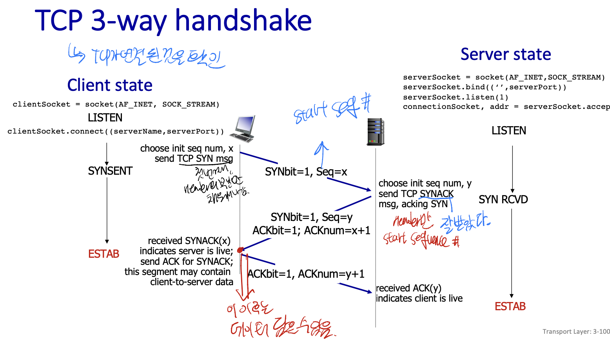
1. 클라이언트 TCP는 서버에게 특별한 TCP세그먼트를 보냄**(헤더만 나감)**
  1. 이 특별한 세그먼트는 애플리케이션 계층 데이터를 포함하지 않음. ⇒ SYN 비트를 가짐
  2. 최초의 클라이언트 순서번호를 보냄 ⇒ x(random number)
2. 서버는 TCP SYN 세그먼트를 추출하고 TCP 버퍼와 변수들을 할당. ⇒ 연결 승인 세그먼트를 송신. **(헤더만 나감)**
  1. 최초의 서버 순서번호 ⇒ y(x와는 다른 random number)를 보내고 ACK 넘버로 x+1을 보냄
  2. SYNACK 세그먼트.
3. 클라이언트가 SYNACK 세그먼트를 수신하면 연결에 버퍼와 변수들을 할당. **(헤더 + 데이터)**
  1. 서버로 또 다른 세그먼트를 송신. ⇒ 마지막 세그먼트가 서버의 연결 승인 세그먼트를 확인.
  2. 데이터가 옮겨 갈 수도 있음.
  3. 다시 ack 패킷
- 이 다음에는  SYN 비트는 0으로

### TCP 4-way Handshake
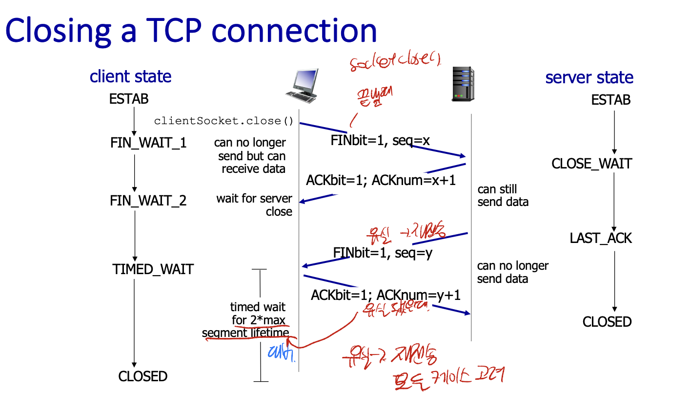

### 신뢰적인 데이터 전달
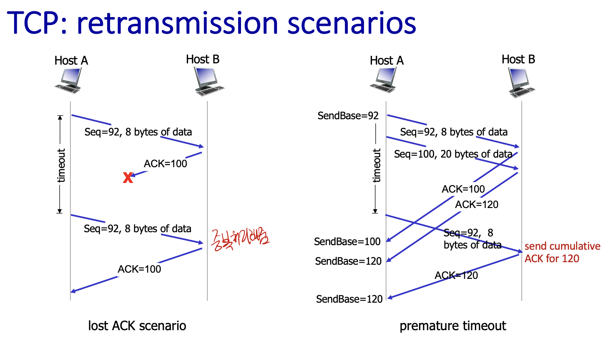
- 첫번째 시나리오
  - 호스트 A가 호스트 B에게 세그먼트를 하나 보냄.
  - ACK 100을 보냈지만 손실됨.
  - 타임 아웃으로 인해 A는 세그먼트를 다시 보냄.
  - B는 중복 데이터를 확인하고 그 세그먼트를 버리고 ACK 100을 다시 보냄
- 두번째 시나리오
  - A가 연속해서 두개의 세그먼트를 보냄
  - B는 세그먼트에 대해 각각 ACK를 보냄(ACK 100, ACK 120)
  - 타임아웃 내에 ACK 100을 받지 못했으므로 첫번째 세그먼트를 다시 보냄.
  - B는 세그먼트를 모두 잘 받았으므로 ACK 120을 보냄
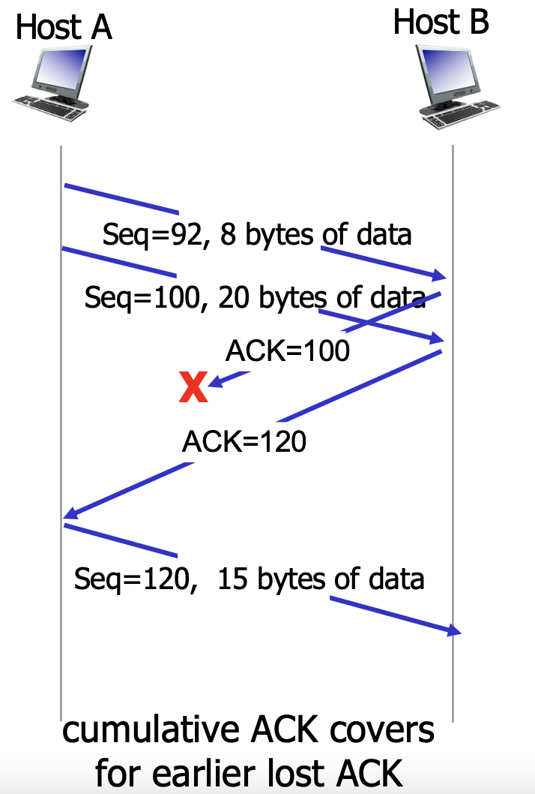
- 세번째 시나리오
- A가 두개의 세그먼트를 보냄
- 각각의 ACK를 B가 보냄.
- ACK100이 유실되었지만 ACK 120이 도착하였음
- 그럼 A는 다음 세그먼트를 보냄.

### TCP fast retransmit
- 재전송의 문제는 주기가 길어진다는 점.
- **3개의 중복 ACK**를 수신하는 경우 TCP의 세그먼트의 다이머가 만료되기 전에 손실 세그먼트를 재전송하는 **빠른 재전송**을 함. 
- 유실된 패킷에 대해 달라고 네번 요청하면 바로 **retransmit 동작을 수행**(time out이 되지 않아도..)

### Flow Control
- 버퍼의 양이 제한적이기 때문에 (Server/Client)TCP는 (Client/Server)read를 고려해서 data를 전송해야함.
- receiver buffer가 남은 데이터(receive **window**)를 sender에게 알려줌.
- sender는 아주 조그만 패킷을 주기적으로 보냄(window 사이즈를 알기 위해서)
- 결론: 버퍼가 오버플로가 나지 않게 제어
- **하나의 소켓에는 Recv/Send Buffer 두개 존재(Window size가 다름)**

### Congestion Control
> 송신측의 데이터 전달과 네트워크의 처리속도  차이를 해결하기 위한 기법

**혼잡원인**
- 시나리오 1: 2개의 송신자와 무한 버퍼를 갖는 하나의 라우터
  - host A & B가 출발지와 목적지 사이에 하나의 라우터를 공유
  - R/2이전일 때는 송신자는 계속해서 증가하고 그 이상이 되면 유지가 된다.
  - 처리량은 R/2가 되면 급속도로 증가.
  - 수신자가 처리하지 못하기 때문에 ⇒ 큐잉지연
- 시나리오 2: 2개의 송신자, 유한 버퍼를 가진 하나의 라우터
  - 송신자는 버퍼 오버플로때문에 버려진 패킷에 대해 재전송해야함.
- 시나리오 3: 4개의 송신자와 유한 버퍼를 가지는 라우터, 멀티 홉 경로
  - 트래픽이 적으면 처리량이 올라감.

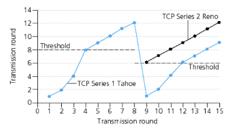
**AIMD**
- 초기에 패킷 하나(mss가 1)
- 패킷 하나씩 증가
- 유실 시 패킷 사이즈 1로 변경

**Slow Start**
- 초기에 패킷 하나(mss가 1)
- 2배로 증가
- 일정 순간 금방 회복
- threshold 이후 부터는 linear하게 증가

**fast recovery**
- 유실이 되면, 유실되기 전 최대 패킷의 반부터 시작

