# 운영체제(Operating System) 개요

> 하드웨어 바로 위에서 컴퓨터 자원(CPU·메모리·I/O)을 **효율적**이고 **형평적**으로 관리하고, 사용자/프로그램이 자원을 안전하게 쓰도록 추상화된 인터페이스(커널 포함)를 제공하는 소프트웨어이다.

## 운영체제란?

운영체제(OS)는 하드웨어와 사용자(혹은 프로그램) 사이에서 **CPU, 메모리, 입출력장치** 등 **컴퓨터 자원**을 관리하고, 자원 접근을 **안전하게 관리**한다.  
운영체제 중 커널(kernel)은 OS의 핵심으로 **프로세스, 메모리, 파일, 장치**를 직접 관리한다.

- **대표적 자원:** CPU, 메모리, 입출력장치(I/O)
- **효율성:** 유한한 자원으로 **처리량/응답성**을 극대화한다.
- **형평성:** 특정 프로세스가 자원을 **독점하지 않도록** 공정 분배한다.

> **정리:** 운영체제는 최대한의 처리성능(효율성)과 고른 분배(형평성)을 **동시에 고려**하여 자원을 분배해야 한다.

## 컴퓨터 시스템 구조

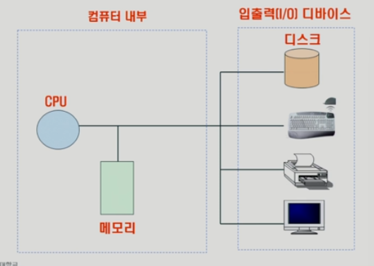

컴퓨터 내부에는 **CPU와 메모리**, 외부(주변장치)에는 **디스크·키보드·프린터·모니터 등 I/O 장치**가 있다.

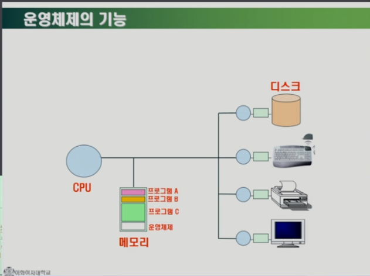

1. 부팅 후 **운영체제**가 메모리에 적재되고, 사용자 프로그램들은 **프로세스**로 실행된다.
2. **CPU**는 매 **클록**마다 **메모리의 기계어**를 읽어 실행한다.
3. **CPU는 I/O 장치에 직접 접근하지 않고**, 장치별 **I/O 컨트롤러**에 **명령을 기록**해 작업을 위임한다. 완료 시 **인터럽트**로 통지받는다.

> **속도차 극복**  
> I/O 장치는 CPU 대비 매우 느리다. OS는
>
> - **인터럽트 기반 I/O:** I/O 중에는 CPU가 **다른 작업**을 수행하도록 한다.
> - **캐싱/버퍼링:** 느린 장치 접근을 **중간 계층**으로 완화한다.  
>   이로써 전체 효율을 높인다.

## 운영체제의 핵심 역할

1. **CPU 스케줄링**  
   어떤 프로세스에 **CPU 사용권**을 줄지 결정한다. **효율성+형평성** 균형이 중요하다.

   - **Q:** 한 프로그램이 **무한 루프**면?  
     **A:** **선점형 스케줄링 + 타이머 인터럽트**로 시간 할당량이 끝나면 **강제로 CPU를 회수**한다.

2. **메모리 관리**  
   한정된 물리 메모리를 **가상메모리/페이징/보호**로 **효율적·안전**하게 사용한다.

3. **디스크 스케줄링**  
   디스크 요청의 처리 순서를 정해 **헤드 이동(seek) 최소화**를 목표로 한다.

## 프로세스와 큐

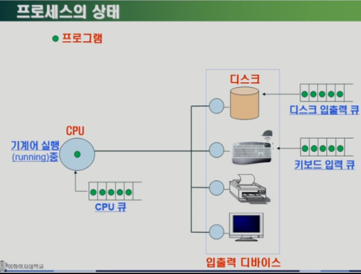

- **프로세스:** 메모리 위에서 실행 중인 **프로그램**이다.
- **준비(Ready) 큐:** CPU를 기다리는 프로세스들이다.
- **대기(Wait/Blocked) 큐:** I/O 완료를 기다리는 프로세스들이다.
- I/O가 끝나면 **인터럽트**로 **준비 큐**에 복귀한다.

## CPU 스케줄링

운영체제가 CPU를 어떻게 배분하는지 살핀다.

### FCFS (First-Come, First-Served)

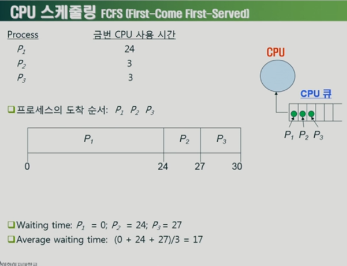

- **도착 순서**대로 처리한다. 단순하지만 앞에 **긴 작업**이 오면 뒤의 **짧은 작업**이 오래 기다려 **평균 대기시간**이 증가한다(컨보이 효과).

### SJF (Shortest-Job-First)

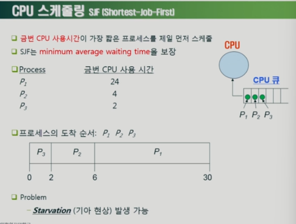

- **예상 실행시간이 짧은 작업**을 우선한다. **평균 대기시간 최소화**에 유리하다.
- 단점: 긴 작업은 **기아**가 발생할 수 있어 **형평성**이 저하된다.

### RR (Round Robin)

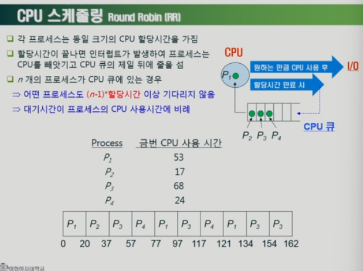

- **고정 시간 할당량**만큼 **돌아가며 실행**한다.
- **응답성**을 높이고 **기아 방지**에 강하다. 퀀텀 선택에 따라 **문맥 교환 오버헤드**와 **효율**이 달라진다.

> **문맥 보존/복원**  
> 타이머 인터럽트 시 **CPU 레지스터·프로그램 카운터·스택 포인터** 등을 PCB(Process Control Block)에 저장하고, 재스케줄 시 **PCB에서 복원**해 **중단 지점부터 이어서 실행**한다.

## 메모리 관리

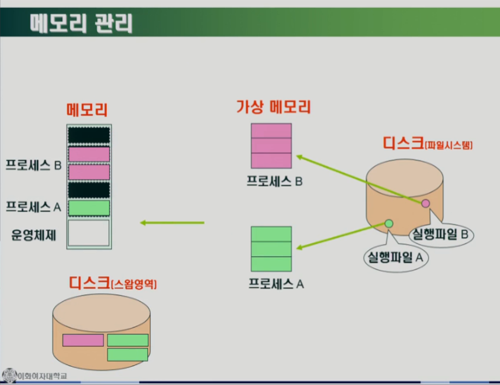

- **가상메모리:** 각 프로세스에 **연속적이고 큰 주소 공간**을 **가상으로 제공**한다. 실제로는 **필요한 페이지**만 물리 메모리에 **지연 적재**한다.
- 물리 메모리가 부족하면 **당장 필요 없는 페이지**를 디스크 **스왑 영역**으로 내보내어(페이지 아웃) 공간을 확보한다.
  > 정확히는 “실행 파일이 먼저 _가상메모리로 올라간다_”가 아니라, **프로세스의 가상 주소 공간을 생성**하고 **접근 시 해당 페이지를 물리 메모리에 적재**한다.

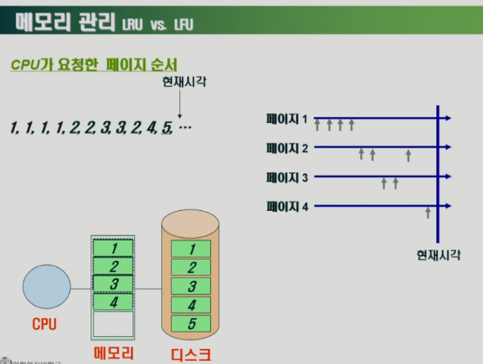

- CPU가 페이지를 **1,1,1,1,2,2,3,3,2,4,5…** 순으로 요구한다고 가정한다:
  - **메모리에 있으면** 즉시 사용한다.
  - **없으면** 페이지 폴트를 발생시키고 **디스크에서 적재**한다.
  - **자리가 부족하면** 페이지 교체 알고리즘으로 **교체 대상 페이지**를 선정한다.

**대표 교체 알고리즘**

- **LRU (Least Recently Used):** 가장 **오래 참조되지 않은** 페이지를 교체한다.
- **LFU (Least Frequently Used):** **참조 빈도가 낮은** 페이지를 교체한다.

> 두 방식 모두 **미래를 직접 알 수 없으므로** 과거 참조 이력으로 추정한다.

## 디스크 스케줄링

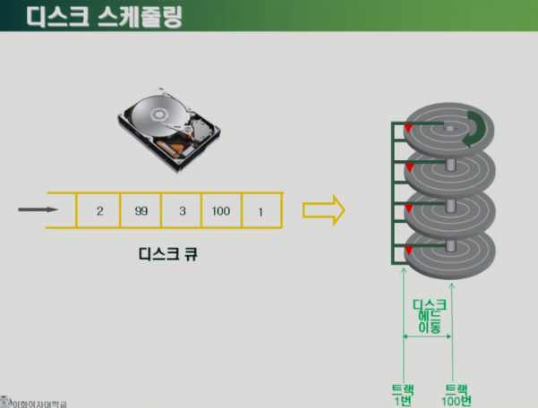

- 디스크는 **회전**하고, **헤드**가 **트랙 위치**로 이동해 데이터를 읽는다.
- 전체 지연 중 **헤드 이동** 비중이 커서, 보통 **이동 최소화**가 목표이다.

### SSTF (Shortest Seek Time First)

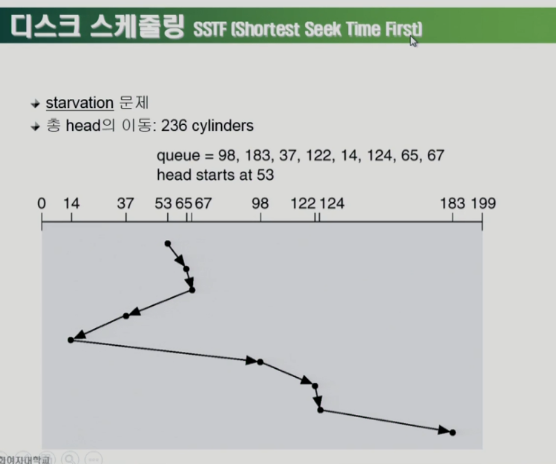

- 현재 헤드 위치에서 **가장 가까운 요청**부터 처리해 **평균 이동거리**를 줄인다.
- 단점: 멀리 있는 요청은 **기아**가 발생할 수 있다.

### SCAN (엘리베이터 알고리즘)

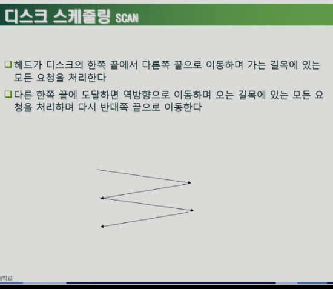

- 헤드가 **한쪽 끝까지 이동**하며 **지나는 길의 요청을 처리**하고, 끝에 도달하면 **반대 방향으로 왕복**한다.
- **SSTF의 기아 문제**를 완화하고, **이동 거리의 예측 가능성**이 높다.

## 프로세스 개요

프로세스는 **메모리에서 실행되고 있는 프로그램**이다. 프로세스는 **CPU**에 의해 처리된다.

- **포어그라운드 프로세스**  
  사용자가 **화면에서 직접 상호작용**하는 프로세스이다.
- **백그라운드 프로세스**
  - 사용자와 **직접 상호작용 가능한** 백그라운드 프로세스이다.
  - 사용자와 **상호작용하지 않고** 백그라운드에서 **지속 실행**되는 프로세스이다(예: **데몬**, **서비스**).

## 프로세스 제어 블록

모든 프로세스는 실행을 위해 **CPU**가 필요하다. 하지만 CPU는 자원이 한정되어 있으므로, 프로세스는 **한정된 시간**만큼만 처리되고 번갈아 실행된다(예: **라운드 로빈**).

이때 OS는 빠르게 전환되는 프로세스들을 관리하기 위해 **프로세스 제어 블록**이라는 자료구조를 사용한다.  
**PCB는 프로세스 생성 시 커널 공간에 생성**되고, **종료 시 폐기**된다.

대표적으로 PCB에는 아래 정보가 담긴다.

- **프로세스 ID**  
  특정 프로세스를 식별하는 고유 번호이다.  
  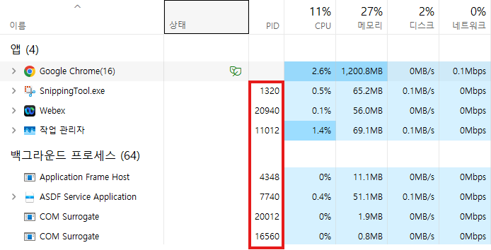
- **CPU 레지스터 값**  
  다음 실행 재개를 위해 **프로그램 카운터(PC), 스택 포인터** 등 레지스터 스냅샷을 보관한다.
- **프로세스 상태**  
  생성(Create), 준비(Ready), 실행(Running), 대기(Waiting), 종료(Terminated) 상태를 기록한다.
- **CPU 스케줄링 정보**  
  우선순위, 스케줄링 큐 포인터, 시간 사용량 등을 포함한다.
- **메모리 관리 정보**  
  코드/데이터/스택/힙의 위치, **페이지 테이블** 등을 포함한다.
- **열린 파일/입출력 장치 정보**  
  파일 디스크립터, 할당된 장치 등의 정보를 포함한다.

## 문맥 교환

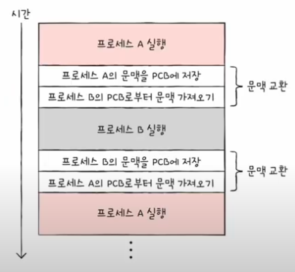

CPU는 여러 프로세스를 **번갈아 가며** 처리한다.  
한 프로세스에서 다른 프로세스로 실행이 넘어갈 때, OS는 **현재 프로세스의 실행 문맥(레지스터·PC·SP 등)을 PCB에 저장**하고, **다음 프로세스의 문맥을 PCB에서 복원**한다. 이를 **문맥 교환**이라 한다.

> 문맥 교환은 **저장/복원 오버헤드**가 발생한다. 따라서 스케줄링 정책과 퀀텀 설정은 **응답성**과 **오버헤드** 사이에서 균형을 맞춰야 한다.

## 프로세스의 메모리 영역

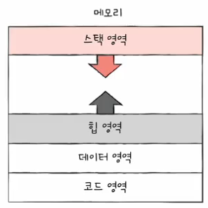

프로세스의 메모리 주소 공간(=가상 메모리)은 보통 다음과 같이 구성된다.

- **코드(Code / Text) 영역**  
  실행될 기계어 명령이 저장되는 **읽기 전용** 영역이다. **컴파일 타임**에 결정된다.
- **데이터(Data) 영역**  
  **전역 변수, static 변수** 등이 저장되는 영역이다.
- **스택(Stack) 영역**  
  **함수 호출 프레임**, 복귀 주소, 지역 변수 등이 **자동으로** 할당/해제되는 영역이다.
- **힙(Heap) 영역**  
  프로그래머가 **동적 할당**으로 사용하는 영역이다(런타임 결정).  
  예: **Java**에서는 객체가 힙에 생성되고 **GC**에 의해 회수된다.

## 프로세스 상태

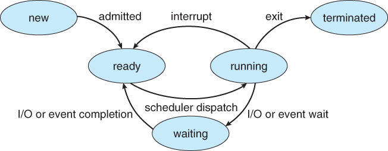

프로세스는 실행 수명 주기 동안 여러 상태를 오가며 스케줄링과 자원 사용을 수행한다. 대표적인 상태는 다음과 같다.

- **생성 상태** _(New)_  
  프로세스가 생성되어 커널이 초기화 중인 단계이다. 초기 PCB 생성과 주소 공간 준비가 이루어진다.

- **준비 상태** _(Ready)_  
  CPU를 할당받기만 하면 즉시 실행할 수 있는 상태이다. 준비 큐에서 스케줄러의 선택을 기다린다.

- **실행 상태** _(Running)_  
  CPU를 할당받아 명령을 수행 중인 상태이다. 타이머 만료나 시스템 호출로 상태가 바뀔 수 있다.

- **대기 상태** _(Waiting/Blocked)_  
  I/O 완료, 이벤트 발생, 페이지 적재 등 외부 조건을 기다리는 상태이다. 조건이 충족되면 준비 상태로 전이된다.

- **종료 상태** _(Terminated)_  
  실행이 끝나 커널이 정리 작업을 수행하는 상태이다. PCB와 자원이 회수된다.

### 전이 예시

- 생성 → 준비: 로더가 적재를 마치고 스케줄러가 큐에 등록한다.
- 준비 → 실행: 디스패치가 발생해 CPU를 할당한다.
- 실행 → 준비: 타이머 인터럽트로 선점된다.
- 실행 → 대기: I/O 요청이나 이벤트 대기로 진입한다.
- 대기 → 준비: I/O 완료나 이벤트 발생으로 깨어난다.
- 실행 → 종료: 정상 종료 또는 예외로 종료된다.
