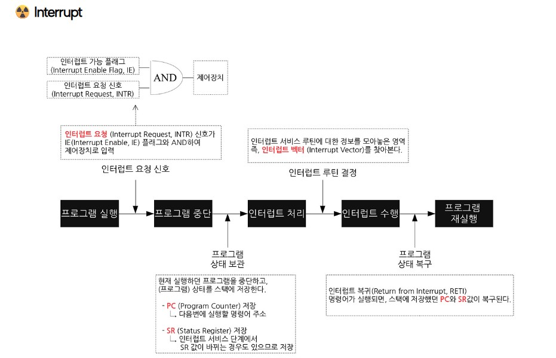

# OS 기본 구성 요소 정리

## Registers (레지스터)
- CPU 내부에 있는, **L1 캐시보다도 더 작고 빠른 저장 공간** [한 클럭 사이클 내 접근 가능하기에 지연이 거의 없음] (가장 비싸기도...)
- 명령 레지스터: 현재 실행 중인 명령에 필요한 데이터를 저장.
- 프로그램 카운터(PC): 다음에 실행할 명령어의 메모리 주소를 저장.

- 즉, 레지스터는 “CPU의 손끝에 들고 있는 작은 메모장” 같은 존재. 공간은 작지만 즉각적인 계산에 필수라서, 성능을 위해 가장 소중하게 관리되는 자원이라 할 수 있다.

---

## Interrupt (인터럽트)
CPU가 외부/내부 요청에 의해 실행 중이던 동작을 중단하고, 운영체제의 서비스 루틴으로 제어를 넘기는 메커니즘.

### 인터럽트 발생 시 동작 과정 (중요!)

1. **인터럽트 요청(IRQ) 발생**
   - 하드웨어 장치(키보드, 디스크 등) 또는 소프트웨어/예외 상황에서 인터럽트 신호 발생.

2. **현재 명령어 실행 완료**
   - CPU는 현재 실행 중이던 명령어를 끝까지 실행한 후 인터럽트를 처리한다.

3. **문맥 저장 (Context Save)**
   - CPU는 우선적으로 **Program Counter(PC)**와 일부 상태 레지스터를 커널 스택에 임시 저장한다.
   - 이후 운영체제 커널이 개입하여 현재 프로세스의 **PCB(Process Control Block)**에 전체 레지스터 값, 스택 포인터, CPU 상태 등을 저장한다.
   - 이 과정을 통해 나중에 동일한 프로세스를 이어서 실행할 수 있게 된다.

4. **인터럽트 벡터 조회**
   - 인터럽트 번호를 이용해, 해당 인터럽트의 **ISR(Interrupt Service Routine) 주소**를 찾는다.

5. **인터럽트 서비스 루틴(ISR) 실행**
   - 운영체제가 정의해 둔 ISR 코드를 수행한다.
   - 예: 키보드 입력 처리, 디스크 읽기 완료 처리 등.

6. **문맥 복원 (Context Restore)**
   - ISR 실행이 끝나면, PCB에 저장된 레지스터 값과 PC 값을 다시 복원한다.
   - CPU는 중단했던 지점부터 프로세스를 재개한다.

### 관련 개념
- **인터럽트 벡터**: 인터럽트 번호와 ISR 주소를 매핑한 테이블.
- **인터럽트 처리 루틴(ISR)**: 해당 인터럽트를 처리하는 커널 함수.
- **인터럽트 라인**: 하드웨어 → CPU로 신호를 전달하는 경로.
- **인터럽트 컨트롤러**: 여러 장치에서 발생한 인터럽트의 우선순위를 정해 CPU에 전달.

### 인터럽트의 종류

- **HW 인터럽트**:  
외부 장치(I/O 장치, 타이머 등)에서 발생하여 CPU의 실행 흐름을 중단시키고, 해당 이벤트를 처리하도록 하는 인터럽트.(ex: 키보드 입력, Timer Interrupt)

- **SW 인터럽트 (Trap)**:  
프로그램 실행 중 명령어에 의해 의도적으로 발생하거나, 예외 상황(오류)에 의해 발생하는 인터럽트.
  → 사용자 모드에서 커널 함수 호출 시 Mode Bit 전환.

| 구분 | 하드웨어 인터럽트 (HW Interrupt) | 소프트웨어 인터럽트 (SW Interrupt) |
|------|--------------------------------|-----------------------------------|
| **발생 원인** | 외부 장치에서 발생 (I/O, 타이머, 키보드 등) | 프로그램 내 명령어 실행 또는 예외 발생 |
| **발생 시점** | 비동기적 (언제든 발생 가능) | 동기적 (명령어 실행 중 발생) |
| **발생 주체** | 하드웨어 장치 → CPU | 프로그램(명령어) 또는 CPU 내부 |
| **용도** | 외부 장치 이벤트 처리 | 시스템 콜, 예외 처리, 커널 진입 |
| **처리 방식** | 인터럽트 컨트롤러(PIC/APIC) 통해 ISR 호출 | 소프트웨어 명령어(`int n`) 또는 트랩(Trap)으로 ISR 호출 |
| **예시** | 키보드 입력, 디스크 I/O 완료, 타이머 인터럽트, 네트워크 패킷 수신 | Divide by Zero, Page Fault, Overflow, `int 0x80` (리눅스 시스템 콜) |

---

## Mode Bit (CPU 내부 레지스터에 존재하는 1비트 플래그)
- CPU가 **커널 모드(0)**인지, **사용자 모드(1)**인지 구분하는 플래그.
- 운영체제가 프로세스의 권한 수준(Privilege Level)을 제어하기 위해 사용된다.

### 사용자 모드 (User Mode)
- 일반 애플리케이션이 실행되는 모드.
- 제한된 명령어만 실행 가능 (**특권 명령어 실행 불가**).
- I/O, 메모리 관리, 하드웨어 제어 같은 작업은 직접 수행 불가.
- 잘못된 명령 실행 시 **트랩(Trap) / 예외(Exception)** 발생 → 커널 모드로 전환.

### 커널 모드 (Kernel Mode, Supervisor Mode)
- 운영체제 커널 코드가 실행되는 모드.
- 모든 명령어 실행 가능 (**특권 명령어 포함**).
  - 예: 디스크 제어, 메모리 관리, CPU 제어, 인터럽트 제어.
- 하드웨어와 직접 소통 가능.
- 오류 발생 시 시스템 전체가 위험해질 수 있음.

### Example
- **시스템 콜**: 사용자 모드 → 커널 모드 전환
- **타이머 인터럽트**: 사용자 프로세스 중단 후 커널 모드로 전환, 스케줄러 실행

### 핵심 정리
Mode Bit은 CPU가 현재 실행 중인 코드가  
- **사용자 프로그램(User Mode)**인지  
- **운영체제 커널 코드(Kernel Mode)**인지 구분해주는 **안전장치**이다.  
- 이를 통해 OS는 보안, 안정성, 권한 제어를 보장한다.

---

---

## DMA (Direct Memory Access)

### 정의 : 
- DMA는 CPU를 거치지 않고, I/O 장치가 **메모리와 직접 데이터를 주고받을 수 있도록** 하는 방식이다.
- CPU의 개입을 최소화하여, 대용량 데이터 전송 시 시스템 성능을 크게 향상시킨다.

### 필요한가 ? 
#### 기존 방식 (Programmed I/O)
- I/O 장치와 메모리 간 데이터 전송을 **CPU가 명령어로 일일이 제어**.
- 데이터가 많을수록 CPU가 전송 작업에 매달리게 되어, 다른 연산을 못 함 → **CPU 낭비** 발생.

#### DMA 방식
- DMA 컨트롤러가 데이터 전송을 **대신 처리**.
- CPU는 단순히 "어디서 어디까지 복사해라"라는 명령만 내리고, 나머지는 DMA가 처리.
- 전송이 끝나면 DMA가 **인터럽트**로 CPU에게 완료 사실을 알림.

#### 어떻게 동작하나 ?

1. **CPU가 DMA 컨트롤러에 명령**
   - 소스 주소(메모리/장치)
   - 목적지 주소(메모리/장치)
   - 전송할 데이터 크기
   - 전송 모드

2. **DMA 컨트롤러가 데이터 전송**
   - CPU 대신 **버스 제어권**을 얻어, 메모리와 I/O 장치 간 직접 데이터 이동.

3. **전송 완료 후 인터럽트 발생**
   - DMA가 CPU에게 "작업 완료" 신호를 보냄.
   - CPU는 인터럽트를 받아 후속 작업(데이터 처리 등)을 이어감.

---

## 전체 단어 요약 ~

- **레지스터**: CPU 내부 초고속 저장소 (매우비쌈..)
- **인터럽트**: 실행 중단 + OS 서비스 호출
- **Mode Bit**: 사용자/커널 모드 구분
- **Timer**: 시분할 처리, CPU 자원 회수
- **I/O Controller**: 장치 제어 및 CPU와 연결
- **Memory Controller**: 주소 변환 및 메모리 제어
- **DMA Controller**: CPU 대신 대량 데이터 전송
