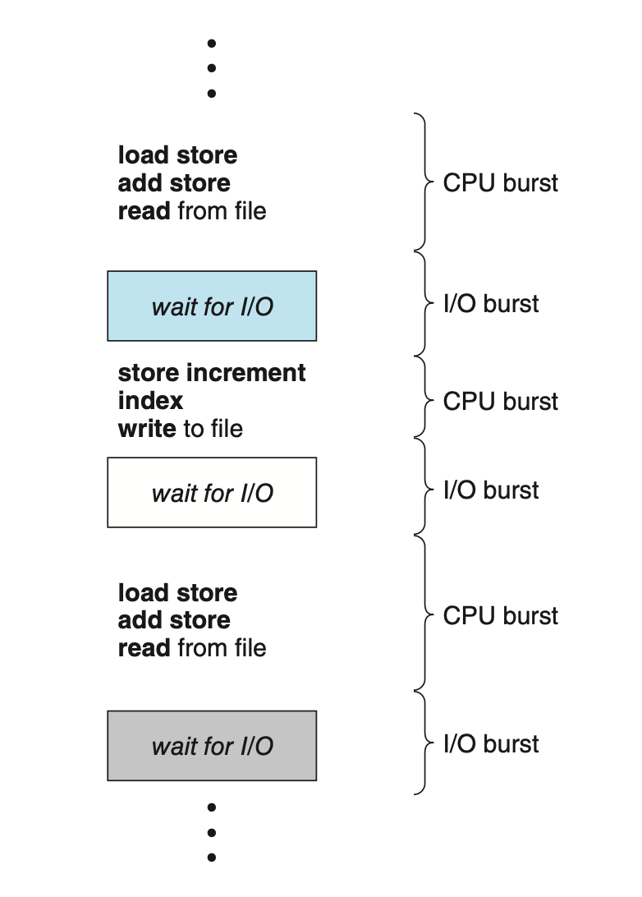
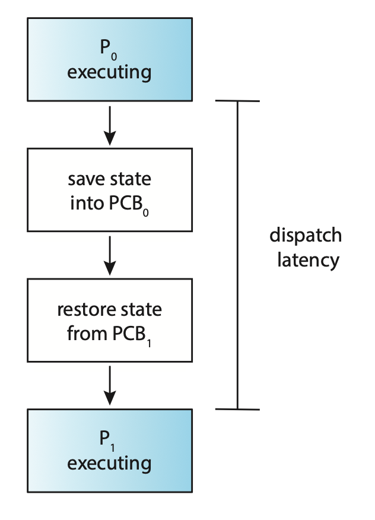
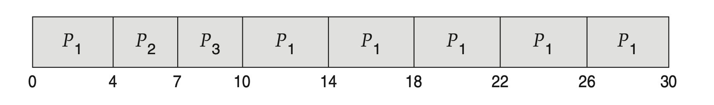
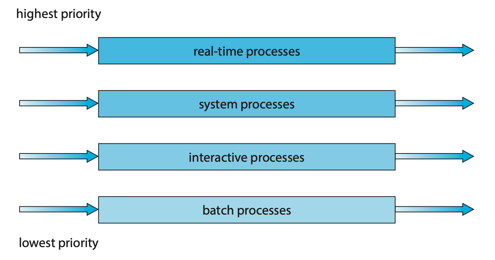
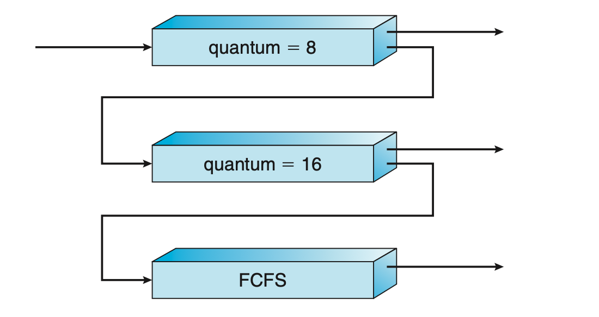

# CPU 스케줄링

## CPU 스케줄링이 왜 필요할까?

만약에 CPU 코어가 하나인 시스템을 생각해보면, 물리적으로는 한 순간에 하나의 프로세스만 실행이 가능할 것이다.
이때, 나머지 프로세스들은 `Ready` 상태로 다시 스케줄링이 될 때까지 기다려야한다.

그러나 멀티프로그래밍 환경에서는 CPU의 이용률을 최대화하기 위해서 몇몇 프로세스들이 동시에 실행시키는게 목적이다.
멀티프로그래밍 환경에서는, 어느 한 순간에 다수의 프로세스들을 메모리에 유지하고, 이후에 어떤 프로세스가 대기해야 하는 경우, 운영체제는 CPU를 해당 프로세스로부터 회수에서 다른 프로세스에 할당한다.



프로세스 실행은 `CPU burst` 라는 상태와 `I/O burst` 가 교대로 나타나는 패턴으로 이루어진다.

일단 CPU burst가 뭔지 알아야 한다.

#### CPU Burst

CPU burst라는 것은 프로세스가 CPU를 잡고 계산 위주로 실행되는 구간이다.

컴퓨터 구조 수업에서 배운 `load`, `add`, `store`, 변수 계산 등이 CPU burst에 해당된다.

#### I/O burst

I/O burst는 프로세스가 `입출력 작업`을 기다리는 구간이다.

파일을 읽기/쓰기 하거나, 디스크에 접근하거나, 프린터 출력, 네트워크 패킷 등이 이에 해당된다.

이때 CPU는 해당 프로세스를 더 이상 실행할 수 없으므로, `Waiting` 상태에 들어가게 된다.

> ### 왜 CPU burst가 먼저 일어나나요?

    프로그램이 실행되면 보통 코드 로딩과 연산이 수행되기 때문에 CPU 사용부터 시작하는 경우가 일반적이고, 그 후에 입출력이 필요해지는 경우 I/O burst로 넘어가게 된다.

이 개념이 왜 중요할까?

CPU burst라는 것은 CPU가 필요하다는 뜻이고 이건 곧 `스케줄러가 CPU를 할당해야 한다.` 라는 뜻이다.

그렇다면 I/O burst를 생각해보면 이건 반대로 다른 프로세스에게 CPU를 넘겨야 한다는 뜻이다.

## CPU 스케줄러

CPU의 상태가 `idle` 일 때마다, 운영체제는 레디 큐에서 자기 차례를 기다리고 있는 프로세스들 중 하나를 꼭 선택해서 실행되게 해줘야한다.

이러한 선택이 `CPU scheduler`에 의해서 실행이 되고, 이 스케줄러는 실행 준비가 되어 있는 메모리 내의 프로세스들 중 하나를 꺼내서 CPU에 할당해주는 작업이다.

### CPU 스케줄링의 발생 조건 4가지

CPU 스케줄링은 아래와 같은 4가지 상황에서 발생할 수 있다.

1) 프로세스가 `Running` 상태에서 `Waiting` 상태로 바뀔 때

2) 프로세스가 `Running` 상태에서 `Ready` 상태로 바뀔 때

3) 프로세스가 `Waiting` 상태에서 `Ready` 상태로 바뀔 때

4) 프로세스가 종료될 때

1번 상황과 4번 상황을 봤을 때, 스케줄링이 필요할 것 같이 생겼는가? 를 생각해본다면 스케줄링이 필요하진 않다.

그 이유를 생각해보면, 1번과 4번 상황은 CPU가 무조건 비는 상황이기 때문에 무조건 새로운 프로세스를 골라야 한다.

그래서 이런 상황을 `Non-Preemptive(비선점형) Scheduling` 이라고 한며, 2번 상황과 3번 상황은 `Preemptive(선점형) Scheduling` 이라고 한다.

### Preemptive(선점형) Scheduling

선점형 스케줄링에서는 데이터가 다수의 프로세스에 의해 공유될 때 `Race Condition`이 발생할 수 있다.

`Race Condition` 이란 예를 들어서 두개의 프로세스가 데이터를 공유한다고 해보자.

하나의 프로세스가 데이터를 업데이트 하는 도중에 두번째 프로세스가 선점해서 데이터를 읽으려 한다면, 아직 일관되지 않은 상태의 데이터를 읽을 수 있는데 이걸 `Race Condition` 이라고 한다.

운영체제의 커널은 비선점형 또는 선점형으로 설계될 수 있다.

#### Dispatcher

CPU 스케줄링 기능에 포함된 요소들중 `Dispatcher` 라는게 존재하는데, 이는 CPU의 컨트롤을 단기 스케줄러가 선택한 프로세스에게 주는 모듈이다.

Dispatcher는 아래와 같은 작업을 수행할 수 있다. 

1. Context Switching
2. 사용자 모드로 전환
3. 프로그램을 다시 시작하기 위해서 User Program을 적절한 위치로 이동시키기

Dispatcher는 모든 프로세스의 Switching 시에 호출되므로, 가능한 한 빨리 수행되어야 한다.

Dispatcher가 하나의 프로세스를 정지하고, 다른 프로세스의 수행을 시작하는 데까지 소요되는 시간을 `Dispatch latency(디스패치 지연시간)` 이라고 한다.

## Scheduling Criteria

CPU 스케줄링 알고리즘 마다 다 다른 장단점을 가지고 있고, 어떤 기준으로 평가하느냐에 따라 "좋다" 라는 기준이 달라질 수 있다.

그래서 운영체제를 설계를 할 때, 상황에 따라 적합한 알고리즘을 선택해야 한다.

### 알고리즘 평가 기준

#### 1. CPU utilization

CPU를 가능한 최대한 바쁘게 유지시키는 것을 최우선 순위로 생각

이론상 0 ~ 100 이지만 실제 시스템 상에서는 40 ~ 90 의 범위를 가진다.


#### 2. Throughput

단위 시간당 완료된 프로세스의 개수를 뜻하는 Throughput

ex) 1시간에 한 프로세스, 초당 10개의 프로세스

#### 3. Turnaround time

해당 프로세스를 실행하는 데 소요되는 시간

프로세스의 submission과 completion 사이의 간격을 Turnaround time이라고 함

이 시간은 메모리에 들어가기 위해 기다리는 시간 + Ready Queue에서 대기한 시간 + CPU에서 실행한 시간, I/O 시간 이다.

#### 4. Waiting time

CPU 스케줄링 알고리즘은 실제 프로세스 실행 시간이나 I/O 수행 시간에는 영향을 주지 않는다.

대신 Ready Queue에서 기다리는 시간에만 영향을 주는데, 이를 고려한게 Waiting Time이다.

스케줄러가 정하는거는 CPU 누가 먼저 쓸래? 이거다.

그래서 프로세스가 ReadyQueue에서 CPU를 얻을 때까지 기다린 모든 시간의 합을 Waiting Time 이라고 한다.

#### 5. Response time

Response time이란 한 request를 제출한 후, 첫 번째 response가 나올 때까지 걸리는 시간이다.

Response time의 기준은 응답의 "시작" 시간이므로, 응답이 출력하는 데까지 걸리는 시간은 아니다.


### 그래서 뭐를 고려해야하는거야?

보통은 이 모든것을 고려해서 평균값을 기준으로 성능을 평가하는게 일반적이다. 

그러나 만약에 모든 사용자에게 최소한의 보장을 하고 싶어요 라고 하면 최대 응답 시간을 최소화 하는게 중요하다.

만약 PC나 노트북처럼 UI가 있는 환경이다?

평균 응답 시간 보다는 Response Time의 변동성이 더 중요하다.

예를 들어서 평균 응답 시간이 0.5 초라고 해서 봤는데 어떤 건 0.1초가 걸리고 어떤 건 3초가 걸리면 좀 불편하지만

평균 응답시간이 0.7초여도 모든 요청이 0.6초 ~ 0.8초 사이에 들어오는 시스템을 더 선호할 것이기 때문에 상황에 맞게 잘 고려해야 한다.


## Scheduling Algorithm

### FCFS (First-Come, First-Serve)

가장 간단한 CPU 스케줄링 알고리즘으로, 비선점형 알고리즘이다.

FCFS가 뜻하는 그대로, 먼저 요청하면? 먼저 CPU를 할당 받는 선착순 시스템이다.

이러한 알고리즘은 큐로 쉽게 관리하고 구현할 수 있다.

단점으로는 평균 대기 시간이 때에 따라 매우 길어질 수 있다.

만약에 프로세스 3개가 동시에 들어온 상황을 가정하자.

| Process | Burst time |
|---------|------------|
| Process 1    | 24 ms      |
| Process 2    | 3 ms       |
| Process 3    | 3 ms       |

이렇게 세개의 프로세스가 1 -> 2 -> 3 순차적으로 도착하게 되면 평균 대기시간은 아래와 같이 구한다.

```text
(0 + 24 + 27) / 3 = 17(ms)
```

그러나 만약에 프로세스가 2 -> 3 - 1 순서로 들어 왔다고 생각해보자.

그러면 평균 대기시간은 아래와 같이 3ms 가 나온다.

```
(6 + 0 + 3) / 3 = 3(ms)
```

위와 같이 FCFS 방법을 사용했을 때, 평균 대기시간은 일반적으로 최소가 아니며, 프로세스 CPU burst time이 크게 변할 경우에는 평균 대기시간도 크게 변할 수 있다.

이처럼 모든 다른 프로세스들이 하나의 긴 프로세스가 CPU를 양도하기를 기다리는 것을 `Covoy Effect` 라고 한다.

이 효과는 짧은 프로세스들이 먼저 처리되도록 허용할 때보다 CPU와 장치 이용률이 저하되는 결과를 발생시킨다.

### SJF (Shortest-Job First Scheduling)

SJF 알고리즘은 각 프로세스에 다음 CPU burst 길이를 생각하여 CPU가 가용하면, 가장 시간이 적게 걸리는 프로세스에게 CPU를 할당해준다.

| Process | Burst time |
|---------|------------|
| Process 1    | 6 ms      |
| Process 2    | 8 ms       |
| Process 3    | 7 ms       |
| Process 4    | 3 ms       |

프로세스가 위와 같을 때, SJF 알고리즘을 적용하면 4 -> 1 -> 3 -> 2 순서로 스케줄링을 하게 된다.

평균 대기시간은 7ms 가 나온다.

```
(3 + 16 + 9 + 0) / 4 = 7(ms)
```

SJF알고리즘을 사용하면, 최소의 평균 대기시간은 보장되지만, 실제로 SJF를 구현하면 다음 CPU 요청의 길이를 파악해야 하기 때문에 어렵다.

Short-term scheduling에서는 다음 CPU burst 길이를 알 수 있는 방법이 없기 때문에, Long-term scheduling에 자주 사용된다.

SJF는 선점형일수도 있고, 비선점형일 수도 있다.

선점형 SJF 알고리즘은 Shortest Remaining Time First 스케줄링이라고도 불린다.

| Process   | Burst time | Arrive Time |
|-----------|------------| ----------- |
| Process 1 | 6 ms       | 0 ms        |
| Process 2 | 8 ms       | 1 ms        |
| Process 3 | 7 ms       | 2 ms        |
| Process 4 | 3 ms       | 3 ms        |

프로세스 4개가 위와 같을 때 선점형 SJF 알고리즘의 평균 대기시간은 6.5 ms 이다.

```
((10 - 1) + (1 - 1) + (17 - 2) + (5 - 3)) / 4 = 6.5(ms)
```

### Priority Scheduling

SJF 알고리즘은 Priority Scheduling의 특별한 경우이다.

Priority Scheduling 알고리즘에서는 가장 높은 우선순위를 가진 프로세스에게 할당된다.

만약에 우선순위가 같으면? FCFS 순서로 스케줄 된다.

| Process   | Burst time | Priority  |
|-----------|------------| --------- |
| Process 1 | 10 ms       | 3         |
| Process 2 | 1 ms       | 1         |
| Process 3 | 2 ms       | 4         |
| Process 4 | 1 ms       | 5         |
| Process 5 | 5 ms       | 2         |

위와 같은 프로세스들이 들어왔을 때, 우선순위 스케줄링을 적용한다면 평균 대기시간은 8.2ms이다.

```
(6 + 0 + 16 + 18 + 1) / 5 = 8.2(ms)
```

실질적인 우선순위는 내부적인 요인과 외부적인 요인으로 결정된다.

내부적인 요인으로는 시간제한이나 메모리를 얼마나 요구하는지 등이 있고, 외부적으로는 프로세스의 중요성, 비용 등이 있다.

Priority Scheduling 알고리즘의 주요 문제는 `Indefinite Blocking` 또는 `Starvation` 이 있다.

낮은 우선순위를 가진 프로세스들은 평생 CPU를 할당받지 못할 수가 있는데, 이를 해결하는 방법 중 하나로 `Aging` 이라는 것이 있다.

이 Aging은 오랫동안 시스템에서 대기하는 프로세스들의 우선순위를 점진적으로 높이는 방법이다.

### Round Robin Scheduling

RR이라고 불리는 스케줄링 알고리즘은 `Time-Sharing System`을 위해 설계되었다.

이 방식에서는 `Time Slice` 라고 하는 작은 단위의 시간을 정의해서 사용한다.

Ready Queue는 원형큐로 동작하며, CPU 스케줄러는 Ready Queue를 돌면서 한 번에 한 프로세스에게 1 Time Slice 만큼 CPU를 할당해준다.

CPU burst가 TimeSlice보다 작다면, 다 쓰고 나서 반환을 하게 되고,
TimeSlice보다 크다면, Context Switching이 일어나고, 실행중이던 프로세스는 Ready Queue의 마지막에 들어가게 된다.

그렇다고 RR이 최적이냐? 그건 아니다.

| Process | Burst time |
|---------|------------|
| Process 1    | 24 ms      |
| Process 2    | 3 ms       |
| Process 3    | 3 ms       |

프로세스가 이렇게 들어오고 Time Slice가 4ms라고 하면 평균 대기시간은 6.77ms가 나온다.



이처럼 RR의 알고리즘의 성능은 Time Slice의 크기에 영향을 받으며, Time Slice가 크면 FCFS와 같아지게 되고, 매우 작을 때는 너무 많은 Context Switching 을 발생시키기 때문에 굉장히 비효율적이다.

### Multilevel Queue Scheduling

Multilevel Queue Scheduling은 Ready Queue를 다수의 별도의 큐로 분류한다.

큐의 분리 기준은 프로세스 유형(Real-time, Interactive, batch, ...), 우선순위, 메모리크기, 프로세스 특성 등이 있다.

이렇게 나눠진 큐 간에 각 큐는 독자적인 스케줄링 알고리즘을 사용 가능하다.

지금까지 봤던 위와 다른 점은, 위는 전부 단일 큐 방식으로 모든 프로세스를 하나의 큐에 넣고, 그 중에서 제일 빨리 온 프로세스를 고른다던지, 제일 짧게 걸리는 프로세스를 고르는 방식으로 진행을 했다.

그러나 다중 큐 방식에서는 우선순위 별로 큐를 따로 두고, 스케줄러는 가장 높은 "큐" 를 고르고, 해당 큐의 프로세스를 실행한다. 따라서 가장 높은 우선순위 탐색은 O(1)로 단순화된다.



### Multilevel Feedback Queue Scheduling

위의 Multilevel Queue Scheduling에서는 시스템 진입 시에 영구적으로 하나의 큐에 할당되는 스케줄링이었다면, `Feedback` 이 들어간 이번 스케줄링에서는 프로세스가 큐들 사이를 이동하는 것을 허용한다.

이 스케줄링의 아이디어는 프로세스의 CPU burst 특성에 따라 큐를 이동시키는 것이다.

CPU-bound 프로세스처럼 cpu burst가 오래 걸리는 프로세스들은 점점 낮은 우선순위 큐로, I/O bound나 Interactive 프로세스와 같은 것들은 높은 우선순위 큐에 머무르게 한다.

이러면 또 너무 오랫동안 할당이 안되는 `Starvation`이 발생하기 때문에 `Aging`을 활용하여 우선순위를 높여준다.



예를 들어서 위의 그림과 같이 3개의 큐가 있다고 하자. 여기서 말하는 quantum은 Time Slice이다. 

1.	큐 구조
- 큐는 총 3개 (Queue 0, Queue 1, Queue 2)가 존재한다.
- Queue 0: Time Quantum = 8ms
- Queue 1: Time Quantum = 16ms
- Queue 2: FCFS (First Come First Serve, 선입선출)
<br><br>
2.	스케줄링 규칙
- 스케줄러는 항상 가장 높은 우선순위 큐(Queue 0 → Queue 1 → Queue 2)부터 실행된다.
- 즉, Queue 0이 비어야 Queue 1이 실행되고 Queue 1이 비어야 Queue 2 실행된다.
<br><br>
3.	프로세스 이동 규칙
- 새로운 프로세스는 무조건 Queue 0에 들어감.
- Queue 0에서 8ms 동안 실행했는데도 끝나지 않으면 → Queue 1 뒤로 이동한다.
- Queue 1에서 16ms 동안 실행했는데도 끝나지 않으면 → Queue 2 뒤로 이동한다.
- Queue 2에서는 FCFS로 실행되며, 상위 큐가 비어있을 때만 실행이 가능하다.
<br><br>
4.	Preemption
- Queue 1에서 실행 중이더라도 Queue 0에 새 프로세스가 들어오면, Queue 0이 먼저 실행된다.
- Queue 2에서 실행 중일 때도 Queue 1이나 Queue 0에 프로세스가 들어오면 즉시 선점된다.
<br><br>
5.	Starvation 방지 (Aging)
- 낮은 우선순위 큐(예: Queue 2)에서 너무 오래 기다리면, 프로세스를 점차 상위 큐로 승격시켜 기아(Starvation)를 방지한다.

이 방식대로 이뤄지는게 Multilevel Feedback Queue Scheduling이다.