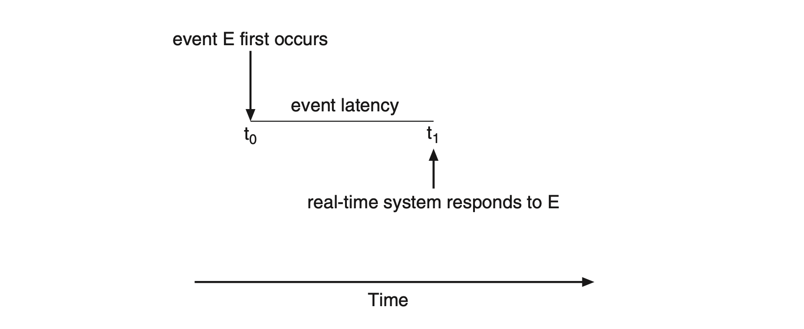
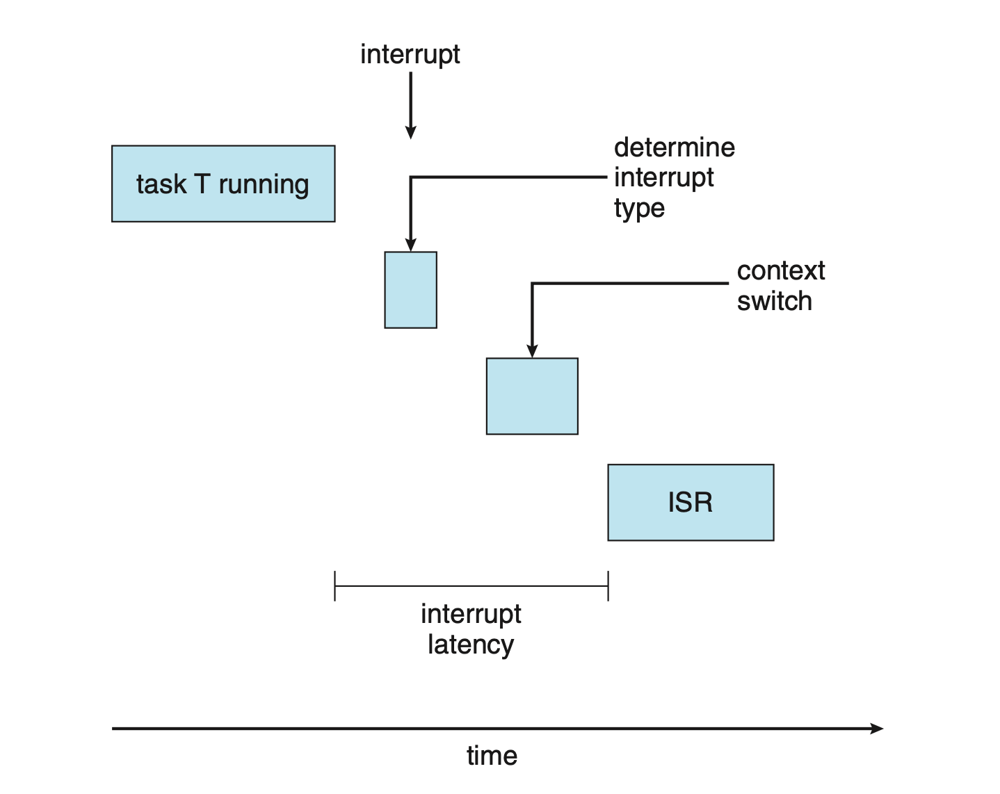
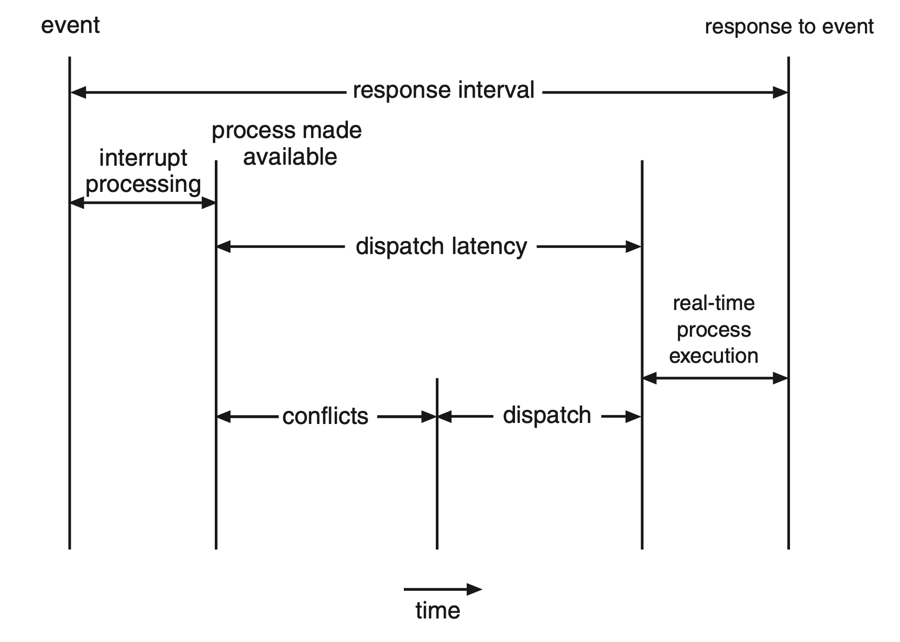
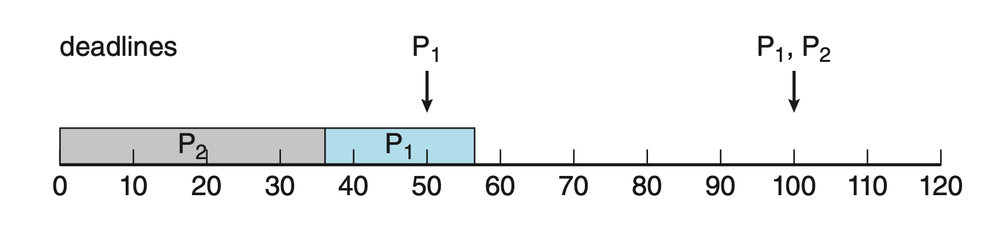
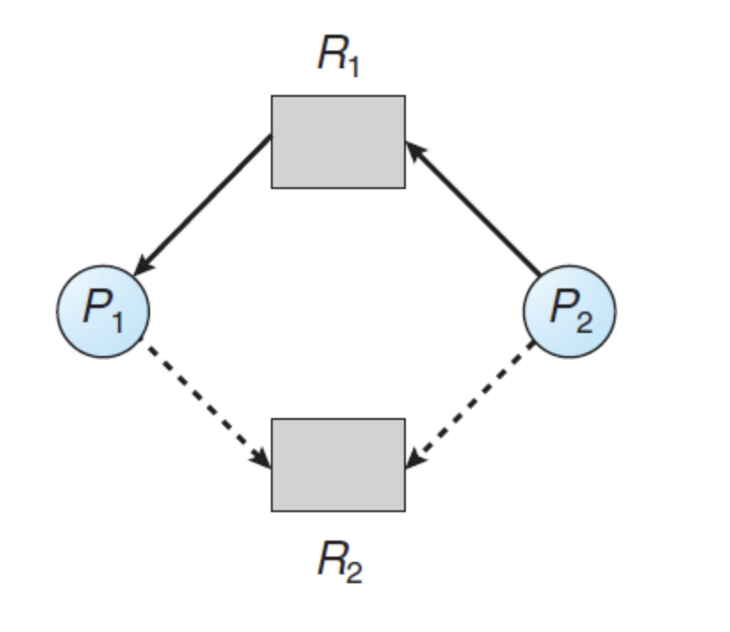

# Concurrency Control(병행 제어)

## Multiple-Processor Scheduling

지금까지 공부했던 SJF, FCFS 등등은 모두 싱글 프로세서를 가진 시스템에서 CPU를 스케줄링 하는 방법에 대한 내용이다.

그러나 요즘은 전부 여러 개의 CPU를 사용 가능한, 멀티프로세서 환경이기 때문에 이를 스케줄링 하는 방법을 알아햐 한다.

만일 여러 개의 CPU를 사용 가능하다면, Load Sharing이 가능하지만, 스케줄링에 어려움이 있다.

### Asymmetric Multiprocessing

비대칭 멀티프로세싱은 하나의 processor만 시스템 자료 구조에 접근을 해서 Data Sharing 의 필요성을 배제하기 때문에 간단하다. 여기서 하나의 processor를 마스터 서버라고 부르는데, 이 마스터 서버는 병목 현상을 일으킬 수 있다.

모든 요청이 마스터 서버를 거쳐야 하기 때문에, 마스터 서버에 부하가 집중되면 시스템 전체의 성능이 저하될 수 있다.

### Symmetric Multiprocessing

일반정그로 Multi processor 스케줄링 지원 방법이다. 모든 CPU 코어가 동등한 권한을 가지고, 각 프로세서는 자신의 스케줄링을 할 수 있다.

각 프로세스가 독립적으로 작업을 처리하기 때문에, 작업 부하가 코어들에 분산된다.


## Real-Time CPU Scheduling

일반적인 운영 체제와 달리, Real-Time 스케줄링은 특정 시간 내에 작업을 완료하는 것을 가장 중요하게 생각한다. **항공기 제어 시스템이나 의료 기기 등 정해진 시간 내에 반응해야 하는 시스템**에 사용된다.

실시간 CPU Scheduling은 `Soft real-time system` 과 `Hard real-time system` 으로 구분된다.

Soft real-time system은 중요한 실시간 프로세스가 스케줄 되는 시점에 어떤 보장도 하지 않는다. 오직 중요 프로세스가 그렇지 않은 프로세스들에 비해서 우선권을 가진다는 것만 보장한다.

Hard real-time system은 훨씬 더 엄격한 요구 사항을 가진다.
작업은 반드시 정해진 마감 시간(dead line) 내에 완료 되어야 한다. 서비스가 마감 시간을 넘겨서 제공되는 것은 아예 서비스가 제공되지 않은 것과 같은것으로 간주한다.

### Minimizing Latency (지연시간 최소화)

시스템은 일반적으로 real-time으로 발생하는 event를 기다리게 된다.

여기서 말하는 event는 소프트웨어적 요인, 하드웨어적인 요인 두가지가 있다.

이벤트가 발생하면, 시스템은 가능한 한 빨리 반응하고 처리해야 한다.

`Event Latency`란 이벤트가 발생한 순간부터 시스템이 해당 이벤트를 처리하기 시작할 때까지 걸리는 시간을 의미한다.



Real-time System의 성능에 영향을 미치는 latency는 두가지가 있다.

#### Interrupt Latency

`Interrupt Latency` 는 CPU에 interrupt가 발생한 시점부터 해당 interrupt routine이 시작하기까지의 시간을 말한다.



#### Dispatch Latency

`Dispatch Latency`는 스케줄링 dispatch가 하나의 프로세스를 블록시키고 다른 프로세스를 시작하게 하는데 걸리는 시간이다.



### Priority-Based Scheduling

Real-time 운영체제에서 가장 중요한 기능은 real-time 프로세스가 CPU를 필요로 할 때, 바로 응답해주는 것이다.

따라서, Real-time 운영체제의 스케줄러에서는 선점을 이용한 **우선순위 기반의 알고리즘**을 제공해야한다.

### Rate-Monotonic Scheduling

Rate-Monotonic Scheduling 알고리즘은 선점 가능한 정적인 우선순위 정책을 이용해서 주기 task를 스케줄링 한다.

낮은 우선순위 프로세스가 실행중에 있고, 높은 우선순위의 프로세스가 실행 준비가 되면, 높은 우선순위의 프로세스가 낮은 우선순위의 프로세스를 선점하게 된다.



## Process Synchronization(프로세스 동기화)

### 개념

동시에 여러개의 프로세스가 동일한 data에 접근하여 변경하고, 그 실행 결과가 접근이 발생한 특정 순서에 의존하는 상황을 **`Race Condition`** 이라고 한다.

이러한 상황을 방지하기 위해서 한 순간에 단 하나의 프로세스만이 데이터를 변경하도록 보장해야 하며, 따라서 어떤 형태로든 프로세스들이 동기화 되도록 할 필요가 있다.

### Critical-Section Problem

n개의 프로세스가 있는 시스템에서 각 프로세스는 임계구역이라고 부르는 코드를 ㅗ함하고 있고, 그 안에서는 다른 프로세스와 공유하는 변수를 변경하는 등의 작업을 수행한다.

이 시스템의 중요한 특징은 **한 프로세스가 자신의 임계 구역에서 수행하는 동안에는 다른 프로세스들은 그들의 임계 구역 안에서 실행할 수 없다** 라는 점이다.

각 프로세스들은 자신의 임계 구역으로 진입하기 위해서 허가를 받아야하는데, 이러한 요청을 구현하는 코드를 **진입구역(EntryPoint)** 라고 하며, 임계 구역 뒤에는 **퇴출 구역(Exit Section)** 이 있을 수 있다.

코드의 나머지 부분은 **나머지 구역(Remainder Section)** 이라고 한다.

이러한 임계구역 문제를 해결하기 위해서는 아래 세가지 요구 조건을 충족시켜야 한다.

1. 상호 배제(Mutual Exclusion)
    
    프로세스 P가 자신의 임계구역에서 실행된다면, 다른 프로세스들은 그들 자신의 임계구역에서 실행될 수 없다.

2. 진행(Progress)
    
    자신의 임계구역에서 실행되는 프로세스가 없는 상황에서 그들 자신의 임계 구역으로 진입하려는 프로세스들이 있다면, 나머지 구역에서 실행 중이지 않은 프로세스들만 다음에 누가 해당 임계구역으로 진입할 수 있는지를 결정하는데 참여할 수 있으며, 이 선택은 무제한으로 연기 될 수 없다.

3. 한정된 대기(Bounded Waiting)
    
    프로세스가 자신의 임계구역에 진입하려는 요청을 한 후부터 그 요청이 허용될 때까지 다른 프로세스들이 그들 자신의 임계 구역에 진입하도록 허용되는 횟수에 한계가 있어야 한다.

운영체제 내에서 임계 구역을 다루기 위해 `선점형 커널`과 `비선점형 커널` 의 두 가지 일반적인 접근법이 사용된다.

**선점형 커널**은 프로세스가 커널 모드에서 수행되는 동안 선점되는 것을 허용한다.

**비선점형 커널**은 커널 모드에서 수행되는 프로세스의 선점을 허용하지 않는다.

### Peterson's Solution

고전적인 소프트웨어 기반해결책이다. 현대 컴퓨터 구조에서는 `load` 나 `store` 같은 기본적인 기계어를 수행하는 방식 때문에 항상 올바르게 작동한다고 보장할 수는 없다.

시스템이 명령어 순서를 재정렬할 수 있기 때문에, 한 프로세스의 메모리 변경 사항이 다른 프로세스에게 즉시 반영되지 않을 수 있다.

Peterson에서는 임계구역과 나머지 구역을 번갈아가며 실행하는 두 개의 프로세스로 한정된다.

``` C
int turn;
boolean flag[2];

while(true) {
    flag[i] = true;
    turn = j;
    while(flag[j] && turn == j)
        ;
            /* critical section */

       flag[i] = false;

            /* remainder section */ 
}
```

위의 코드에서 변수 `turn` 은 임계구역으로 진입할 순번을 나타낸다.
`(turn == i)` 이면, 프로세스 P(i)가 임계 구역에서 실행될 수 있음을 나타낸다.

`flag` 배열은 프로세스가 임계 구역으로 진입할 준비가 되었다는 것을 의미한다.
`flag[i] == true` 이면, P(i)가 임계 구역으로 진입할 준비가 되었다는 것을 나타낸다.

임계 구역으로 진입하기 위해서 P(i)는 flag[i] 를 true로 만들고 turn을 j로 지정한다.

이렇게 함으로써, 프로세스 j가 임계 구역으로 진입하기를 원한다면 진입 가능하다는 것을 보장한다.
`turn` 의 값이 궁극적으로 어떤 프로세스가 먼저 임계 구역으로 진입할 것인가를 결정한다.

### 동기화 하드웨어

Peterson은 현대의 컴퓨터 구조에서 올바르게 작동한다는 것을 보장하지 못한다고 했는데, 이를 해결하기 위해서 운영체제는 하드웨어의 지원을 받는다.

#### Memory Barrier

Memory Barrier는 시스템에서 후속으로 오는 `load`, `store` 연산이 실행되기 전에 현재 프로세스에서 진행되고 있는 저장 작업이 메모리에서 완료되도록 한다. 그래서 그 후의 `load`나 `store` 연산이 메모리에 반영된 최신 값을 읽거나 쓸 수 있도록 한다.

한 프로세스의 메모리 변경 결과가 다른 프로세서들에게 모두 보이도록 하여 메모리를 동기화하는 것이다.

### 하드웨어 명령어

현대의 시스템들은 인터럽트되지 않고 원자적으로 연산을 해주는 특별한 하드웨어 명령어들을 제공해준다.

C++의 `atomic` 헤더에서 제공되는 `atomic_flag_test_and_set` 같은 함수, `Swap` 등이 있다.

### 소프트웨어 도구들

#### Mutex Lock

`Mutex` 는 Mutual Exclusion의 약자로, 상호 배제를 의미한다.

프로세스가 임계 구역에 진입하고자 할 때 lock을 획득하고, 임계 구역을 떠날 때 lock을 반환한다.

이 동작들은 원자적으로 수행되어야 한다.

``` C
acquire(){
    while(available == FALSE);
    available = FALSE
}

release() {
    available = TRUE;
}
```

다른 프로세스가 임계구역을 점유하고 있으면, 임계 구역에 들어가려고 하는 다른 프로세스들은 계속 `acquire`를 호출하면서 기다리는데, 이를 `busy waiting` 이라고 한다.

이러한 `busy waiting` 을 하는 lock 유형들을 `스핀 락` 이라고도 한다. 이 방식은 다른 프로세스가 생산적으로 사용할 수 있는 연산 능력을 낭비할 가능성이 있다.

그러나 프로세스가 임계 구역에 진입할 수 있게 되면 Context Switchin 없이 바로 임계 구역에 진입할 수 있다는 장점이 있다.

따라서 잠깐동안 lock을 유지해야 하는 경우 스핀 락을 사용하는 경우가 많고, 멀티프로세서 시스템에서 자주 사용된다.

#### Semaphore

세마포어는 뮤텍스와 유사해보이지만 `busy waiting` 이 필요없는 도구이다.

세마포어는 `wait` 과 `signal` 두개의 원자적 연산으로만 접근 가능한 정수 변수이다.

``` C
wait(S) {
    while(S <= 0);
    S--;
}

signal(S) {
    S++;
}
```

세마포어 종류

**카운팅 세마포어(Counting Semaphore)** 는 세마포어가 가질 수 있는 값에 제한이 없다.

이 세마포어는 임계 구역에 들어갈 수 있는 프로세스의 수를 제한하는 데 쓰일 수 있다.

**이진 세마포어(Binary Semaphore)** 는 세마포어가 가질 수 있는 값이 0, 1 뿐이다.

카운팅 세마포어보다 구현이 간단하며 `mutex lock` 과 유사하다.

### Liveness Problem

Liveness는 프로세스가 무한정 기다리지 않고, 언젠가는 무언가를 하게 되는 것을 의미한다.

## Deadlock

2개 이상인 프로세스들이 대기 중이며 대기 중인 프로세스들 중 하나에 의해서만 발생할 수 있는 이벤트가 발생할 때 까지 무한정 기다리는 것이다.

```
P0
wait(S);
wait(Q);
---
signal(S);
signal(Q);

P1
wait(Q);
wait(S);
---
signal(Q);
signal(S);
```

위의 코드와 같이 2개의 프로세스 `P0` 와 `P1`이 있고 1로 초기화된 세마포어 S,Q에 접근한다고 하자.

P0가 `wait(S)`를 실행하고 P1이 `wait(Q)`를 실행한다. 각자 다음 `wait` 으로 넘어가기 위해서는 다른 프로세스에서 `signal`을 호출해줘야 하는데 이게 **`deadlock`** 이다.

### 발생조건

1. Mutual Exclusion

    최소한 하나의 resource는 `nonsharable mode`로 점유되어야 한다.
    
    nonsharable mode 에서는 한 번에 하나의 프로세스만이 해당 resource를 사용할 수 있다.

2. Hold-And-Wait

    프로세스는 최소한 하나의 resource를 점유한 채, 현재 다른 프로세스에 의해 점유된 resource를 추가로 얻기 위해 반드시 대기해야 한다.

3. No Preemption

    resource들을 선점할 수 없어야 한다. 즉, resource가 강제적으로 방출될 수 없고, 점유하고 있는 프로세스가 task를 종료한 후, 그 프로세스에 의해서만 resource가 자발적으로 방출될 수 있다.

4. Circular Wait
   
   대기하고 있는 프로세스의 집합에서는 순환적으로 resource를 대기해야 한다.

이 발생조건들 중에 적어도 하나가 성립하지 않도록 해서 교착상태를 예방할 수 있다.

### Deadlock Avoidance

#### Safe State(안전상태)

시스템 상태가 안전하다라는 말은 시스템이 어떤 순서로든 프로세스들이 요청하는 resource를 Deadlock을 발생시키지 않고, 차례로 모두 할당해 줄 수 있다는 것을 의미한다.

시스템이 안전 순서를 찾을 수 있다면 시스템은 안전하다고 말할 수 있다.

시스템이 안전순서를 찾을 수 없다면 시스템은 불안전한 상태에 있다.
Deadlock에 빠질수도있고, 아닐수도 있는 상태를 의미한다.

#### Resource-Allocation Graph Algorithm

자원할당 그래프에서 Cycle을 방지하여 Deadlock을 회피할 수 있다.

`요청 간선`, `할당 간선` 과 함께 점선으로 `예약 간선`을 사용할 수 있다.

그래프에서 Cycle이 존재하지 않는다면, resource를 할당해도 시스템은 안전 상태가 된다.

Cycle이 발생하게 되면, 시스템은 불안정한 상태가 되므로 교착상태를 회피할 수 없게 된다.




#### Banker's Algorithm

자원할당 알고리즘은 종류마다 자원이 여러개가 존재한다면 사용할 수 없다.

은행원 알고리즘에서는 자원이 여러개씩 있더라도 사용할 수 있다.

1. Available
   
   각 종류별로 available한 resource의 개수를 나타내는 벡터이다.

2. Max
   
   각 프로세스가 최대로 필요로 하는 resource의 개수를 나타내는 행렬로, 크기가 `n X m` 이다.

3. Allocation

    각 프로세스에게 현재 나가있는 resource의 개수를 나타내는 행렬로, 크기가 `n X m` 이다.

4. Need

    각 프로세스가 이후 요청할 수 있는 resource의 개수를 나타내는 행렬로, 크기가 `n X m` 이다.

### Deadlock Recovery

탐지 알고리즘을 통해 Deadlock이 존재한다고 판단되면, 운영자가 수작업으로 처리할 수도 있지만 자동으로 회복하게 할 수 도 있다.

자동으로 회복하는 방법은 프로세스를 종료시키는 것과, 자원을 선점하는 것 두가지 종류가 있다.

#### Process Termination(프로세스 종료)

종료된 프로세스로부터 할당되었던 모든 자원을 회수하게 한다.

1. Deadlock 프로세스를 모두 중지

    확실하게 Deadlock의 Cycle을 깨뜨리지만, 관련된 모든 프로세스를 중지시키므로 비용이 커진다.

2. Deadlock이 제거될 때까지 한 프로세스씩 중지

    각 프로세스가 중지될때마다, 탐지 알고리즘을 통해 Deadlock의 존재여부를 확인해야하기때문에 큰 overhead가 발생한다.

어떤 프로세스를 먼저 중지시켜야 하는가에는 프로세스의 우선순위, 수행된 시간과 종료하는 데까지 필요한 시간, 종료하기 위해 필요한 resource의 수, 사용한 resource type과 수 가 있을 수 있다.

#### Resource Preemption

자원 선점을 이용하여 Deadlock을 제거하려면, Deadlock이 깨질때까지 프로세스로부터 Resource를 계속적으로 선점해 이들을 다른 프로세스에게 주어야 한다.

이때, 다음의 세 가지 사항을 고려해야한다.

1. Selection of a victim

    어느 Resource와 Process가 선점될 것인가?

2. Rollback

    프로세스로부터 자원을 선점하려면, 그 프로세스를 어떻게 처리해야 하는가?

3. Starvation

    Starvation이 발생하지 않는다는 것을 어떻게 보장해야 하는가?


### Starvation

기아현상은 프로세스가 무한히 `block`되는 상태로, 영원히 세마포어의 대기 리스트에서 제거되지 못하는 것을 말한다.

예를 들어 lock을 다시 획득 할 때 lock을 기다리고 있던 프로세스들 중에서 우선순위가 가장 높은 프로세스가 lock을 획득한다고 하자.

그리고 lock의 대기 리스트에는 계속 새로운 프로세스가 추가되고 있다고 했을때, Lock의 대기 리스트에 있는 프로세스 중 우선순위가 낮은 프로세스는 무한에 가깝게 디라게 되는데 이걸 **`starvation`** 이라고 한다.

