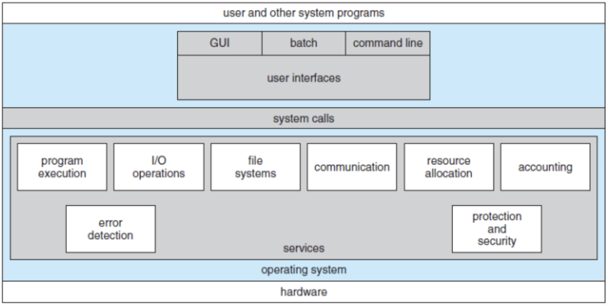
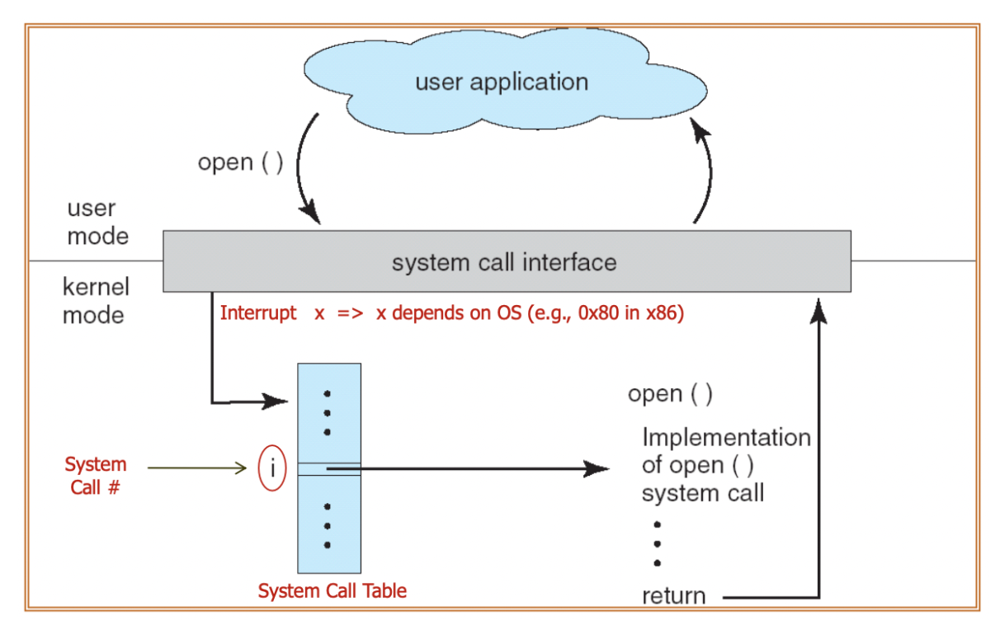
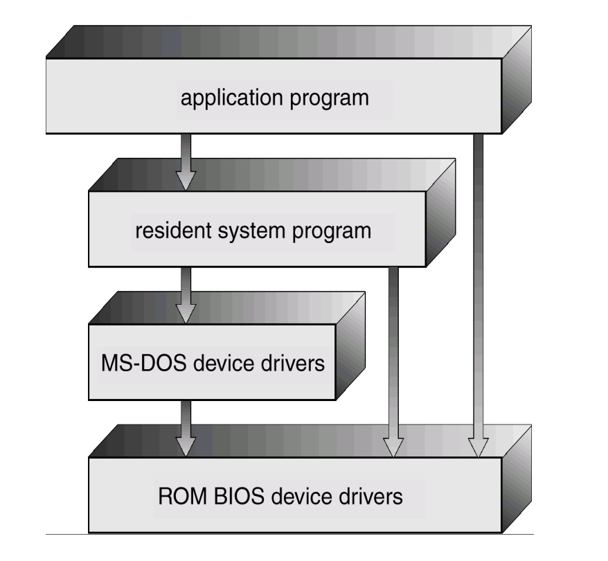
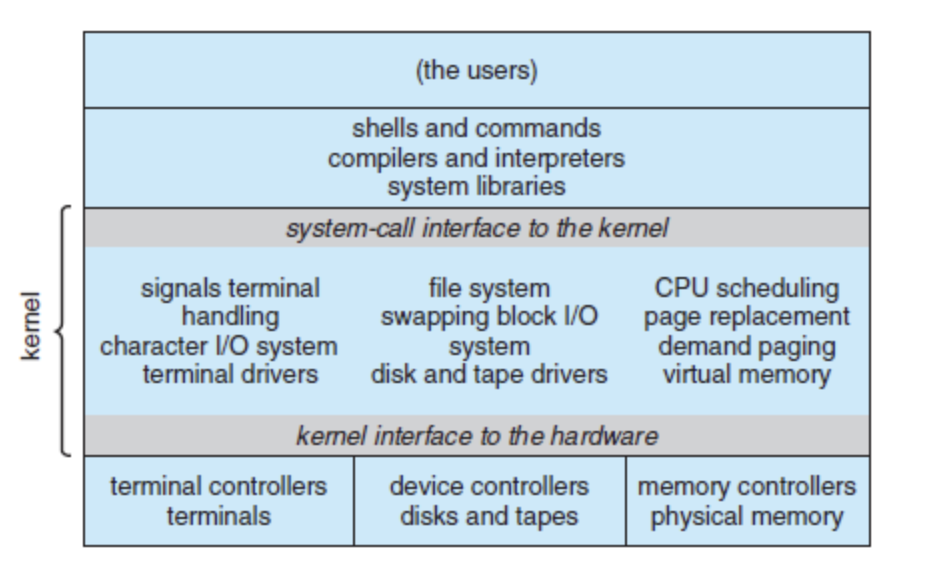
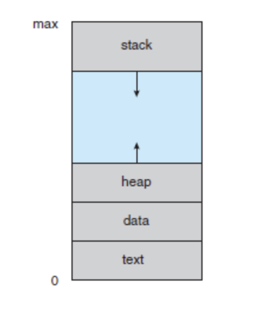
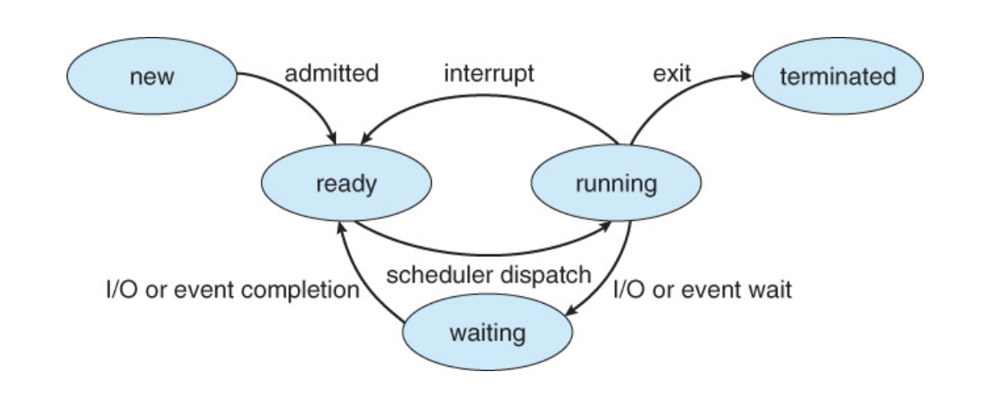
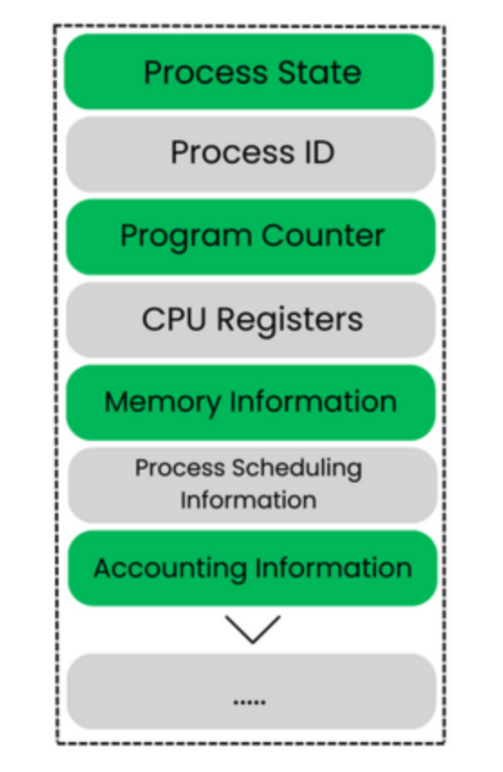

# Introduction

## 운영체제?

컴퓨터 하드웨어 바로 위에 설치되어 사용자 및 다른 모든 소프트웨어와 하드웨어를 연결하는 소프트웨어 계층을 운영체제를 말한다.

### 운영체제는 뭘 할까

일단 운영체제가 뭘 하는지 알기 전에 컴퓨터의 동작 시스템을 한번 살펴보면 러프하게 4개의 구성요소로 나눌 수 있다.

1. 하드웨어
    
    컴퓨터의 자원을 제공해주는 CPU, 메모리, 입출력장치 등을 `하드웨어`라고 부른다.
2. **운영체제**

3. 애플리케이션 프로그램

    워드프로세서, 스프레드시트, 같이 사용자의 문제를 직접적으로 해결해줄 수 있는 프로그램들을 말한다.
4. 사용자

컴퓨터 시스템 자체를 하드웨어, 소프트웨어와 데이터의 관점으로 볼 수도 있는데 운영체제는 컴퓨터의 다양한 자원들이 적절하게 쓰일 수 있도록 하는 핵심 소프트웨어를 뜻한다.

#### 운영체제의 정의

일단 운영체제는 사용자 관점에서 봤을 때는 그냥 단순히 편하게 동작할수만 있게 해주면 되고 `자원 최적화` 같은 작업은 굳이..? 신경 쓸 필요가 없다.

그러나 컴퓨터 관점에서 보면 프로그램들이 올라가 있으면 `자원 할당(Resource Allocator)` 이라는 과정을 통해 다양한 프로그램들이 자원을 나눠갖도록 해야한다. 여기서 자원이란 CPU, Memory, 저장공간 등을 말한다.

운영체제는 바로 이 자원할당이라는 역할을 담당하며, 모든 프로그램이 효율적으로 자원을 사용할 수 있도록 관리하고 할당해주는 것이다.

### 컴퓨터 시스템의 구성 (Computer-System Organization)

#### 컴퓨터 시스템 연산 (Computer-System Opertaion)
컴퓨터시스템은 한개 이상의 CPU와 여러개의 device controller 들로 이루어져 있고 이것들은 `System Bus` 라는 것으로 연결되어 있다.

컴퓨터가 구동을 시작을 하면, 수행할 초기 프로그램으로 `BootStrap` 이라는 프로그램이 있는데 이 프로그램은 보통 펌웨어 라고 알려져 있는 컴퓨터 내의 ROM이나 EEPROM에 저장된다.

부트스트랩 코드는 컴퓨터의 메인보드에 장착된 칩셋, 메모리 컨트롤러, 장치 제어기 등 하드웨어의 특정 주소와 레지스터에 접근하는 방법을 이미 알고 있다. 사용법이 설명서에 미리 적혀 있듯이, 부트스트랩 코드 자체에 하드웨어 초기화 절차가 내장되어 있는 것이라고 생각하면 편할듯 하다!

이 `BootStrap` 프로그램은 CPU 레지스터로부터 장치 제어기, 메모리 내용 등을 포함한 시스템의 모든 면을 초기화하고, 운영 체제를 적재하는 방법 및 수행을 시작하는 방법을 알아야 한다.

컴퓨터가 부팅이 된다면 `**init**` 프로세스 시작 후 외부로부터의 **사건**이 발생하기를 기다리는데 사건이 벌어진다면 하드웨어 또는 소프트웨어 `**interrupt**`를 통해 CPU에 신호를 보내게 된다.

하드웨어는 어느 순간이든, System Bus를 통해서 CPU에 신호를 보내고, 인터럽트를 발생시킬수 있으며, 소프트웨어는 System Call 이라고 불리는 연산을 통해 인터럽트를 발생시킨다.

> ### 인터럽트가 뭐죠?

    일단 하드웨어 인터럽트부터 설명하자면 키보드, 마우스, 프린터 등 하드웨어 장치가 CPU에게 보내는 신호다.
    이들은 대부분 독립적으로 동작하며, 자신의 작업이 완료되거나 문제가 발생했을 때 CPU에게 알려야 할 필요가 있다.
    예시로는 키보드 키를 누르는 동작, 마우스를 움직이거나 클릭하는 동작, 프린터 인쇄, 하드 디스크에서 데이터를 읽어는 작업이 끝났을 때 등등이 있다.

    소프트웨어 인터럽트는 실행 중인 프로그램이 스스로 발생시키는 인터럽트이다. 프로그램이 특정 작업을 위해 운영 체제의 도움을 받아야 할 때 주로 사용된다.

    시스템 호출(System Call) : 프로그램이 파일을 열거나 화면에 데이터를 출력하는 등, 운영 체제의 자원을 사용할 때 요청한다.
    예외(Exception) : 프로그램 내에서 0으로 나누거나, 잘못된 메모리에 접근을 요청하는 등 비정상적인 상황이 발생햇을 때 스스로 인터럽트를 걸어서 운영 체제에 처리를 맡긴다.

CPU에 인터럽트가 되면 CPU는 하던 일을 중단하고 고정된 위치로 실행 위치를 옮긴다.
여기서 고정된 위치란 일반적으로 인터럽트를 위한 서비스 루틴이 위치한 시작 주소를 가지고 있으며, 인터럽트 서비스 루틴이 시작된다. 이 서비스 루틴이 완료되면, 인터럽트 됐던 연산을 재개한다.

인터럽트 구조는 인터럽트 된 명령의 주소를 반드시 저장해야 하며, 복귀하기 전에 상태를 복원해야한다.
약간 **백트래킹?** 느낌이라고 생각하면 될 듯 하다!!

인터럽트를 서비스 한 후, 저장되어 있던 복귀 주소를 Prom Counter에 적재하고, 인터럽트에 의해 중단되었던 연산을 다시 시작한다.

> ### 고정된 위치는 어디에 저장되어있나요..?
    고정된 위치는 일반적으로 인터럽트 벡터 라고 불리는 테이블에 저장된 인터럽트 서비스 루틴의 시작 주소들을 말한다. CPU는 인터럽트의 종류에 따라 이 테이블에서 해당 서비스 루틴의 주소를 찾아 이동한다.

#### 저장 장치 구조 (Storage Structure)

CPU는 명령어를 그냥 메모리부터 가져오는 것이기 때문에, 프로그램을 수행하려면 프로그램이 반드시 메모리에 있어야 한다.

컴퓨터는 대부분의 프로그램을 RAM에서 가져오며, ROM이나 EEPROM 도 사용하긴 한다.

모든 형태의 메모리는 Byte의 배열을 제공하며, 각 바이트는 자신의 주소를 가지고 있다. 상호 작용은 특정 메모리 주소들에 대한 일련의 Load, Store 명령을 통해 이루어진다.

Load: RAM으로부터 CPU 내부의 레지스터로 한 바이트 옮기기
Store: 레지스터의 내용을 RAM으로 옮기기

> ### 그러면 그냥 프로그램이랑 데이터를 RAM에 계속 넣어두면 안되나요?
    일단 저장용량이 부족하다. 우리가 주로 사용하는 노트북이나 PC를 보면 작게는 8GB, 뭐 많게는 32GB 까지도 쓰는데 모든 필요한 프로그램과 데이터를 계속 넣어둔다? 이거는 너무 작은 용량이다.

    두번째로는 RAM은 휘발성 저장 장치이다. 휘발성은 전원이 한 번 꺼지게 된다면, 그 내용이 전부 날아간다는 뜻이다.

위에서 말한 것처럼 RAM에 모든 프로그램과 데이터를 저장할 수 없기에 대부분의 컴퓨터 시스템은 RAM의 확장으로 보조 저장 장치(HDD, SSD 등)를 제공하는데 이 보조 저장 장치가 하는 일은 대량의 데이터를 영구적으로 보존하는 일이며 이 외에도 캐시 메모리, CD-ROM, 자기 테이프 등 여러 저장 장치가 존재한다.

이 다양한 저장 장치 시스템을 나누는 주된 차이점은 속도, 가격, 크기, 휘발성이다.

> ### 다양한 저장 장치 시스템엔 뭐가 있나요?
    1. 속도: 빠른 장치로는 CPU레지스터, 캐시메모리(L1, L2, L3) 등이 있고 중간 속도로는 RAM, 느린 장치로는 보조 저장 장치(SSD, HDD), 자기 테이프 등이 있다.

    2. 가격: 가격은 속도에 비례한다. 빠르면 비싸다. 위에서 말한 순서대로 가격이 정해진다.
        CPU레지스터 > RAM > SSD > HDD

    3. 용량 : 용량은 속도에 반비례한다. CPU에 내장되거나, 가까이 위치하는 레지스터와 캐시메모리가 제일 작고 그 다음 RAM, 그다음 보조 저장장치 등이다.

### 컴퓨터 시스템 구조 (Computer System Architecture)

#### 싱글 프로세서 시스템 (Single-Processor System)

싱글 프로세서 시스템은 사용자의 process 명령어를 포함한 범용 instruction 을 수행할 수 있는 하나의 주 CPU를 가진 시스템을 말한다.

#### 멀티 프로세서 시스템 (Multi-Processor System)

멀티 프로세서 시스템은 하나 이상의 프로세서를 가지며 컴퓨터 버스, Clock, Memory와 주변 장치를 공유한다.

멀티 프로세서를 사용해서 얻는 대표적인 장점으로는 증가된 처리량, 규모의 경제, 증가된 신뢰성이 있다.

1. Increasing Throughput
    
    프로세서의 수가 증가하였기 때문에 더욱 많은 일을 수행할 수 있다.

    그렇다고 N배가 늘어나서 증가율이 N배가 되냐? 그건 아니다. 다수의 프로세서가 하나의 일을 수행하기 위해 협력을 하는 경우, 오버헤드가 발생하고, 공유 자원에 대한 경쟁이 더해져서 생각보다 그렇게 정량적으로 증가하지는 않는다.

2. Economy of Scale

    멀티 프로세서는 여러 개의 싱글 프로세서에 비해 비용을 절약하는데, 이는 프로세서들이 주변 장치, 대용량 저장 장치 등을 공유하고 있기 때문이다.

3. Increased Reliability

    기능들이 여러 개의 프로세서에 적절히 분산되어 수행된다면, 한 프로세서가 고장 나더라도 시스템이 바로 멈추는 건 아니고 그냥 속도만 느려진다.

### 운영체제의 구조(Operating System Structure)

운영체제는 프로그램이 수행될 환경을 제공한다고 했는데 어떻게 제공할까?

운영체제가 일단 왜 생겼는지부터 생각을 해보면 가장 중요한 기능은 Multi-Programming, 즉 다중 프로그래밍을 할 수 있는 기능이다.

일반적으로, 사용자는 CPU 또는 입출력 장치를 항상 빠르게 유지할 수 없다.
이때, 다중 프로그래밍은 CPU가 동시에 여러 작업을 처리하는 것처럼 보이게 만들어 CPU의 활용도를 극대화한다.

`**Multi-Tasking**` 이라는 개념이 이 때 나오는데, 이건 멀티 프로그램의 논리적 확장이다.

멀티 태스킹 시스템에서는 CPU가 다수의 작업들을 교대로 수행하지만, 교대가 매우 빈번하게 일어나기 때문에, 프로그램이 실행되는 동안 사용자들은 각자 자기의 프로그램과 상호 작용할 수 있다.

멀티 태스킹 운영체제는 각 사용자에게 분할되는 컴퓨터의 작은 부분을 제공하기 위해서 `CPU 스케줄링` 과 `다중 프로그래밍` 을 사용한다.

멀티태스킹과 다중 프로그래밍 운영체제에서는 여러 작업이 메모리에 동시에 유지되어야 한다.
몇몇 작업이 메모리로 옮겨올 준비가 되었는데, 메모리에 충분한 공간이 없다? 그러면 운영체제는 그들 중 몇개를 선택해서 메모리에 올려야하는데 이 과정을 `작업 스케쥴링` 이라고 한다.

여러 개의 작업이 동시에 실행될 준비가 되어 있으면, 운영체제는 그들 중 하나를 선택해야 하는데 이것은 `CPU 스케쥴링` 이라고 한다.

## 시스템 구조

### 운영체제 서비스(Operating System Service)

운영체제는 프로그램 실행 환경을 제공하고, 특정 서비스를 사용자에게 제공한다.

1. 사용자 인터페이스 (User Interface)
   
- GUI : 가장 일반적으로 우리가 보는 화면으로, 그래픽 요소들을 통해 인터페이스를 제공한다.
- Batch : 사용자와의 상호작용 없이 미리 준비된 작업 목록을 순서대로 실행한다. 주로 과거의 메인프레임 시스템에서 사용되었고, 현재는 현대 운영체제에서 특정 작업을 자동화하는 용도로 활용된다.
- CLI : 문자열로 명령하는 인터페이스를 제공하며 Unix, UbuntuServer 등이 있다.

2. 프로그램 실행(Program Execution)

- 시스템은 프로그램을 메모리에 로드해서 실행할 수 있어야 한다.
- 프로그램이 정상적이든, 비정상적이든 실행을 끝낼 수 있어야 한다.

3. 입출력 연산(I/O Operations)

- 수행 중인 프로그램은 입출력을 요구할 수 있다.
- 사용자는 보통 입출력 장치를 제어할 수 없기 때문에, 운영체제가 수단을 제공해야 한다.

4. 파일 시스템 조작(File System Manipulation)

   - 프로그램은 파일을 읽고 쓸 수 있어야 하며, 이름에 의해 파일 생성/삭제/검색 등을 할 수 있어야 한다.

5. 통신(Communication)
   
   - 한 프로세스가 다른 프로세스와 정보를 교환해야 할 필요가 있는 상황이 있는데 `Shared Memory` 또는 `Message Passing` 에 의해 구현된다.

6. 오류 탐지(Error Detection)

   - 운영체제는 모든 가능한 Error를 항상 의식하고 있어야 하는데 Error는 `CPU`, `Memory Hardware`, `I/O` 또는 `User Program` 에 의해 일어날 수 있다.

7. 자원 할당(Resource Allocation)

   - 다수의 User가 존재하거나 다수의 작업들이 동시에 수행될 때, 자원을 적절히 할당해주어야 한다.

8. 회계(Accounting)

   - 사용자가 컴퓨터 자원을 어떻게, 얼마나 많이 사용하는지를 알 수 있도록 해야 한다.

9. 보호와 보안

   - 보호: 시스템 자원에 대한 모든 접근이 통제되도록 보장하는 것
   - 보안: 각 사용자가 자원에 대한 접근을 원할 때, 시스템에게 자기 자신을 인증하는 것에서부터 시작한다.

### 사용자 운영체제 인터페이스 (User OS Interface)

- 명령 해석기(Command Interpreter)
  
  선택할 수 있는 명령어 해석기를 여러 개 제공하는 시스템에서는 이 Interpreter를 `**셸(Shell)**` 이라고 부른다.

  명령어 해석기의 중요한 기능은 사용자가 지정한 명령을 가져와서 그것을 수행하는 역할이다.

- GUI(Graphic User Interface)
  
  CLI 방식보다 사용자 친화적인 방식으로, 마우스를 통해 아이콘을 클릭하거나 하는 등의 상호작용으로 프로그램을 수행할 수 있다.

### 시스템 호출 (System Call)

System Call은 운영체제에 의해 사용 가능하게 된 서비스에 대한 인터페이스를 제공한다.
파일을 복사하거나 이동하는 등의 간단한 프로그램도 많은 System Call을 수행한다.

보통 System Call을 호출 할때는 `API` 방식을 사용한다.

API를 사용하게 되면 System Call이 어떻게 구현되고, 실행 중 무슨 작업을 하는지 신경 쓸 필요가 없으며, 단지 API를 준수하고 System Call의 결과로 운영체제가 무엇을 할 것인지만을 파악하면 된다.

그래도 API에 파라미터를 전달을 해줘야하는데 어떻게 전달할까?

크게 3가지로 나눌 수 있는데
1. 매개변수를 레지스터 내에 전달하는 방법
2. 매개변수를 메모리 내의 블록이나 테이블에 저장하고, 블록의 주소가 레지스터 내에 저장되는 방법
3. 매개변수를 블록이나 스택에 저장하는 방법
이 있다.

### 시스템 호출의 유형(Type of System Calls)

시스템 호출은 5가지 주요 유형이 있다.

#### 프로세스 제어(Process Control)

1. End & Abort

    실행 중인 프로그램은 수행을 정상적으로 End, 혹은 비정상적으로 Abort 종료할 수 있어야 한다.

2. Load & Execute

    한 프로그램을 실행하고 있는 process가 다른 프로그램을 `Load` 하고 `Execute` 하기를 원할 수 있을 것이다.

    이때 `Load`가 되어있던 프로그램이 종료 되었을 때, 시스템의 제어권은 다시 원래 프로그램을 실행하던 위치로 돌아가야하는데 그러려면 기존 프로그램의 Memory 이미지를 저장해놔야 한다.

    만약 두 프로그램이 병렬로 수행된다면, 멀티프로그램 될 새로운 process를 생성한 것이다. 

3. 프로세스 생성, 프로세스 종료

    새로운 process를 생성하면, 이들의 실행을 컨트롤 할 수 있어야 한다.

4. 프로세스 속성 획득, 속성 결정

    프로세스의 우선순위, 최대 가능 실행 시간등을 포함하여 속성을 결정할 수 있어야 한다.

5. Wait for Time

    새로운 프로세스를 생성한 후에, 이들의 실행이 끝나기를 기다릴 필요성이 있을 수 있다.

6. Wait Event, Signal Event

    Wait Event: 특정 사건이 일어날 때까지 기다릴 수 있어야 한다.
    Signal Evnet: 그 사건이 일어나면 신호를 보낼 수 있어야 한다.

7. Allocate and Free Memory

    둘 이상의 프로세스들이 공유하는 데이터들에 대해 일관성을 보장해야 할 필요성이 있다.
    운영체제는 종종 프로세스가 공유 데이터를 lock 할 수 있는 `System Call`을 제공한다.

#### 파일 조작(File Manipulation)

1. 파일 생성, 파일 삭제

    이 `System Call`은 보통 파일 이름이나 파일 속성의 일부를 요구한다.

2. 열기, 닫기

    생성된 파일들을 사용하기 위해서는 Open System Call을 사용
    파일을 더 이상 사용하지 않을 때는, Close System Call을 사용

3. 읽기, 쓰기, 위치 변경

    파일을 열은 뒤에, 읽기, 쓰기를 할 수 있다.
    위치 변경으로 파일의 처음으로 가기, 파일의 끝으로 가기 등을 할 수 있다.

4. 파일 속성 획득 및 결정

    파일 속성에 대한 정보를 얻을 수 있고, 변경할 수 있다.

#### 장치 조작(Device Manipulation)

프로세스는 작업을 계속 수행하기 위해 Main Memory 또는 Disk Drive 등의 추가 자원이 필요할 수도 있다.

1. Request Device, Release Device

    다수의 사용자가 동시에 사용하는 시스템은 장치의 독점적인 사용을 보장받기 위해 Request를 한다.
    사용이 끝나게 된다면, Release 를 해준다.

2. 읽기, 쓰기, 위치 변경

    장치가 할당이 된다면, 해당 장치를 읽고, 쓰고, 위치를 변경할 수 있다.

#### 정보 유지보수(Information Maintenance)

    시간과 날짜의 설정과 획득, 시스템 데이터의 설정과 획득, 프로세스/파일/장치 속성의 획득, 프로세스/파일/장치 속성의 설정 등이 있다.

#### 통신(Communication)

`Message Passing` 과 `Shared Memory Model` 이 있다.

1. Message Passing

    통신하는 두 프로세스가 정보를 교환하기 위해 서로 메시지를 주고받는다.
    메시지는 두 프로세스 사이에서 직접 교환되거나, 메일박스를 통해 간접적으로 교환될 수 있다.

2. Shared Memory Model

    프로세스는 다른 프로세스가 소유한 메모리 영역에 대한 접근을 하기 위해 `System Call`을 사용한다.

    기본적으로 운영체제에서는 프로세스 간의 메모리 접근을 막는데, 이런 제한을 제거해야한다.

### 운영체제의 구조 (Operating System Structure)

#### 간단한 구조

일단 간단한 구조를 가지고 있는 운영체제로, `MS-DOS` 라는 운영체제가 잇다.

interface와 functionality 계층이 잘 분리되어 있지 않기 때문에 Application program이 Display와 Disk Drive에 직접 쓰기가 가능하다.

따라서, User Program이 고장나면 시스템 전체가 고장나버린다,,

UNIX 또한 제한적인 구조의 또 다른 예로, 아래 그림과 같은 UNIX 운영체제가 있다. 그림을 보면 알겠지만 `System Call Interface` 와 `Kernel Interface` 사이의 모든 것이 Kernel 이다.

## 프로세스

### 프로세스란?

일단 프로세스라고 하면 실행 중인 프로그램을 뜻하는데 그냥 단순히 프로그램 코드를 의미하는게 아니라, 실행 중인 프로그램과 관련된 모든 정보를 포괄하는 개념이며 이러한 정보들은 4가지 주요 영역에 저장된다.

1. 프로그램 카운터 (Program Counter)
    
    현재 프로세스가 실행해야 할 다음 명령어의 주소를 가리키는 값으로 CPU는 이 값을 참조하여 순서대로 명령어를 실행한다.

2. 스택 (Stack)
   
    임시 데이터를 저장하는 메모리 공간으로, 함수 호출 시 전달되는 매개변수, 반환 주소, 함수 내에서 선언된 지역 변수 등이 여기에 쌓인다. 함수가 호출되고 반환될 때마다 데이터가 스택에 쌓이거나 제거된다.

3. 데이터 섹션 (Data Section)
   
   프로그램이 시작될 때부터 종료될 때까지 유지되는 **전역 변수(Global Variable)**와 정적 변수들이 저장되는 공간입니다. 프로그램이 실행되는 동안 고정된 크기를 가집니다.

4. 힙 (Heap)
   
   프로그램 실행 중에 동적으로 할당되는 메모리 공간이다. 예를 들어, 사용자의 입력에 따라 필요한 만큼의 메모리를 할당받거나 해제할 때 사용되며 스택과 달리 개발자가 직접 메모리를 관리한다.

#### 프로세스 상태(Process State)

프로세스는 실행되면서 상태가 변화하며, 프로세스의 상태는 현재 프로세스의 활동에 따라서 정의된다.

1. New

    새로운 프로세스가 생성되었지만 아직 실행되지 않은 상태
    프로세스가 시스템에 의해 생성되고 초기화되었을 때 발생한다.
    이 상태에서는 프로세스가 아직 CPU를 할당받지 않은 상태

2. Ready

    실행을 위해 대기 중인 프로세스가 있는 상태
    이 상태의 프로세스들은 CPU 할당을 기다리고 있으며, 언제든지 실행될 수 있다.
    다른 프로세스가 CPU를 사용 중인 동안 대기

3. Ready

    CPU를 할당받아 실제로 실행 중인 프로세스
    현재 CPU를 점유하고 작업을 수행 중인 상태
    하나의 CPU에서는 하나의 프로세스만이 실행 상태에 있을 수 있다.

4. Ready

    실행을 위해 대기 중인 프로세스가 있는 상태
    이 상태의 프로세스들은 CPU 할당을 기다리고 있으며, 언제든지 실행될 수 있다.
    다른 프로세스가 CPU를 사용 중인 동안 대기한다.

5. Terminated

    프로세스가 실행을 마치고 종료된 상태
    프로세스가 정상적으로 실행을 완료하거나 오류로 종료되었을 때 발생한다.
    종료된 프로세스의 자원은 반환되고, 프로세스 관리 테이블에서 제거된다.

#### 프로세스 제어 블록 (Process Control Block)

Process Control Block은 특정 프로세스와 연관된 여러 정보를 가지고 있다.

- Process State(프로세스 상태)

    프로세스의 상태를 가진다.

- Process ID

    각 프로세스를 고유하게 식별하는 변호로, 운영체제가 특정 프로세스를 구분하고 관리할 때 사용한다.

- Program Counter(프로그램 카운터)

    이 프로세스가 다음에 실행할 명령어의 주소를 가진다.

- CPU Register
    
    CPU 내부에 있는 고속의 임시 저장 공간으로 프로세스가 실행될 때 필요한 모든 레지스터 값을 저장하여, Context Switching 이 일어날 때 프로세스의 상태를 완벽하게 복원할 수 있게 한다.

- Memory Information

    프로세스가 사용하는 메모리 영역의 시작 주소와 크기, 페이지 테이블 또는 세그먼트 테이블에 대한 정보 등을 포함한다.

- Process Scheduling Information

    프로세스가 CPU를 할당받기 위해 필요한 우선순위, 스케쥴링 큐에 대한 포인터 등 스케쥴링 관련 정보를 담고 있다.

- Accounting Information

    프로세스의 자원 사용량과 관련된 정보로, 시스템의 성능을 분석하는데 사용될 수 있다.

#### Thread

현재 대부분의 운영체제에서는 한 프로세스가 다수의 `Thread` 라는 것을 가질 수 있도록 허용하는데 이 스레드란 로세스 내에서 실행되는 가장 작은 단위의 작업 흐름을 뜻한다. 이 스레드들은 Stacka메모리는 혼자 쓰지만 나머지 메모리는 프로세스의 자원을 공유한다.

이러한 점은 여러 스레드가 병렬로 수행되는 multi-core system에서 이익을 얻을 수 있다.

### 프로세스 스케쥴링(Process Scheduling)

Multi-Programming의 목적은 CPU의 효율성을 최대화하기 위해 항상 어떤 프로세스가 실행되도록 하는 것이다.

각 프로그램이 실행되는 동안 유저가 상호작용할 수 있도록 프로세스들 사이에서 CPU를 자주 Switching 해주는 것이다.
프로세스 스케쥴러는 CPU에서 실행 가능한 여러 프로세스들 중 한 프로세스를 선택한다.

#### Scheduling Queue

스케줄링 큐는 운영체제가 여러 프로세스들을 효율적으로 관리하기 위해 사용하는 **'대기 리스트'**다. 고객들이 목적에 따라 다른 창구 줄에 서 있는 것처럼, 프로세스들도 자신의 상태에 맞는 큐에 들어간다.

프로세스가 시스템에 들어오면, 이 프로세스들은 `Job Queue`에 놓이게 된며 Job Queue에는 시스템의 모든 프로세스가 존재한다.

스케쥴링 큐는 메인메모리에 존재하며, Ready 상태에서 실행을 대기하는 Process 들은 Ready Queue라고 불리는 리스트에 있게 된다.

특정 입출력 장치를 대기하는 프로세스들의 리스트는 Device Queue라고 한다.

#### Schedulers

프로세스에 CPU와 같은 자원을 할당하는 역할을 담당하는 시스템 소프트웨어를 스케쥴러라고 한다.

스케쥴러는 여러가지 유형이 있으며, 각기 다른 목적으로 프로세스를 관리한다.

- 장기 스케줄러 (Long-Term Scheduler)

    역할: `Job Queue` 에서 어떤 프로세스를 메모리로 가져와 Ready Queue에 넣을지 결정한다. 즉, 시스템에 제출된 작업 중 어떤 것을 실행할지 선택한다.

    목적: 시스템의 다중 프로그래밍 정도를 제어하는 것으로 메모리에 너무 많은 프로세스가 올라오면 시스템 성능이 저하되기 때문에 이를 적절히 조절하여 전체 시스템의 처리량을 유지하는 것이 중요하다.

- 단기 스케줄러 (Short-Term Scheduler)

    역할: Ready Queue에 있는 프로세스들 중 하나를 선택하여 CPU를 할당한다.

    목적: CPU의 효율성을 극대화한다. 매우 자주 실행되므로, 이 스케줄러의 속도가 곧 시스템의 반응 속도와 직결된다.

- 중기 스케줄러 (Medium-Term Scheduler)

    역할: 메모리에 있는 프로세스 중 일부를 보조 저장 장치로 잠시 내보냈다가, 다시 메모리로 가져오는 역할을 한다.

    목적: 시스템에 너무 많은 프로세스가 있어 메모리 공간이 부족할 때, 프로세스를 일시적으로 메모리에서 제거하여 시스템의 혼잡도를 완화하고 성능을 회복한다.

#### Context Switching

Interrupt가 발생하면, 시스템은 인터럽트 처리가 끝난 후에 Context를 복구할 수 있도록 현재 실행 중인 프로세스의 Context를 저장할 필요가 있다.

CPU를 다른 프로세스로 옮기기 위해서는, 이전의 프로세스의 상태를 PCB에 보관하고 새로운 프로세스의 보관된 상태를 복구하는 작업이 필요한데, 이 작업을 `**Context Switch**` 라고 한다.