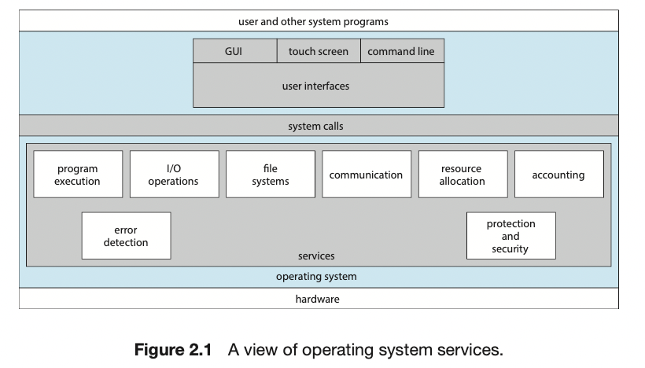
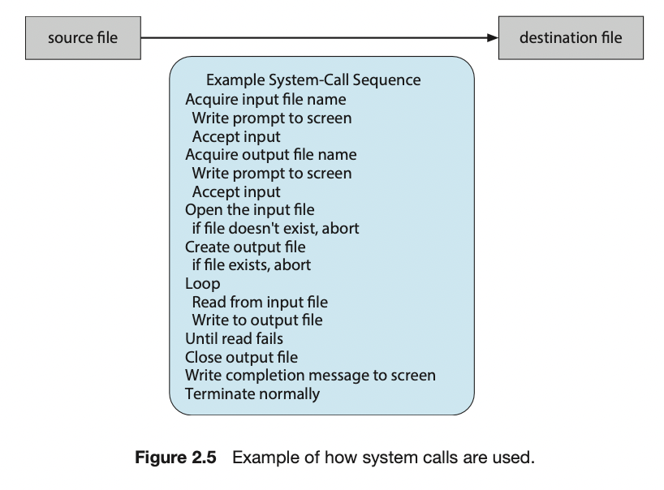
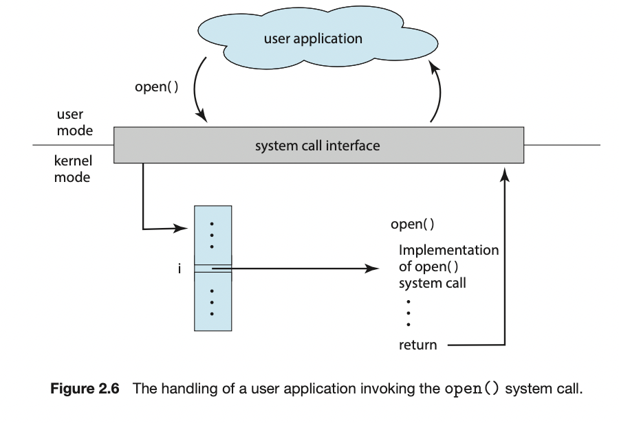
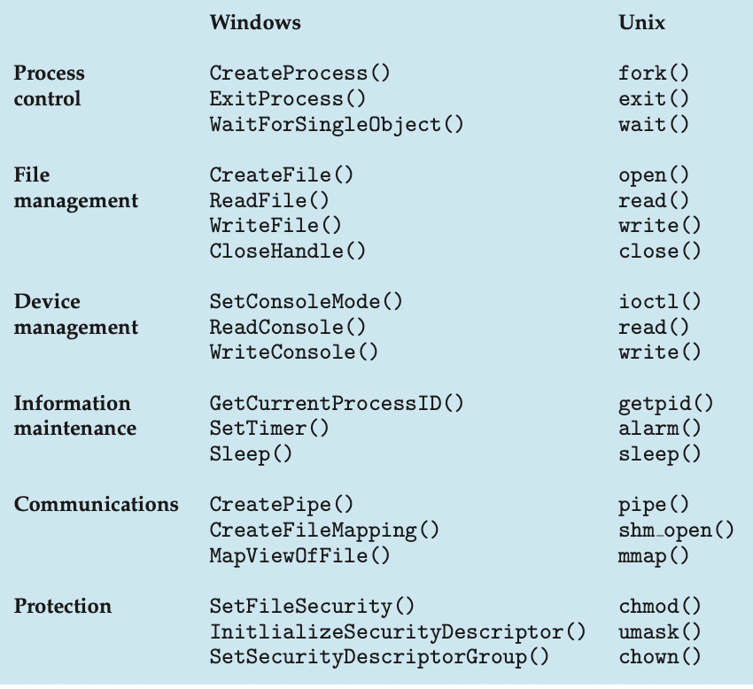

# Operating System Structure

---

## Operating System Service



> 운영체제는 프로그램 실행 환경을 제공.
> 프로그램과 그 프로그램의 사용자에게 특정 서비스를 제공

### Services
- **user interface**
  - 모든 운영체제는 UI를 제공
  - 여러 형태로 제공 될 수 있음
    - ```CLI```로서 문자열 명령과 이를 입력할 수 있는 형태
    - ```batch interface``` 명령어와 명령어를 제어하는 디렉티브 파일 형태로 입력되고 파일이 실행되는 인터페이스
    - ```GUI``` 입출력을 지시하고 메뉴에서 고르고 다양한 선택을 할 수 있는 위치 장치와 텍스트를 입력할 수 있는 윈도우 시스템
- **program execution**
  - 시스템은 **프로그램을 메모리에 적재해 실행**할 수 있어야 한다.
  - 프로그램은 정상적이든 비정상적이든 실행을 끝낼 수 있어야 한다.
- **I/O Operation**
  - 실행 중인 프로그램은 **입출력을 요구**할 수 있다.
  - 입출력에는 파일 혹은 입출력 장치가 연관될 수 있고 특정 장치에 대해서는 특수한 기능이 요구될 수 있다.
- **File System Manipulation**
  - 프로그램은 **파일을 읽고 쓸 필요**가 있다.
  - 생성, 삭제, 수정 탐색이 가능해야하고, 권한 부여도 제공해야 한다.
- **Communication**
  - 한 프로세스와 다른 프로세스와 정보 교환해야 할 필요가 있는 상황이 필요
  - 이때 ```Shared Memory```를 통해서 구현하거나 ```Message send```를 통해서 구현
- **Error Detection**
  - CPU, 하드웨어, 입출력 장치 또는 사용자 프로그램에서 오류가 가능
  - 운영체제는 올바르고 일관성 있는 계산을 보장하기 위해 각 유형의 오류에 대해 적당한 조치를 취해야한다.

### 시스템 자체의 효율적인 동작을 보장하기 위한 기능
- resource allocation
  - 다수의 사용자나 다수의 작업들이 동시에 실행될 때, 그들 각각에 자원을 할당
- accounting
  - 어떤 종류의 컴퓨터 자원을 사용하는 지를 추적할 수 있어야 함.
- protection & security
  - 정보의 사용 통제

---

## 사용자 운영체제 인터페이스
> 사용자가 운영체제와 접촉하는 방식에는 여러 방법이 있는데 명령어 라인 인터페이스 또는 명령어 해석기를 제공하는 것. 
> 두번째로는 GUI를 통해 운영체제와 접촉하는 것.

### Command-Interpreter
- 운영체제는 커널에 명령 해석기를 포함하고 있다. ⇒ 쉘. 
- 사용자가 지정한 명령을 가져와서 그것을 실행하는 것. 파일 조작 가능하는 등 여러 동작 가능.

### Graphical User Interface, GUI
- 사용자 친화적인 그래피컬 사용자 인터페이스 또는 GUI를 통하는 방식.
- 데스크 톱이라고 특정 지어지는 마우스를 기반으로 하는 윈도우 메뉴 시스템을 사용.

---

## System call

> **System Call**은 운영체제에 의해 사용 가능하게 된 서비스에 대한 인터페이스를 제공.
> low-level의 작업을 가능하게 해줌.
> 커널이 제공하고 사용자가 커널에 접근하기 위한 interface.
> 즉 커널과 사용자 간의 API.


시스템 콜이 어떻게 사용되는 지 예)
1. 한 파일로부터 데이터를 읽어서 다른 파일로 복사하는 간단한 프로그램을 작성. 
2. 프로그램이 필요로 하는 첫번째 입력은 두개의 파일, 즉 입력 파일과 출력 파일의 이름. <br> 이 이름은 운영체제 설계에 따라 여러가지 방법으로 지정. 
3. 한가지 방법으로는 프로그램이 사용자에게 두 파일의 이름을 요청하는 것, <br> 대화식 시스템에서 이러한 방법은 일련의 시스템 호출이 필요하고 우선 프롬프트 메시지를 화면에 표시하기 위해서 시스템 호출이 필요하고 <br> 이어 두 파일의 이름에 해당하는 문자열을 키보드로부터 읽기 위해 두번째 시스템 호출이 필요하다
4. ….(그림으로 대체)

대부분의 응용 개발자들은 응용 프로그래밍 인터페이스 API에 따라 프로그램을 설계한다. <br>
API는 각 함수에 전달되어야 할 매개변수들과 프로그래머가 기대할 수 있는 반환 값을 포함하여 응용 프로그래머가 사용 가능한 함수의 집합을 명시<br>
또 **각각의 System Call 내부에는 테이블로 번호와 매핑**되어있다.

### API에 따라 프로그래밍 하는 이유
1. 프로그램의 호환성
2. 자세한 명세가 필요하고 프로그램 상에서 작업하기가 응용 프로그래머에게 가용한 API보다 어렵다.


---

## System call Type
> System call은 다섯가지 범주, 
> **프로세스 제어, 파일 조작, 장치 조작, 정보 유지보수와 통신과 보호**
> 등으로 묶일 수 있다.



---

## System Programming
> 시스 프로그램은 시스템 유틸리티로도 알려진, 프로그램 개발과 실행을 위해 보다 편리한 환경을 제공

- 파일 관리
  - 파일과 디렉토리를 생성, 삭제, 복사, 개명, 인쇄, 덤프, 리스트 등 일반적 조작
- 상태 정보
  - 시스템에게 날짜, 시간, 사용가능한 메모리와 디스크 공간의 양, 사용자 수 혹은 비슷한 상태 정보
  - 상세한 성능, 로깅 및 디버깅 정보를 제공
- 파일 변경
  - 파일의 내용을 생성하고 변경하기 위해 다수의 문서 편집기가 사용 가능
  - 파일의 내용을 검색하거나 변환하기 위한 특수 명령어가 제공.
- 프로그래밍 언어 지원
  - 프로그래밍 언어들에 대하 컴파일러, 어셈블러, 디버거 드이 제공되거나 다운이 가능
- 프로그램 Load와 실행
  - 프로그램이 어셈블 되거나 컴파일 된 후 그것이 실행되려면 메모리에 있어야 한다.
  - absolute loader, relocatable loader, linkage editor, overlay loader등을 제공 가능
- 통신
  - 프로세스, 사용자, 다른 시스템들 사이의 접속하기 위한 기법을 제공
  - 메시지를 전송하거나 웹 페이지를 서칭하거나 로그인 파일 전송 등
- 백그라운드 서비스

---
