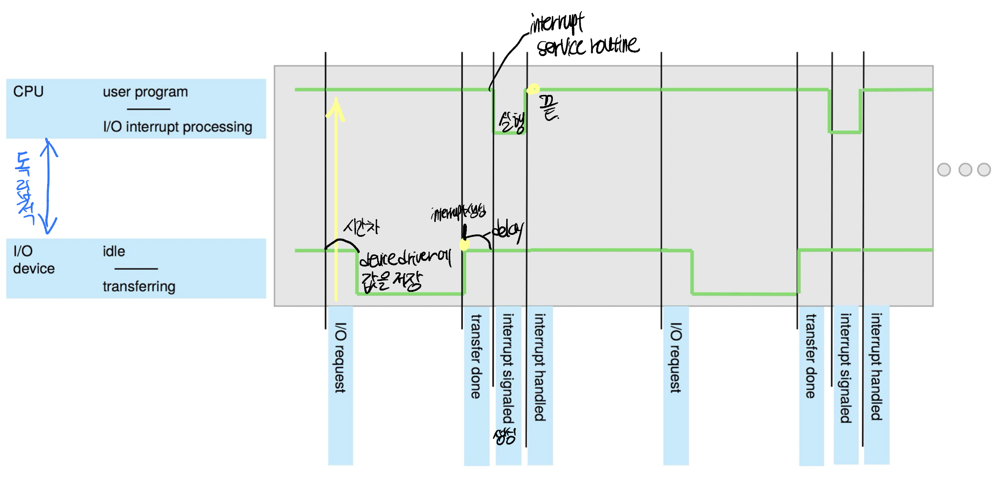
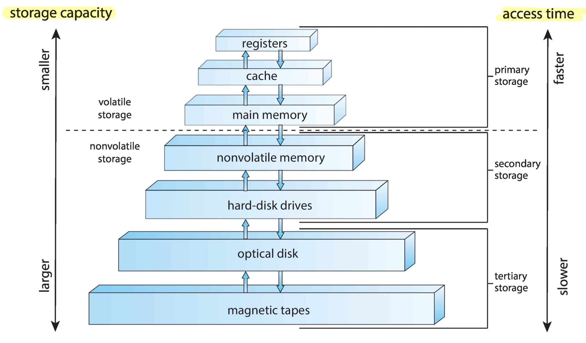
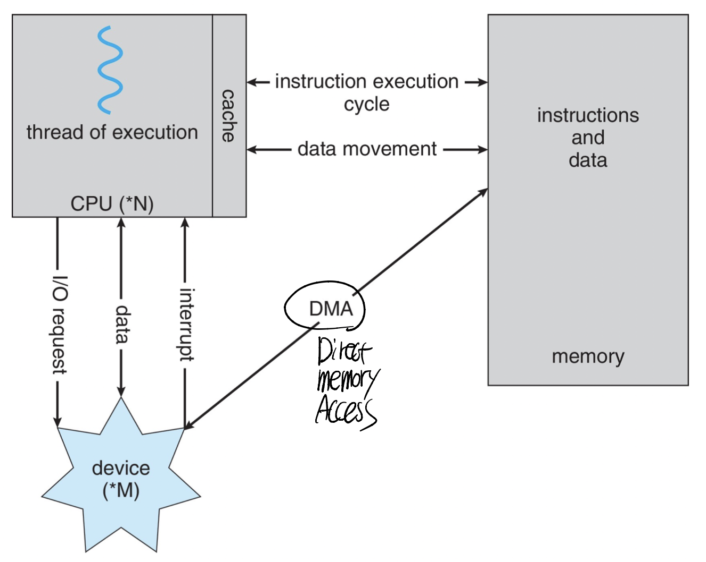
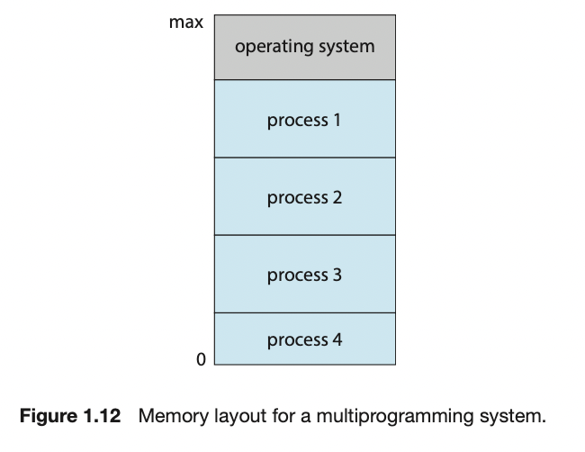
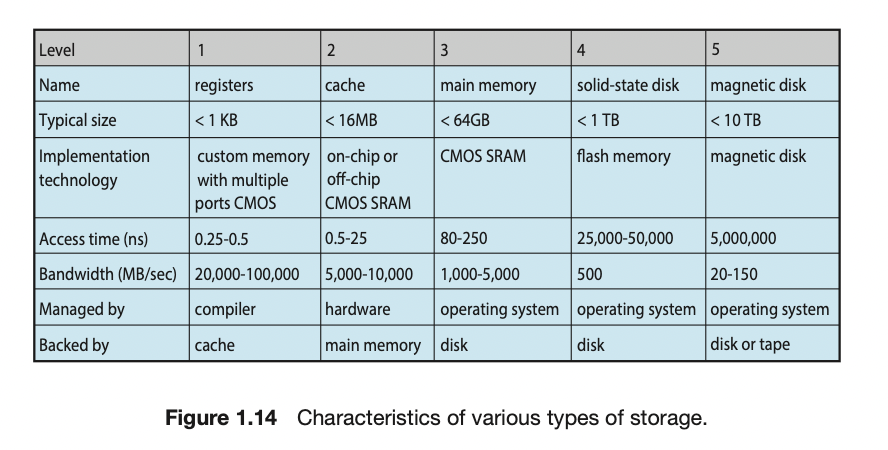
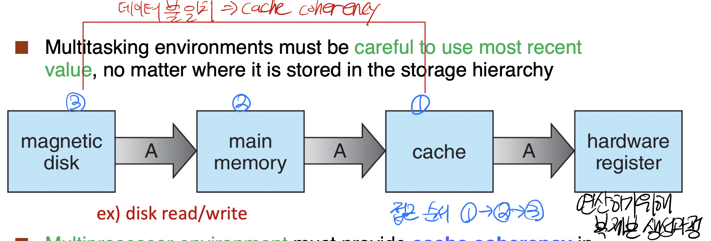

# 운영체제

---

운영체제는 컴퓨터 하드웨어를 관리하는 프로그램.  
응용 프로그램을 위한 기반을 제공하고 user와 hardware 사이의 중재자 역할  
=> **사용하기에 편리하도록, 효율성에 따라 설계**

> 💡 목표
> 1. 컴퓨터 시스템 구조에 대한 기본 지식 제공
> 2. 운영체제의 주요 구성요소에 대한 개관
> 3. 컴퓨팅 환경에 대한 개관
> 4. 다수의 오픈소스 운영체제

## 운영체제가 할 일

---

**컴퓨터 시스템의 네가지 분류**
1. 하드웨어
   1. 중앙처리장치(CPU), 메모리, 입출력장치로 구성
2. 운영체제
   1. 다양한 사용자들을 위해 다양한 응용프로그램 간의 하드웨어 사용을 **제어하고 조정**
3. 응용 프로그램
   1. 계산 문제를 해결하기 위해 자원을 어떻게 사용할지
4. 사용자
   1. 사람, 머신

### 사용자 관점
컴퓨터에 대한 사용자의 관점 => 인터페이스(키보드, 마우스, 모니터, etc ...)  
따라서 운영체제는 사용의 편의성과 성능에 초점

### 시스템 관점
하드웨어와 가장 밀접하게 연관된 프로그램  
CPU 시간, 메모리 공간, 파일 저장 공간, 입출력 장치 등을 운영체제가 가짐.  

컴퓨터 시스템을 **효율적이고 공정하게 운영**할 수 있도록 어느 요소를 누구에게 할당할 것인지를 결정

### 운영체제 정의
> 하드웨어와 응용프로그램 사이에 제어와 공통적인 연산
> 자원을 제어, 할당하는 기능을 하나의 소프트웨어로 통합한 것.

- **컴퓨터에서 항상 실행되는 하나의 프로그램 => 커널**
- 운영체제와 연관되어 있으나 반드시 커널에 포함될 필요가 없는 프로그램 => 시스템
- 시스템의 작동과 관계없는 모든 프로그램 => 응용 프로그램

> 💡 미들웨어(Middleware)
> 응용 개발자에게 추가 서비스를 제공하는 소프트웨어 프레임워크의 집합
> 휴대폰 운영체제인 Apple의 iOS, Google의 Android, 데이터베이스 등

## 컴퓨터 시스템의 구성

--- 

### 컴퓨터 시스템 연산
하나 이상의 CPU와 다수의 장치 제어들로 구성되어 공용 버스를 통해 연결.  
버스를 통해 데이터가 전달되며 각 장치 제어기는 특정 장치를 제어하고, 메모리 사이클을 얻기 위해서 경쟁하면서 병렬 실행한다.

컴퓨터가 실행되면 **ROM**이나 **EEPROM**에 저장되고(펌웨어),  
CPU 레지스터를 시작으로 장치 제어기, 메모리 내용 등을 포함한 시스템의 모든 측면을 초기화.  
 
커널이 적재되고 실행되면 시스템과 사용자에게 서비스를 제공.  
일부 서비스는 시스템 프로그램에 의해 제공되고 커널이 실행되는 동안 계속 실행되는 **시스템 프로세스나 시스템 데몬**

event 발생 여부는 하드웨어나 소프트웨어로부터 발생한 **interrupt**에 의해 전달. 
하드웨어는 시스템 버스를 통해서 CPU에 신호를 인터럽트를 발생시켜 부르는데 소프트웨어는 **System Call**이라는 연산을 실행하여 인터럽트를 발생
  

CPU가 인터럽트되면 하던 일 중단, 지정된 위치로 실행위치를 옮겨 **서비스 루틴의 시작주소**(인터럽트에 기록되어있음)에 따라 ISR(인터럽트 서비스 루틴) 실행. 
완료되었으면 이전 연산 재개.
  

인터럽트는 적절한 서비스 루틴으로 제어를 전달해야하고, 이후 고유의 핸들러를 호출
  이는 느릴 수 있어 인터럽트 핸들러의 주소를 저장한 테이블을 통하여 인터럽트 루틴이 호출 될 수 있음. 
인터럽트가 요청되면 이 주소의 배열. 즉 **인터럽트 벡터**가 인터럽트 요청과 함께 전달된 고유한 장치 번호로 색인되어 인터럽트를 촉발한 장치를 위한 인터럽트 서비스 루틴의 주소를 얻을 수 있음.
  

인터럽트에는 인터럽트에 의해 중단된 명령의 주소를 반드시 저장해야함. 
또 복귀 주소를 저장해야함 => **Program Counter**

> 인터럽트 벡터:interrupt 종류 여러개. 어떤 요청을 실행할지, 일종의 배열
> 인터럽트 서비스 루틴: interrupt 되었을 때 요청을 저장하고 해결하는 코드.

### 저장장치 구조

CPU는 명령어를 오로지 메모리에서만 가져올 수 있음.
  따라서 프로그램을 실행하기 위해서 프로그램이 반드시 메모리에 있어야 함.
  대부분의 컴퓨터는 프로그램을 **메인 메모리**(RAM, DRAM)에서 가져옴

  
모든 메모리는 바이트 배열을 제공.각 바이트는 자신의 주소를 가지고 있고 load, store 명령을 통해 전송

 
폰 노이만 구조에서는 실행되는 명령 실행 사이클은 메모리부터 명령을 가져와 **명령레지스터**에 저장. 
명령을 해독하고 필요한 경우 메모리로부터 피연산자를 인출하여 내부 레지스터에 저장하고 실행한 결과를 다시 메모리에 저장 

영구히 존재하는 메모리 => 보조 저장장치. 대량의 데이터를 영구히 보존할 수 있는 HDD(하드 디스크 드라이브)와 SSD

### 입출력 구조

입출력 연산을 시작하기 위해 디바이스 드라이버는 장치 제어기의 적절한 레지스터를 load. 
장치 제어기는 이어 해야 할 동작을 결정하기 위해 레지스터 내용을 조사하고 제어기는 장치로부터 자신의 로컬 버퍼로 데이터 전송을 시작. 
데이터 전송이 완료되면, 장치 제어기는 자신이 연산을 완료했음을 인터럽트를 이용하여 디바이스 드라이버에게 통보. 디바이스 드라이버는 제어를 운영체제에 반환하고 입력 완료의 경우에는 데이터 또는 데이터에 대한 포인터를 같이 반환. 
 

디스크 입출력과 같은 경우는 큰 오버헤드를 일으킬 수 있는데 DMA장치를 통해서 그 문제 해결.
> DMA: CPU의 개입없이 메모리로부터 자신의 버퍼 장치로 데이터 블록 전송.
> 블록 전송이 완료될 때마다 인터럽트가 발생하여 전송을 실행할 때에는 CPU가 다른 작업 수행.

## 운영체제의 구조

---

> 운영체제 -> 다중 프로그램도 가능.
> 한명의 사용자도 여러 프로그램을 동시에 실행 시킴

- 기본 아이디어
  - 운영체제는 한번의 여러 작업을 메모리에 load
  - 디스크의 작업 풀 내에 유지.
  - 메모리에 존재하는 작업의 집합은 작업 풀에 대기중인 작업의 부분집합
  - 운영체제는 메모리 내에 있는 작업 중에서 하나를 선택해 실행
  - 효율적으로 시스템 자원을 사용해야하기에 **시분할**과 같은 개념 등장
- 시분할 운영체제
  - 동시에 많은 사용자가 컴퓨터를 공유
  - CPU 시간이 짧다면 시스템이 한 사용자에서 다음 사용자로 빠르게 전환.
  - 다수의 사용자가 한의 컴퓨터를 공유하는 것이지만 각 사용자는 자신이 전체 컴퓨터를 전용하는 것 처럼 느낌
- 시분할 과 다중 프로그래밍 운영체제에서는 여러 작업이 메모리에 동시에 유지되어야 함.
- 충분한 공간이 없을 때에는 몇몇 작업을 선택해야함.
  - **작업 스케줄링**
- 여러개의 작업이 동시에 실행 준비가 되어있으면 운영체제는 그들 중 하나를 선택
  - **CPU 스케줄링**
- 작업의 일부만 메모리에 적재되어도 수행을 허용하는 기법
  - 가상메모리: 물리 메모리의 크기보다 더 커도 되고 논리 메모리를 물리 메모리로부터 분리.

## 프로세스 관리

---

- 프로그램은 자신의 명령어가 CPU에 의해 실행되지 않으면 아무 일도 수행하지 않음
- 프로세스는 자신의 일을 수행하기 위해 CPU 시간, 메모리, 파일 등 여러가지 자원을 필요.
  - 다음 수행할 명령어를 가르키는 Program Counter (PC)
- 프로세스의 수행은 순차적이여야하고 하나의 명령만을 수행해야 함.

## 메모리 관리

---

- 메인 모메리는 일반적으로 CPU가 직접 주소를 지정할 수도 있고 직접 접근할 수 있는 메모리
- 프로그램이 수행되기 위해서는 절대 주소로 매핑되어있어야하고, 메모리에 load
- 프로그램이 종료되고 프로그램이 차지하던 메모리 공간은 가용공간으로 선언
- 다른 프로그램이 load되어 수행
- CPU 이용률과 사용자에 대한 컴퓨터의 응답속도를 개선하기 이ㅜ해 우리는 메모리에 여러개의 프로그램을 유지
  - 이를 위해서 메모리 관리 기법
  - 하드웨어 설계에 따라 메모리 관리 기법이 선택되는데 메모리는 다음과 같은 일을 담당해야함.
    - 메모리의 어느 부분이 현재 사용되고 있으며 누구에 의해 사용되고 있는 지를 추적해야한다.
    - 어떤 프로세스들은 메모리에 적재하고 제거할 것인가를 결정
    - 필요에 따라 메모리 공간을 할당하고 회수.

## 저장장치 관리

---
> 컴퓨터 시스템의 편리한 사용을 위해 운영체제는 정보 저장장치에 대한 일관되며 논리적 관점을 제공
> OS는 저장장치의 물리적 특성을 추상화하여 논리적인 저장단위인 파일을 정의

### 파일 시스템 관리
- 컴퓨터는 여러 유형의 물리적 매체에 정보 저장 가능
  - 하드디스크, 광디스크, 자기 테이브 등.. 
  - 자신의 특성과 물리적 구조를 가지고 있음
  - 각 매체는 디스크 드라이버 혹은 테이프 드라이버와 같은 장치에 의해 제어되며 각자의 접근속도, 용량, 데이터 전송률, 접근 방식이 있다.
- 파일은 file descriptor에 의해 정의된 관련 정보의 집합체
  - 파일을 관리하기 쉽도록 디렉토리들로 구성

### 대용량 저장장치 관리
- 보조 저장장치는 매우 빈번하게 사용되므로 효율적으로 사용해야함.
- 컴퓨터의 전체 동작 속도는 디스크 서브 시스템과 그것을 조작하는 알고리즘의 속도에 의해 제어

### 캐싱

- 데이터는 어떤 저장장치에 보관.
- 데이터가 사용됨에 따라 보다 빠른 장치인 **캐시**에 일시적으로 복사되고 우리는 메모리를 보는 것이 아니라 캐시에 사용할 정보가 있는 지 먼저 확인
  - 다시 사용할 가능성이 높은 것을 캐시에 저장
  
